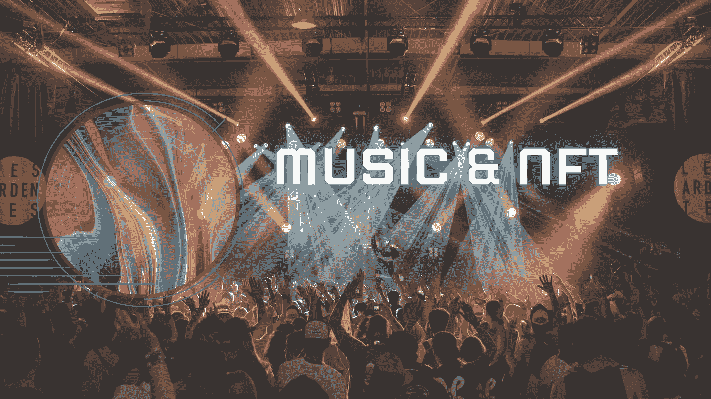

# 音乐和 NFT

> 原文：<https://medium.com/coinmonks/music-nft-8bce74f17b52?source=collection_archive---------50----------------------->

Image by [Dammykudz](/@dammykhudz061)

作为一名音乐爱好者，听 OGs 谈论他们的成功之路，以及正在崛起的艺术家如何从他们的经历中学习，往往会令人怀旧——你会感受到一切。尽管这些谈话很有趣，除了可能在生活中有一个坎坷的开始，你会发现一些在他们成为明星的早期犯过类似错误的怪物的模式；他们通常会摸索他们的[创作权](https://quizlet.com/167233216/flashcards)。

没有创造力的艺人算什么？我先来，我什么也不回答— *见鬼，他们每次都签出他们的创造性控制？*

在把这篇文章放在一起之前，我反复思考了好几次，我已经决定这篇文章不会把 NFTs 或区块链美化成一种颠覆性技术。相反，我将强调非功能性思维至少可以帮助创造性行为获得更好的创造性控制— *这篇文章只是表达了非功能性思维如何被音乐艺术家所利用。*

## 从明星到犯错…..

这种趋势主要是一种有才华的音乐行为，试图获得更好的生活，与一个标签签约，然后在取得令人难以置信的职业成功后独立。这肯定经常发生，只是事情从来没有那么简单；*至少是天赋试图独立的部分*。

我听了这个播客，里面有一个怪物。OG 提到他的[目录](https://www.homemusicproducer.com/what-does-catalog-mean-in-music/)被他以前的唱片公司抢走了，而他声称拥有它的权利——如果他不拥有他的目录，那么他就不拥有他的音乐。

这当然让我反感，我的意思是，“为什么要夺走一个人的一切？”。我没看到他的合同也没签，但他的话是真的可能性不可小视。

就像任何人会建议的那样，OG 走上了合法的道路。可悲的是，即使在法律面前，这些大品牌似乎也有优势——尽管有可能与它们对抗，但这太苛刻了。*“有很多来来回回，我只是不得不放手，”*是 OG 从那个播客中发表的声明。

作为一个了解区块链技术广度的人，看到 NFTs 已经走了多远，我不禁认为音乐行业可以利用这项技术做更多的事情。

***2021 年 NFT 音乐市场规模估值 13.5 亿美元，为什么不拥抱它？***

区块链技术的属性之一是不变性。这种不变性很大程度上与写在区块链上的智能合约有关；其中一部分是为 NFT 的传输和铸造编写代码。值得注意的是，NFTs 自然呈现出区块链的特征。

如果艺人用 NFTs 来代表他们的音乐，这将保证从他们的作品中获得[版税](https://soundcharts.com/blog/music-royalties)(按预先约定的百分比)。

为了让它发挥作用，约束 NFT 的智能合同将包括如何分享收益。从好的方面来看，这种安排不仅可以确保艺人从他们制作的音乐中获得应有的回报，还可以帮助唱片公司节省管理成本和与完成传统支付和记录保存相关的人工劳动。

区块链的不变性在这方面扮演的角色是支持艺术家音乐(NFT)的智能合约不能被篡改。没有人能够重写代码，更好的是，无论标签是否希望操纵它们，代码都是按照预先指示自动完成交易的。

音乐行业本身是一个广阔的空间，对于一个新手来说，像所有已知的大型行业一样，它是非常复杂的。通过将 NFTs 作为一个音乐门户，新艺人可以独立托管他们的音乐，并避免与 web2 音乐托管平台进行过度收费的收入分成。他们可以充分利用自己的音乐，并获得资金来满足其他职业需求。

艺人有可能获得更多的创作控制权，签署更务实的协议，甚至独立地为全球不受限制的观众主持音乐。区块链技术在这种类型的开发中发挥了作用，它可以从探索 NFTs 作为这种方法的数字音频表示开始。 [Audius](/coinmonks/audius-a-decentralized-music-streaming-service-10cbfb2c3f7f) 是一个分散的数字流媒体平台，它采用了区块链技术，使艺术家能够控制他们的工作，这是一个很好的开始。

## **结论**

我们不可能忽视一个像 NFT 工业一样快速发展的行业，以及它影响其他行业的能力。

基于现有的技术/事件，本内容仅反映了 NFT 在音乐行业的部分可能性。NFT 和音乐行业都有望发展壮大，并找到协同效应，让它们充分发挥潜力。