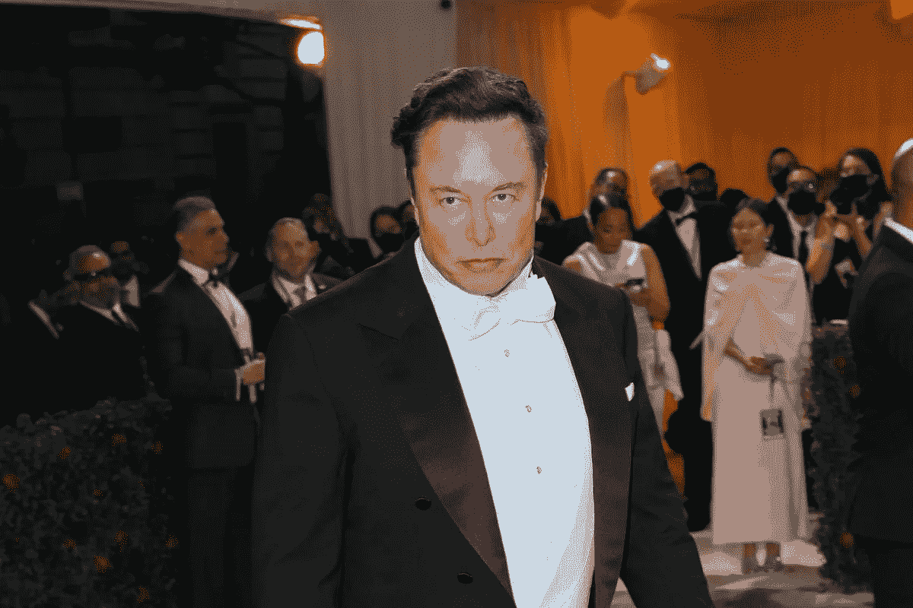

# 马斯克告诉 Twitter，他希望通过交易收购它。Twitter 表示，这将迫使他关闭销售

> 原文：<https://medium.com/coinmonks/musk-tells-twitter-he-wants-out-of-deal-to-buy-it-twitter-says-it-will-force-him-to-close-the-sale-f1f0e4909718?source=collection_archive---------6----------------------->

周五下午，埃隆·马斯克(Elon Musk)终止了他以 440 亿美元收购 Twitter 的交易——这是亿万富翁特斯拉首席执行官成为该公司最大股东、拒绝董事会席位、同意收购社交媒体平台，然后开始怀疑是否会继续进行下去的旋风过程中的最新转折