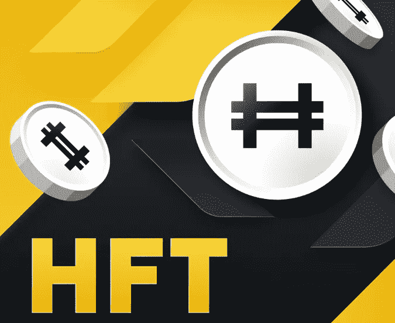

# 马斯克收购 Twitter，Dogecoin DOGE 天涨 2.6 倍

> 原文：<https://medium.com/coinmonks/musks-acquisition-of-twitter-dogecoin-doge-rose-2-6-times-in-5-days-3d1247ddc3e1?source=collection_archive---------22----------------------->

上周，埃隆·马斯克(Elon Musk)宣布收购 Twitter，并搬进 Twitter 总部。

一个他移动脸盆，高高兴兴走进推特大楼的视频，浏览量超过 4k，点赞超过 100 万，人气无人能及。

Elon Musk on Twitter

马斯克收购 Twitter 后，很快宣布 Twitter 将被摘牌，此前称单的 doge 也在崛起。

从收购消息发酵前的 0.06 美元继续涨到 0.157 美元，几天内涨了 2.6 倍。其他相关面膜，SHIB 和 RACA 都有不同程度的上涨。

突然之间，牛市又回来了？

doge daily trend

马斯克在今天的动态中放出了另一张图，不知道是什么意思。反正 doge 涨了 24 个点。

在加密市场，名人效应特别明显，尤其是这么爱表达和分享的 KOL，已经带火了几个项目。

Musk’s Activity

狗 DOGE 是去年被马斯克叫出来的。从最初的默默无闻，交易送了几百万 doge，到现在有了长足的进步，排到了整个市场的前 8，市值达到了 200 亿美元。

其中 BTC 市值 3950 多亿，以太坊市值 1900 多亿。

有些玩家关注的是某些 KOL 的推文，比如 Musk，Vitalik，CZ 等。，分析他们分享的内容，埋伏好机会。

如果好运赶上了，它可能会飞上天空。

DOGE’s market value reaches more than 20 billion US dollars

这两天，币安再次启动发射台活动，计划启动 HFT 项目。这一宣布直接使 HFT 脱离了圈子。

HFT，Hashflow 是一个 DEX 平台，设计用于互操作性，零滑动和 MEV 保护的交易。

去年在 HFT 平台上互动过的玩家可能会收到 HFT 空投。HFT 目前的价值未知，但毫无疑问，空投会带来新的人气。

楚小莲也在关注各种互动运营，真的是无底洞。只要你想互动，就不用担心找不到项目。只是不知道哪次互动，什么时候，可能会有什么空投消息。这也是空投最难，最难坚持的原因。

很多人接受不了延迟满足，愤然离开游戏。持之以恒的只有少数，收益巨大。

HFT project is about to start airdrop

上周以太坊从 1360 美元涨到 1663 美元，涨幅超过 18%。在这个市场上，无法预测哪个项目会突然腾飞。如果你抓住了机会，你会暗自高兴。

就像 DOGE，利润直接涨了 2.6 倍。有玩合约的朋友把握住了 DOGE，一单开仓可能就是几十万的利润。

Earnings from long DOGE

然而，合同放大了利益和风险。开错方向，直接平仓归零。比较稳妥的办法是投资还没涨的 doge 的 0.06，涨了也会带来丰厚的回报。

从更长的周期来看，目前市场上的代币都是相对低价位，定投或进场可能是未来的机会。长期定投，也许真的可以随着时间慢慢变富。

当前的赛场内外环境充满了不确定性。风险与机遇并存。就是看谁能撑到最后。只有坚持生活，才能看到曙光。生活和投资都是一样的。

以上只是我个人观点，没有投资建议。我是楚小莲，我正在关注元宇宙和 web3。​​​​

> 交易新手？试试[加密交易机器人](/coinmonks/crypto-trading-bot-c2ffce8acb2a)或者[复制交易](/coinmonks/top-10-crypto-copy-trading-platforms-for-beginners-d0c37c7d698c)