# 我认为 2022 年表现最好的 6 个加密交易机器人

> 原文：<https://medium.com/coinmonks/my-6-top-performing-crypto-trading-bots-of-2022-9d856f632b7?source=collection_archive---------7----------------------->

Buy low and sell high — do not do otherwise!

我喜欢交易机器人，因为它们自动化了一个潜在有利可图的过程——交易，如果手动完成，这可能是一项艰巨而单调的工作。作为一名技术爱好者和加密货币倡导者，我不能夸大交易机器人在帮助我在后台毫不费力地产生被动收入方面的作用，因为我每天都在进行日常活动和白领日常工作，一旦我成功建立了名副其实的被动收入流，我可能会提前退休。在那之前，我将不会放松对市场上各种加密货币交易机器人的探索——我最喜欢的总结如下。

# # 13 常见问题

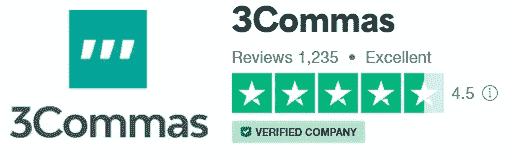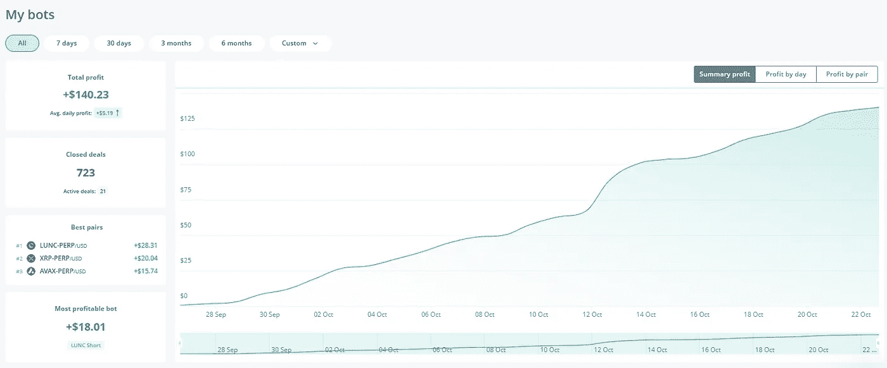

3 [逗号](https://3commas.io/?c=cybery)可能是迄今为止名单中最被低估的交易机器人。它的表现超出了我的预期，在不到一个月的时间里，我从 500 美元的资本中赚了 140 美元。

**3Commas 是一个先进的加密货币交易管理平台，提供 DCA 机器人、电网机器人、期权机器人、期货机器人、HODL 机器人、黄牛终端和全面的投资组合管理**。

## **特性**

*   **智能交易:**支持跨多个交易所的交易，具有高级订单，如跟踪止盈和多个止盈目标。
*   **交易机器人:** DCA、网格、期权和期货机器人
*   **投资组合管理:**自动化交易服务使其用户能够通过 API 密钥监控和管理他们在超过 18 个加密交易所的资产。

## **优点**

*   多功能具有多种功能，满足从新手到高级交易者的各种交易需求
*   各种各样的免费和付费信号**可以用来指导自动交易。**
*   丰富的技术分析指标，如 RSI、均线、MACD、布林线等等！
*   **您的资金是 SAFU** ，因为您**从来不需要将任何资金存入 3 commons**；所有的交易都是通过你的 API 密匙直接在你的交易所完成的。这个机器人只是根据它被编程的方式在你的交易所执行交易，没有取款凭证。
*   **广泛支持 18 个加密货币交易所。**
*   **纸上交易**可用，让你不用真金白银就能检验你的策略。
*   **复制交易:**检查并复制其他用户中表现最好的机器人！
*   **预置设置:**使用专业人士创建的预置设置进行交易，如果不熟悉设置 bot。
*   **多种通知选项:**通过浏览器、手机应用程序、电报和电子邮件接收交易通知。
*   **功能全面的移动应用程序**让您即使在旅途中也能轻松访问交易机器人！

## **缺点**

*   没有桌面应用程序；仅提供网络/移动接口。
*   初学者可能无法充分利用所有可用的功能。

## **开始使用 3 条消息**

*   **注册任何支持的交易所，如******[**Kucoin**](https://www.kucoin.com/r/af/rJH29LZ)**[**huo bi**](https://www.huobi.com/en-us/topic/double-invite/register/?invite_code=5t5jb)**等，如果你还没有账户的话。********
*   ******[**在此**](https://3commas.io/?c=cybery) 注册 3 条消息，如果您希望继续使用付费计划，将获得 3 天免费试用和第一个月 10%的独家折扣。******
*   ******通过直接在 exchange 平台上创建的 API 密钥**将您的 exchange 连接到 3Commas。****

*   ******开始探索**3 commas 的广阔界面，选择启用“[纸交易](https://help.3commas.io/en/articles/3638275-enable-paper-trading-demo-mode)”来测试你的策略！****

****[**在此**](https://3commas.io/?c=cybery) **注册 3 条消息，即可获得 3 天免费试用和第一个月 10%的独家折扣**！****

****关于 3Commas 的更多信息，请看下面我以前的文章。****

**** [## 3 commas Review—5 天内获得 22%的投资回报！

### 3Commas 是一个先进的加密货币交易机器人，简化了低买高卖的过程，以生成…

medium.com](/coinmonks/3commas-review-22-roi-in-5-days-6fa44648bdfe) 

# 排名第二的喷气式机器人

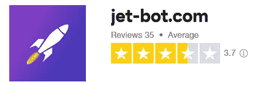

Jet-bot 是一个**高级在线交易机器人，能够在币安**自动进行现货和期货交易，产生 24/7 的现金流。

## **功能**

*   **现货和期货**市场 24/7 自动交易，具有**止盈/止损**功能。
*   先进的**安全订单**配置可自动平均进场价格，以防市场走向不利。
*   **电报机器人支持**:在网络平台和通过电报创建机器人、更改设置和接收交易报告。
*   **模拟交易账户**提供**100，000 美元的虚拟投资组合。**
*   **3 天试用期**可完全访问平台

## 赞成的意见

*   先进的**安全指令**配置有助于在合理的范围内平均交易的进场价格，而不管市场方向如何。
*   出色的**客户支持**。
*   **副本交易**可用——无需担心 bot 设置！
*   如果你有交易经验，并希望成为顶级交易者，喷气机器人可能是一个有利可图的被动收入来源！(顶级交易员从抄袭他们的人那里赚取 25%的利润。)

## 骗局

*   只支持[币安](https://www.binance.info/en/activity/referral-entry/CPA?fromActivityPage=true&ref=CPA_00BFAOLI96)。
*   某些顶级机器人/ bot 设置可能需要相对**高的初始投资**。
*   **一个账户一次只能开立一笔期货交易**；换句话说，如果你想同时进行几笔期货交易，你需要连接一个以上的币安账户。
*   对于小投资者来说，无限 bot 的定价可能有点高。

## Jet-bot 入门

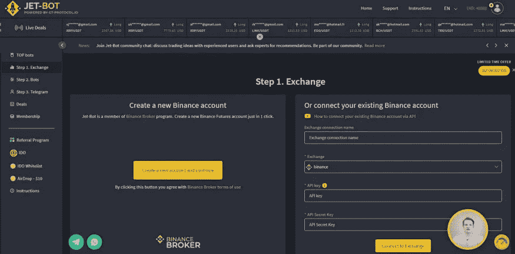

*   [**在这里注册**](https://jet-bot.com/?fpr=l1be4) **免费账号！**
*   只需**在[注册页面](https://jet-bot.com/?fpr=l1be4)输入您的电子邮件和密码**并按下“注册”按钮，或者通过社交网络使用一键注册。
*   **通过发送到您电子邮件地址的链接确认您的帐户**。
*   通过 API 密匙将 Jet-bot 连接到你的币安账户！

[**在此**](https://jet-bot.com/?fpr=l1be4) **注册一个帐户，获得 10 美元奖金(最低赎回要求为 50 美元)，10 万美元虚拟投资组合，3 天试用期，具有完整的机器人功能！**

要了解更多信息，请查看下面我以前写的关于 Jet-bot 的文章。

 [## 如何利用 Jet-bot 实现加密货币交易自动化:综述

### 概述

medium.com](/coinmonks/how-to-earn-passive-income-with-automated-cryptocurrency-trading-on-jet-bot-a-review-60c8ae36dc7c) 

# #3 Pionex

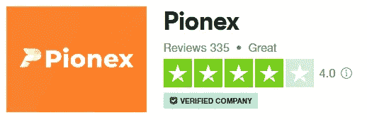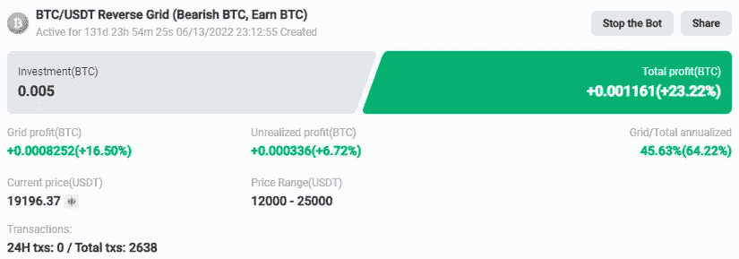

My longest standing trading bot on Pionex that has profited me despite the bear market.

P[**ionex**](https://www.pionex.com/en-US/sign/ref/mWhH4v29)**是世界上第一个内置自动交易机器人**的加密货币交易所，于 2019 年首次推出，此后发展成为一个国际加密平台。

## 特征

**Pionex 提供一个交易平台，以及多个交易机器人**其中一些如下所述。

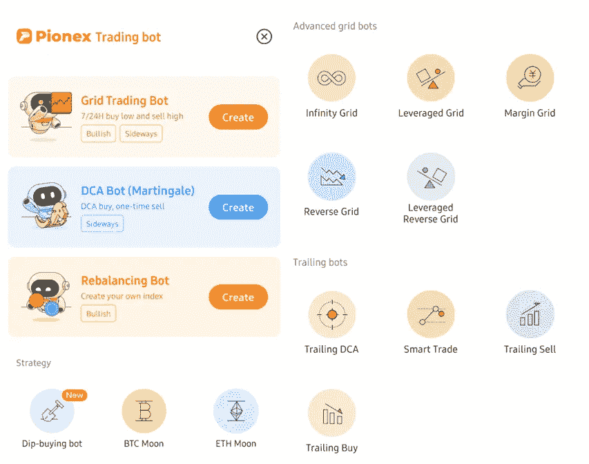

*   **Grid trading bot:****Grid trading bot 在价格达到预定义的“低点”时自动买入资产，在价格达到定义的“高点”时卖出**，允许用户持续利用市场波动。
*   **杠杆网格机器人:**杠杆网格机器人使用与标准网格机器人相同的方法工作，但允许您访问保证金以**放大回报。**
*   **跟踪卖出机器人:**跟踪卖出机器人是为了吸引那些倾向于在上涨的市场中过早卖出的投资者而开发的。跟踪卖出机器人允许你设定多个目标价，这些目标价随后会增值。当每个目标达成后，机器人将自动出售你持有的预定比例的股份。这种做法也限制了市场突然反转时的潜在损失。
*   DCA(美元成本平均)机器人:DCA 机器人允许你**以基于时间的间隔设置一系列的购买订单。机器人不会根据价格来执行购买指令，而是在你的每一个时间间隔按照当前的市场价格购买。这个策略为你提供了一个简单的方法来获得一个更好的平均价格。**
*   **现货期货套利机器人:**现货期货套利机器人允许您**利用加密货币的当前现货价格和期货市场当前价格之间的差异。这个机器人旨在提供“15-50%的年回报率和极低的风险”，你可以从 50 美元的存款开始。**
*   **鞅 bot** :该 bot **执行 DCA 买入，一次性卖出，捕捉波动利润。**
*   **再平衡机器人**:这个机器人通过**定期再平衡你的投资组合来帮助你 HODL 你的硬币，以确保篮子里的资产有相同的预定义比例。**

## 赞成的意见

*   **免费**使用！
*   **所有交易的 0.05%的竞争性费用**。
*   **帮助教程**解释每个交易机器人。
*   实时聊天和**客户支持**电子邮件。
*   大量支持超过 **120 种不同的密码对**。
*   拥有独特的自动化**的能力，通过反向电网交易机器人/杠杆做空代币做空市场**。

## 骗局

*   没有模拟账户可用于交易。
*   **没有菲亚特支持**。

[**立即注册 Pionex**](https://www.pionex.com/en-US/sign/ref/mWhH4v29)**并开始自动化您的加密货币交易！**

关于 Pionex 的更多信息，请查看我下面的文章。

 [## 如何在熊市中利用反向电网交易机器人获利

### 最佳自动化——使用免费的交易机器人自动低买高卖！

medium.com](/coinmonks/how-to-profit-with-a-reverse-grid-trading-bot-in-a-bear-market-9ab1df8a0fe3) 

# #4 火币

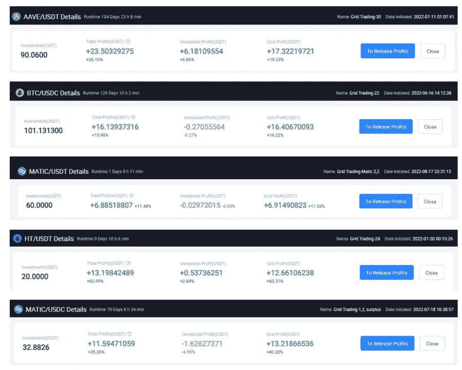

My trading bots on Huobi

H[**uobi**](https://www.huobi.com/en-us/v/register/double-invite/?inviter_id=11345710&invite_code=5t5jb)**是一家提供多样化产品的加密货币交易所**，最近涉足交易机器人领域。

## 特征

火币目前提供 3 种交易机器人，其中一种期货交易机器人计划在不久的将来发布。

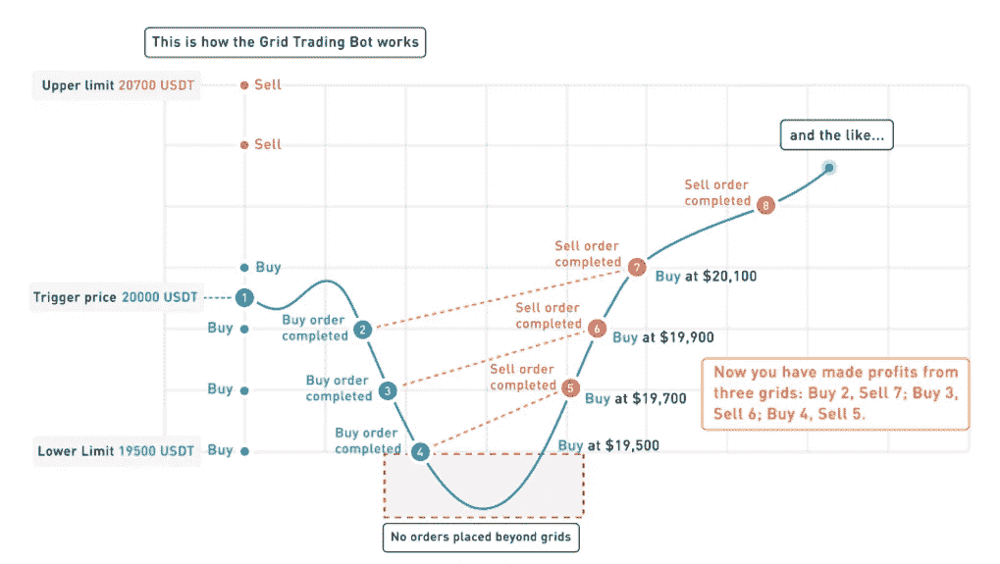

*   [**现货网格**](https://www.huobi.com/support/en-us/detail/900003573146) :让您**在特定价格范围内自动低买高卖**

*   **鞅策略**:这种策略反复逢低买入，一旦价格飙升就立刻全部卖出，产生利润
*   **Infinity Grid** :在波动性上升时持有，赚取利润。

## 赞成的意见

*   **易于**设置。
*   **免费**使用！
*   **启动一个交易机器人的最低资本是 10 美元。**
*   在加密货币交易所的本地交易机器人中存在相对**先进的功能**，如鞅乘数(使退出交易更容易获利)。
*   机器人的自动交易计入每日交易配额，可用于赚取晶体，进而可用于获得被称为“Candydrops”的免费空投！

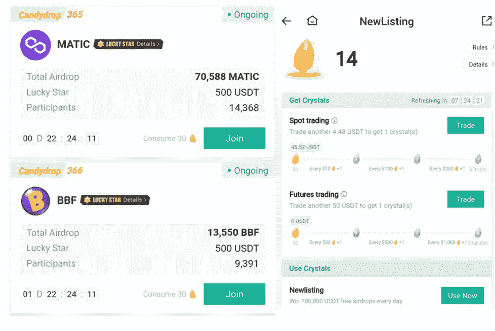

Huobi’s trading bots can generate sufficient trading volumes to earn crystals used for participation in free airdrops! Only USDT pairs are counted.

## 骗局

*   **缺少更高级的功能**，如跟踪、价格偏差鞅等。
*   仍处于相对早期的发展阶段。

## 火币交易机器人入门

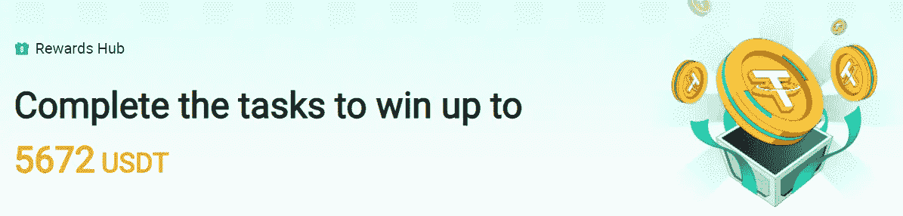

Newbie’s rewards await! However do not take this amount literally, as many of these are offered in the form of trading discount vouchers.

*   [**在这里报名火币！**](https://www.huobi.com/en-us/v/register/double-invite/?inviter_id=11345710&invite_code=5t5jb)
*   继续进行 **KYC 验证** —上传您的文档并扫描您的图像进行验证。
*   **选择“交易机器人”**(在网络界面/移动应用程序上可用)
*   选择想要交易的**对**，选择使用 **AI 设置/自定义设置。**记下投资文本框中该特定硬币的最小投资额。
*   **确认**您的设置，并开始直接在您的加密货币交易所产生被动现金流！

# #5 库币

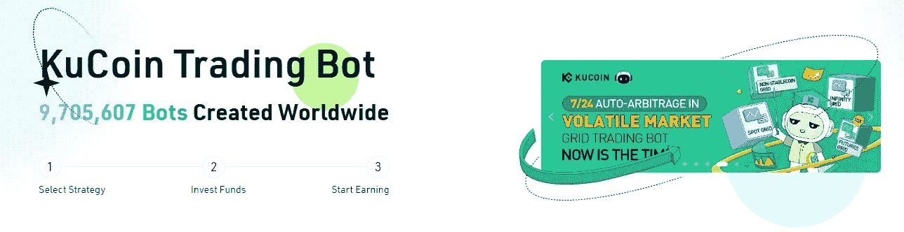

K[**ucoin**](https://www.kucoin.com/ucenter/signup?rcode=rJH29LZ)**是一个流行的加密货币交易所**，目前支持近 800 个交易对和 420 个项目，提供多样化的产品，包括 2021 年初首次亮相的大量交易机器人。

## 特征

*   **现货网格**:现货网格在设定的价格范围内低价买入，高价卖出。
*   **动态再平衡**:一个自动系统买卖资产以维持一个平衡的投资组合。
*   **DCA(美元平均成本)**:资金按照预先确定的时间周期进行分割和投资，从而减轻市场波动的长期不利影响。
*   **无限网格**:对现货网格的一种修改，特别适用于长期来看有很大上升潜力的硬币。
*   **期货网格**:在交易期货时，采用类似的“卖空和高卖”策略。

## 赞成的意见

*   **免费**使用。
*   全面支持**移动应用**。
*   支持**多种多样的交易对**。
*   **安全**。

## 骗局

*   根据硬币的受欢迎程度，**对机器人的最低投资要求有所不同**，有时一对交易量很大的硬币的最低投资要求可能高达 200 美元(尽管交易机器人的配置不一定需要这么大的资金)——因此可能会阻碍希望试水的初学者或交易者。
*   有一个最多 10 个机器人同时运行的**上限。**
*   **不能在库币交易所之外使用。**

[**今天就注册 Kucoin**](https://www.kucoin.com/r/af/rJH29LZ)**，用 Kucoin 内置的交易机器人开始自动驾驶交易吧！**

关于 Kucoin 交易机器人的更多细节，请查看我之前的文章。

 [## 库币交易机器人:终极波动黑仔？

### 让交易在自动化的基础上进行的想法确实非常吸引人；毕竟，谁不喜欢被动…

medium.com](/coinmonks/kucoin-trading-bot-the-ultimate-volatility-killer-cb7e90c13e19) 

# #6 一键式加密

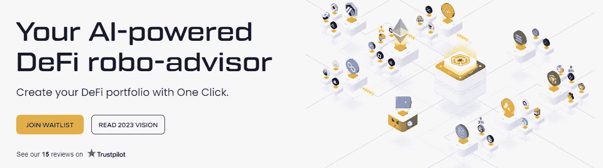

O[**ne C**lick Crypto](https://app.oneclick.fi/sign-up?ref=X%2Bak1CB1aLL2Cg1g&s=MjAtMA%3D%3D)是一组人工智能驱动的交易机器人，它们全天候交易，以有效管理你的加密货币投资组合，**每月跑赢市场 4%**。

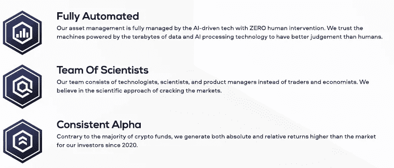

人工智能模型使用**递归神经网络和强化学习来最大化回报，同时交易加密货币**。这些模型建立在类似于亚马逊、谷歌&脸书等主要科技公司用于数据处理和分析的架构之上。

## 特征

有各种不同的策略可供选择，每一种都是为不同的市场条件和投资偏好量身定制的。总的来说，Performer v2 似乎是最健康的机器人，而 Solar 是最保守和最安全的人工智能。

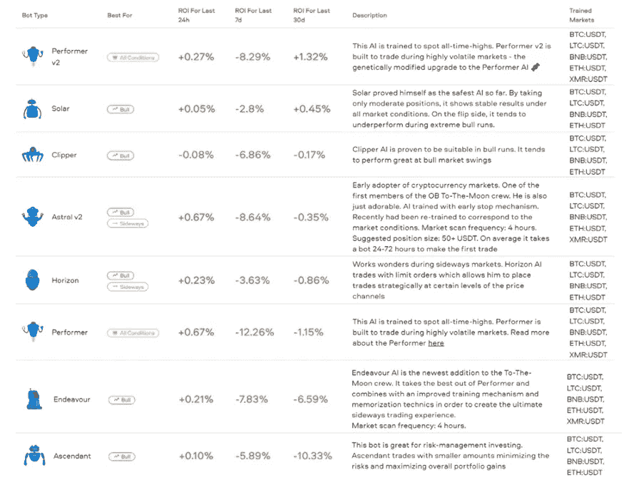

Various available strategies

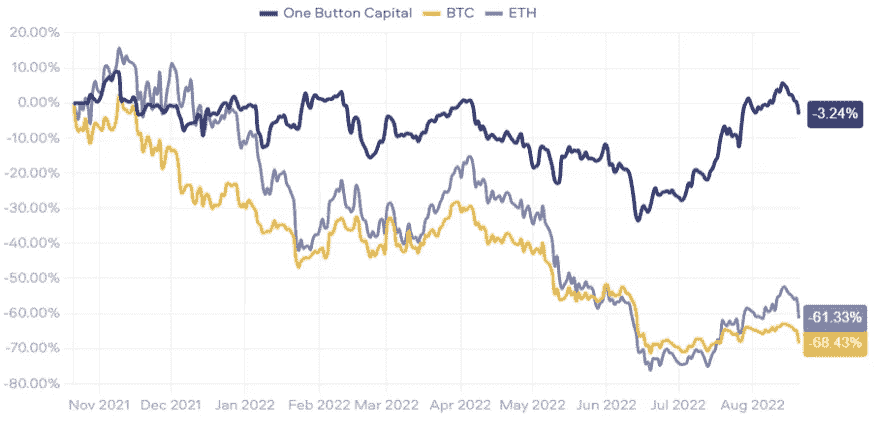

Performance of the AI bot vs simply holding BTC & ETH.

## 赞成的意见

*   **简化**加密货币投资组合管理— **一键**简直就是全部！
*   在缓慢波动的市场中表现良好
*   市场崩溃时可用的**止损**
*   透明的统计数据——关于机器人及其性能的公开数据

## 骗局

*   关于市场对和 bot 类型的交易数据不足；因此，很难确定哪种 bot 在哪种市场条件下最有效。
*   **只能以 1/4 小时为间隔交易。**
*   暂时支持数量有限的交易所— [B **金融**](https://www.binance.info/en/activity/referral-entry/CPA?fromActivityPage=true&ref=CPA_00BFAOLI96) **，** [**币安。美国**](http://binance.us/) **、北海巨妖、比特币基地 Pro、比特瓦沃、比特熊猫 Pro** 。

[**立即注册一键加密**](https://app.oneclick.fi/sign-up?ref=X%2Bak1CB1aLL2Cg1g&s=MjAtMA%3D%3D) **让您的加密货币交易实现自动化！**

欲了解更多信息，请查看我以前的文章。

 [## 如何用 AI 在自动驾驶仪上交易加密货币！

### 了解由人工智能驱动的神经网络如何在自动驾驶仪上自动化交易过程！

medium.com](/coinmonks/how-to-trade-cryptocurrencies-on-autopilot-with-ai-46ae380f126c) 

# 最后的想法

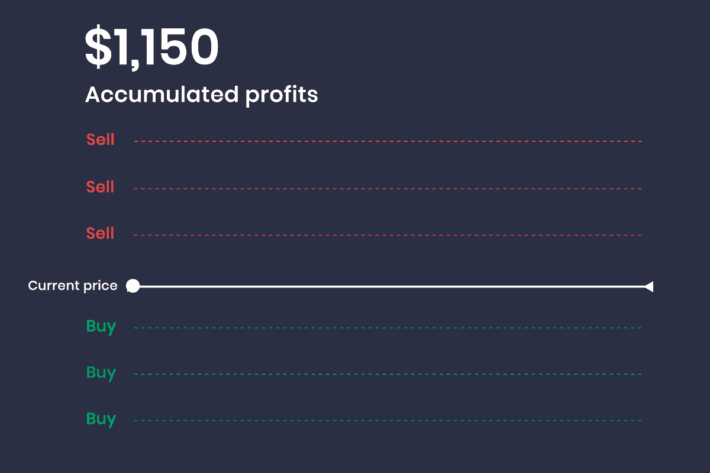

我知道，如果设置正确，交易机器人在创造被动收入方面有巨大的潜力。它自动化了单调的低买高卖，消除了决策过程中的人类情绪，在合理的范围内转化为有效的交易。

你有什么想法？你发现使用哪些交易机器人有利可图？欢迎分享您的经验，并在下方留下您的评论！自动驾驶仪交易愉快！

★ ***不用任何资本的免费 app 挣钱！*** ★

*🎁*[***honey gain***](https://r.honeygain.me/CYBER577DD)**一款被动收入 app，从你未使用的互联网带宽中赚钱。* [*免费获得 5 美元*](https://r.honeygain.me/CYBER577DD) *，无需投资。**

**🎁*[**peer 2 profit**](https://p2pr.me/164388119761fba2ed0531f)*一款被动收入 app，从你未使用的互联网带宽中赚钱。**

**🎁* [**IPRoyal 卒**](https://iproyal.com/pawns?r=532906) *一个被动收入应用程序，从你未使用的互联网带宽中赚钱。**

**🎁*[**earn App**](https://earnapp.com/i/mlztuxu)*一款被动收入 app，利用你未使用的互联网带宽赚钱。**

*★**加密货币投资平台 ★***

**🎁* [***蛋糕 Defi***](https://cakedefi.com/?ref=677920) *一站式投资平台，以高达 100%的 APYs 烘焙被动现金流！* [*用 50 美元存款在 DFI 获得 50 美元奖金*](https://cakedefi.com/?ref=677920) *。**

**🎁*[***Nexo***](https://nexo.io/ref/hce5cfdt5o?src=web-link)**一家先进的受监管数字资产机构，提供即时加密贷款，资产年利率高达 36%，是一家交易所，在 200 多个司法辖区提供 40 多种法定货币的服务。* [*用 100 美元存款获得 25 美元*](https://nexo.io/ref/hce5cfdt5o?src=web-link) 奖金*。***

***🎁* [***币安***](https://www.binance.info/en/activity/referral-entry/CPA?fromActivityPage=true&ref=CPA_00BFAOLI96) *全球最大的加密货币交易所，无需介绍！***

***🎁*[***FTX***](https://ftx.com/referrals#a=traderfx)***专注于衍生品和杠杆产品的集中式加密货币交易所。*****

*****🎁*[***Kucoin***](https://www.kucoin.com/r/af/rJH29LZ)*一个庞大的加密货币交易所，提供有趣的产品，如赌注、自由交易机器人和比特币云挖掘服务。*****

*****🎁* [***火币***](https://www.huobi.com/en-us/topic/double-invite/register/?invite_code=5t5jb) *一个提供多样化产品、免费空投和交易机器人的加密货币交易所。*****

*****🎁*[***MEXC***](https://www.mexc.com/en-US/register?inviteCode=mexc-1NAJC)*一个持有 MX 令牌的加密货币交易所，有着有趣的列表和频繁的空投。*****

*****🎁***一家位于新加坡的加密货币交易所。* [*获得 25 美元*](https://crypto.com/app/fcbsjmf5pb) *在 CRO 赌一张红宝石牌。******

****★ ***加密货币交易机器人*** ★****

*****🎁*[***3 commas***](https://3commas.io/?c=cybery)*一个加密货币交易管理平台，提供 DCA 机器人、电网机器人、期权机器人、期货机器人、HODL 机器人、黄牛终端和完整的投资组合管理，所有这些都来自一个方便的界面。*****

*****🎁*[***Jet-bot***](https://jet-bot.com/?fpr=l1be4)*具有复制交易功能的高级现货、期货交易机器人。* [*试玩账户*](https://jet-bot.com/?fpr=l1be4) *提供 3 天试用期。*****

*****🎁*[***Pionex***](https://www.pionex.com/en-US/sign/ref/mWhH4v29)*一个免费的多功能套利交易机器人，24/7 自动化低买高卖的过程。*****

*****🎁* [***一键资本***](https://app.onebutton.capital/sign-up?ref=X%2Bak1CB1aLL2Cg1g&s=MjAtMA%3D%3D) *一个由神经网络驱动的 AI 机器人，在自动驾驶仪上管理你的加密货币投资组合。*****

****★ ***针对马来西亚投资者*** ★****

*****🎁*[***Luno***](https://www.luno.com/invite/EDXG2X)*在 BTC 用 100 令吉购买 BTC 获得 25 令吉奖金！*****

*****🎁*[***Stashaway***](https://www.stashaway.my/referrals/kenleel9jx)**获得 6 个月免费投资！******

*****🎁****Wahed****代号‘ken lie 1’RM10 报名奖金*****

*****🎁****cap bay****P2P 代码‘8879 C6’RM 100 签约奖金*****

*****🎁* [***亦然***](https://download.versa.com.my/1bAf/referral?deep_link_value=QF218MMB) *用 100 令吉存款获得 10 令吉奖金！*****

*****🎁***用 250 令吉存款获得 10 令吉奖金！******

> ******交易新手？尝试[加密交易机器人](/coinmonks/crypto-trading-bot-c2ffce8acb2a)或[复制交易](/coinmonks/top-10-crypto-copy-trading-platforms-for-beginners-d0c37c7d698c)**********