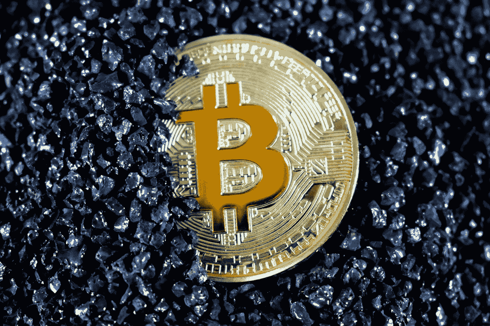

# 我在加密投资中最大的错误

> 原文：<https://medium.com/coinmonks/my-biggest-mistake-in-crypto-investing-792ebe17a867?source=collection_archive---------7----------------------->

从错误中学习，并在未来尽量避免它们是投资成功的关键。这是我在加密投资中最大的错误。

Photo by [Kanchanara](https://unsplash.com/@kanchanara?utm_source=medium&utm_medium=referral) on [Unsplash](https://unsplash.com?utm_source=medium&utm_medium=referral)

> 请注意，这篇文章中的信息不是投资建议，只是我个人的观点。请在投资前做好自己的研究，并考虑所有可能与之相关的风险。

我们都会在投资决策中犯错误。有些导致实际损失，有些导致利润损失。但无论哪种方式，它们都有成本。因此，重要的是从我们的错误中吸取教训，下次尽量避免它们。

我有一个多元化的投资组合，包括当地和美国公司、外汇(主要是美元)——作为应急基金、一些黄金、共同基金、个人养老金账户，当然还有加密货币。我相信现在许多人的投资组合中也有加密货币。

> 标题是“*我在加密投资中最大的错误*”但自然我有很多错误。让我分享 3 个！

## 错误 1——以前没有投资加密

我相信我们都有这样的故事和遗憾，有人在 2012 年告诉我们购买比特币，但我们没有注意。

我也有一个！

对我来说，不是 2012 年，而是 2014 年。我的小弟弟跑向我，要钱。当我问他打算用这些钱做什么时，他的回答是比特币！那时，我已经听说过比特币，但知道的不多。我告诉他不要犯傻！

我这边很有远见！

## 错误 2——不是美元成本平均法

早在 2017 年比特币暴涨到 17000 美元的时候(我猜)，我就已经先投资了。但这是一笔很小的钱。和当时许多被 FOMO 套牢的人一样，我几乎是在最高价买入的。所以，和许多人一样，当价格回落时，我忘记了这件事，没有继续买入。

现在回过头来看，如果从 2017 年到现在继续买，我可能已经积累了很多比特币，会有很大的利润。因此，如果你考虑长期投资，将美元成本平均化为一项资产可能是个好主意。

> 交易新手？试试[密码交易机器人](/coinmonks/crypto-trading-bot-c2ffce8acb2a)或者[复制交易](/coinmonks/top-10-crypto-copy-trading-platforms-for-beginners-d0c37c7d698c)

## 错误 3——不获利

我不确定这是否是一个错误，因为我的投资计划是长期的。如果你没有从中获利，你可以在未来获得很多，甚至可能比在市场上跳来跳去更多。

我在 2020 年夏天开始认真购买加密货币，我的比特币和以太坊成本很低。所以当年底来临时，我在加密货币上的投资已经翻倍了。所以，和其他更安全策略的人一样，我获利并卖出了一半。因此，我把我的资本拿出来了。然而，正如你可能记得的那样，这次比特币没有停在 22.000 美元，而是上涨了很多。

我非常后悔卖掉了我一半的投资，我告诉自己在很长很长一段时间内不要再卖任何东西了！每当我的手按下卖出键时，我都会提醒自己 2020 年底到了。

当比特币一路飙升至 60.000 美元甚至更高时，我对加密货币的投资开始在我的投资组合中占据很大比重。这实际上给了我一个卖出一些并获利的信号，以减少它在我投资组合中的比例。然而，我再次想起了我在 2020 年的经历，我的情绪爆发了。所以我没有卖出任何东西。没想到又回到 20000 美元了。过了一段时间，要卖掉已经太晚了。

Photo by [Maxim Hopman](https://unsplash.com/es/@nampoh?utm_source=medium&utm_medium=referral) on [Unsplash](https://unsplash.com?utm_source=medium&utm_medium=referral)

对我来说，这个故事的寓意是，在投资中绝对没有情绪的空间。不管你以前经历过什么，也不管你有多爱你投资的资产。你实际上需要坚持你所决定的策略，并且感觉那对你是正确的。

尽管如此，我仍然对比特币和其他加密货币进行美元成本平均，以避免我的第二个错误和我未来可能会有的任何遗憾。我希望几年后我可以说我做得很好！

> *加入 Coinmonks* [*电报频道*](https://t.me/coincodecap) *和* [*Youtube 频道*](https://www.youtube.com/c/coinmonks/videos) *了解加密交易和投资*

# 另外，阅读

*   [Bookmap 评论](https://coincodecap.com/bookmap-review-2021-best-trading-software) | [美国 5 大最佳加密交易所](https://coincodecap.com/crypto-exchange-usa)
*   [加密交易机器人](/coinmonks/crypto-trading-bot-c2ffce8acb2a) | [造币评论](https://coincodecap.com/coingate-review)
*   最佳加密[硬件钱包](/coinmonks/hardware-wallets-dfa1211730c6) | [Bitbns 评论](/coinmonks/bitbns-review-38256a07e161)
*   [新加坡十大最佳加密交易所](https://coincodecap.com/crypto-exchange-in-singapore) | [收购 AXS](https://coincodecap.com/buy-axs-token)
*   [红狗赌场评论](https://coincodecap.com/red-dog-casino-review) | [Swyftx 评论](https://coincodecap.com/swyftx-review)