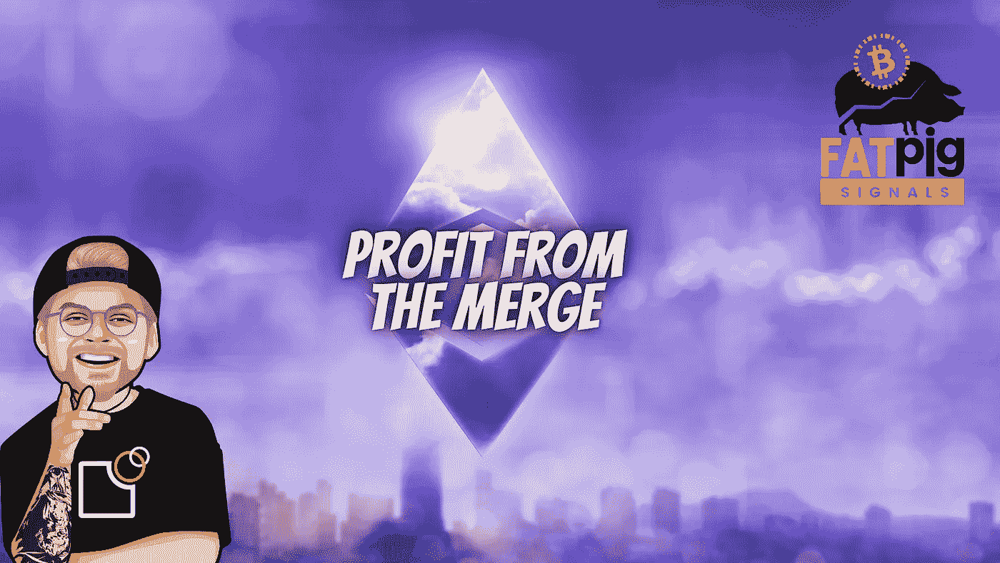

# 我对合并的结论:以太坊 2.0 会爆炸吗？

> 原文：<https://medium.com/coinmonks/my-conclusion-about-the-mer-will-ethereum-2-0-explode-e0f308e39925?source=collection_archive---------4----------------------->

以太坊 2.0 就在眼前，交易者感觉到了从大合并中获利的机会。与此同时，专家们似乎还没有决定，在期待已久的更新后，ETH 是否会像一些投资者希望和假设的那样一飞冲天。

今天，我们想强调一下支持和反对即将到来的价格爆炸的理由…