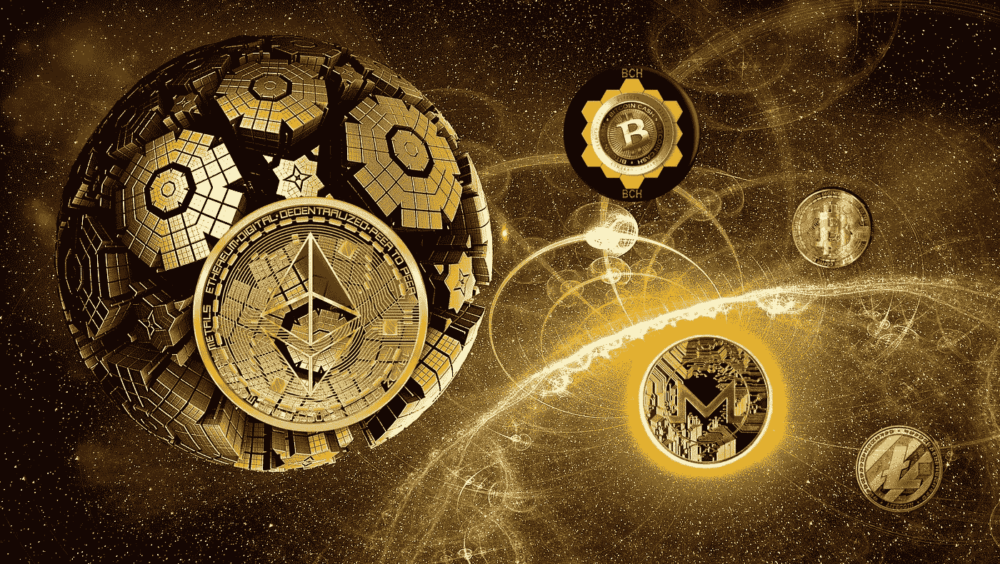

# 我对五年后顶级加密货币的批判性观点

> 原文：<https://medium.com/coinmonks/my-critical-perspective-of-the-top-cryptocurrencies-five-years-later-61a36a5df9ed?source=collection_archive---------5----------------------->

## 加密货币投资

## 关注分散化、性能、安全性和稳定性

加密货币和区块链可以扰乱金融，改善经济，并朝着我们社会的积极方向调整治理，尽管逐步融合可能需要…