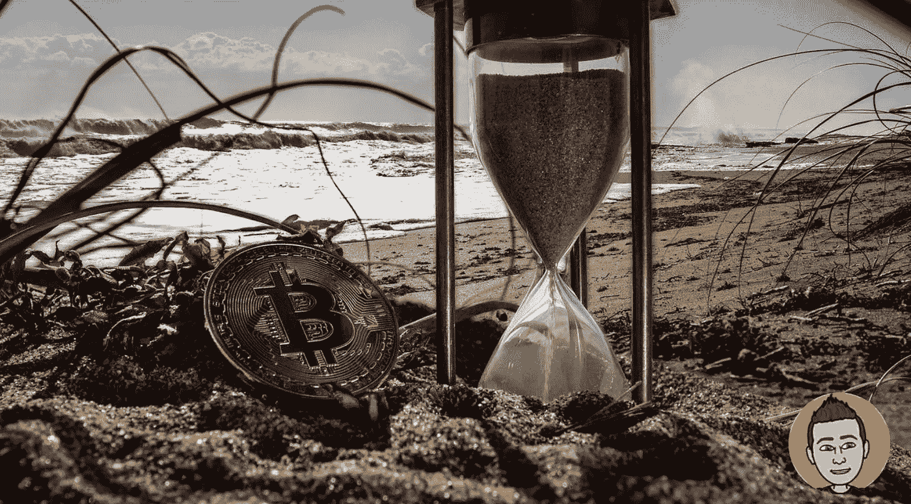

# 我的加密被动收入策略已经改变

> 原文：<https://medium.com/coinmonks/my-crypto-passive-income-strategy-has-changed-487929d16f8d?source=collection_archive---------2----------------------->

在过去的两年里，我大量参与了借出比特币和其他密码来赚取被动收入。这是让我迅速增加投资组合规模的关键方法之一。这是一大笔钱，但我一直知道随之而来的风险。正因为如此，我总是密切关注加密市场和这些特定的服务，寻找任何 FUD 或危险的迹象。