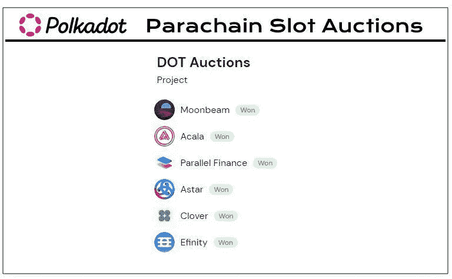
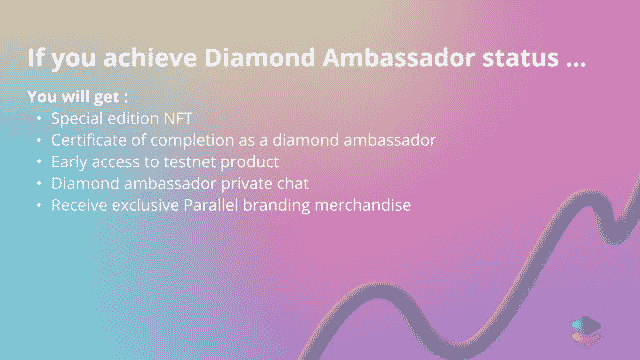
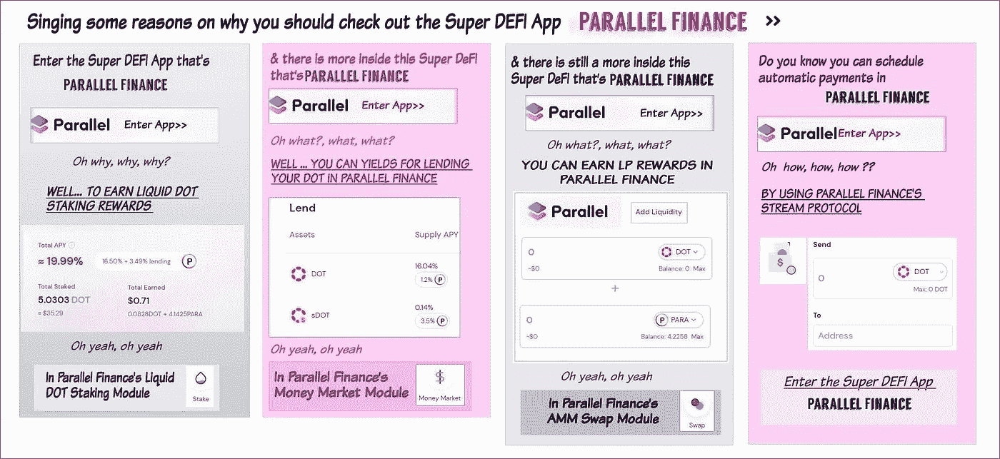
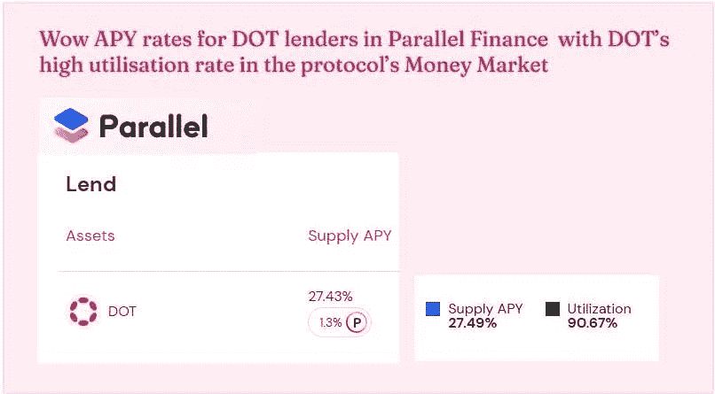
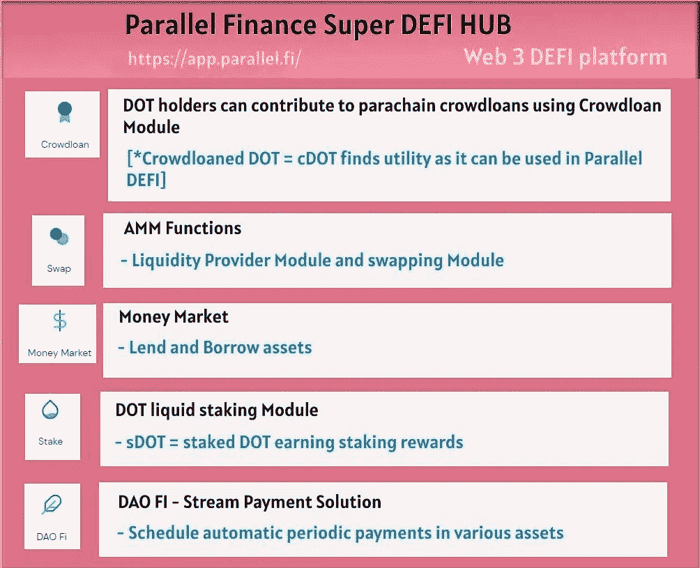
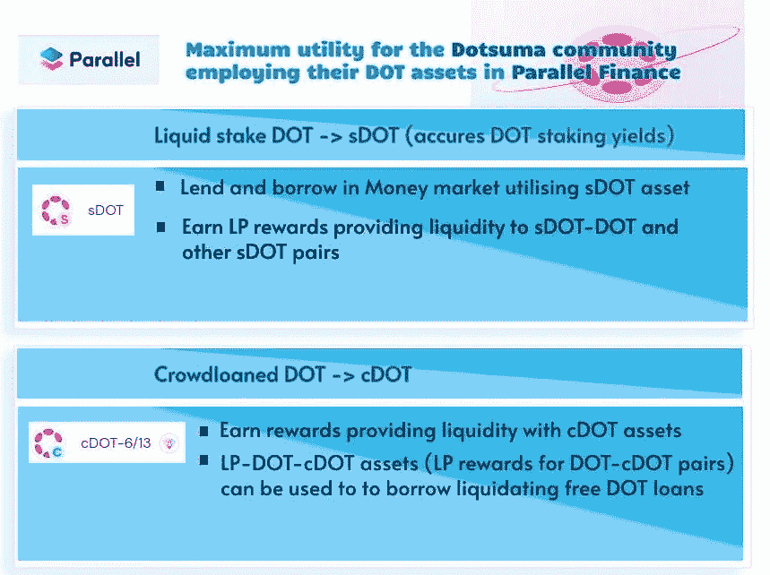

# 作为一名密码作家，我的成长随着并行金融大使而继续

> 原文：<https://medium.com/coinmonks/my-growth-as-a-crypto-writer-continues-as-a-parallel-finance-ambassador-514874e1ddd9?source=collection_archive---------19----------------------->

# 秘密世界已经把我的心和灵魂！！

对我来说，加密是一次冒险，就像区块链项目在短时间内经历的巨大增长一样，我一直在增长关于加密世界的知识和理解。因此，这个空间，无论多么不稳定，多么危险，都让我激动不已，以至于在经历了许多灾难，如 terra 崩溃、通用加密崩溃等之后，我仍然在这个加密空间中。

事实上，crypto 改变并增强了我的批判性思维能力。现在我开始关注更细微的细节，这是我以前讨厌做的。我的整个心态都适应了加密。我知道我在 crypto 的兔子洞里陷得很深，在这个领域我总是有东西要学和做。这对我很重要，让我保持动力。

# 作为一名密码作家，我通过写作和成长与密码打交道

我一直在考虑适当地申请加密写作工作，这是唯一可能的，因为自 2020 年以来，我作为一名作家在 Hive、Steem 和 Publish0x 等平台上经历了所有的增长。无论我从所有与加密相关的理解中获得了什么样迷人的见解和知识，我都通过我的书面文章来分享。

很明显，加密是我的激情所在，我是一个铁杆加密爱好者。现在，结合我对写作和分享知识的热情，我作为一名密码作家的旅程一直是个人参与的。在这些不同的写作平台上，我从我的读者那里得到了一些赞赏，这让我保持了动力。

# 我的加密之旅让我成为了平行金融的大使

今年，我想在这个领域有更多的发展，但很少有新的事情发生。

我参与了平行金融的写作，参加了该项目的大使计划。这本身是出乎意料的，因为我偶然遇到了这个 DEFI 平台。

# 我的波尔卡多特协会最终引导我走向平行金融

## 从一个无法在 Polkadot 网络上下注的小点持有者开始

大约在 2020 年，我一定知道了点加密，因为它突然成为市值排名第四的加密公司。我带来了一些点时，它是 4 美元，很失望，因为我已经晚了，因为最低赌注要求成为 40 点，从 20 点。作为一个小投资者，我已经从 Polkadot 那里赚不到赌注回报了。

[From Polkadot’s Website >>](https://polkadot.network/)

# Polkadot 的 Parachain Crowdloans 使我成为 DOTSUMA 生态系统的积极参与者

## 我有机会投资波尔卡多特的 Parachain Crowdloans

然后在去年，出现了这个 Parachain Buzz，我明白这是我将 DOT 投资于一些有前途的 Parachain 项目的机会，这些项目的种子即将在 Polkadot 区块链中播种。

我可以通过在 Polkadot 的 Parachain Crowdloans 上贡献我的点来支持我想要作为 Parachain 的项目，以赢得 Polkadot 区块链中的 Parachain 插槽。

我的优势在于，我知道我应该支持哪些有前途的项目，这些项目已经在 Polkadot 的姐妹区块链 Kusama Blockchain 上赢得了 parachain slots。草间弥生是 Polkadot 的金丝雀网络，所以在 Polkadot 发生任何发展之前，它都是在草间弥生区块链中进行测试的。

由于在 Polkadot 上启动之前，Parachain 拍卖流程已经在 Kusama Blockchain 中完成，我了解了哪些项目有可能在 Polkadot 中赢得 parachain 槽，以及在 Kusama Network 上赢得 Parachain 槽的项目。

在这个阶段，我通过 youtubers 上的 Lark Davis 和 T2 coin bureau 的教育视频了解了大部分细节。

# 在使用其 crowd loan 模块向 Parachain Crowdloans 捐款时遇到了并行金融

我决定通过 Acala 自己的众筹贷款平台支持 Acala，该平台根据我贡献的点数按比例返还液体众筹贷款点或 LcDOT(如果我没记错)，我可以在 Acala DEFI 中使用这些点。

后来，我听到 Lard Davis 提到，如果一个人使用 Parallel Heiko 的 Crowdloan 平台为 Polkadot 的 crowd loan 做贡献，我们就可以在 Parallel DEFI 中使用 cDOT。这又是液体网点，因为网点的流动性可以在 DEFI 中使用。

因此，我使用 Parallel Heiko 的 Crowdloan 模块将我的 DOT 贡献给了两个项目(Astar 和 Efinity ),最终我获得了 cDOT 和一些 Para 令牌。

这是我第一次接触平行金融，当时我并没有多想。

然而，这让我与平行金融建立了联系，因为我必须申请那些 cDOT 和 Para 令牌。

## 成为平行金融 Defi 用户，因为我可以在那里使用我的 cDOT 和 Para 令牌！！

Parallel Finance 随后推出了一些功能，使我能够利用我的 cDot 和 Para tokens 赚取更多收益。因此，我有理由继续参与平行金融平台，尽管我从未在 Polkadot 的众筹贷款中支持过平行金融。

# 变成了一个平行的金融大使，以探索作为一个密码作家的其他机会

[Source](/@mariajmnz26/parallel-finance-ambassador-program-4f0f32147850)

后来，我听说了 [Parallel 的大使项目](/@mariajmnz26/parallel-finance-ambassador-program-4f0f32147850)，当时我正渴望作为一名密码作者进一步成长。我不得不报名参加[大使项目](/@mariajmnz26/parallel-finance-ambassador-program-4f0f32147850) [填写表格](https://docs.google.com/forms/d/e/1FAIpQLSfltHbeY4rTJE3g9SzTnIB5vOqmKwPplH_LQqQJi7230_GAkA/viewform?vc=0&c=0&w=1&flr=0)，然后过了一会儿，我用 Medium platform 写了我的第一篇平行金融文章，因为我的文章需要是 Medium 帖子。

我从没想过它会被那里的文章策展人成员@CryptoFluffyCat 批准，但它得到了批准，我得到了我的第一个 75 分！！

从那时起，我就一直在撰写关于平行金融的文章，并传播对这个超级 DEFI 应用程序的认识。

# Parallel Finance 向我介绍了 Medium Platform，我在这个平台上发展了自己的受众

我记得我的第一篇文章也为我赢得了第一个媒体追随者，他评论说他喜欢读我的文章。

我的另一篇平行金融文章有一位 [Coinmonks 出版物](https://medium.com/coinmonks/about)的编辑找到我，问我是否可以在他们的出版物上发表我的加密文章。 [Coinmonks](https://medium.com/coinmonks/about) 是一个非盈利的加密教育平台，这些天我总是在他们的出版物上发表我的加密相关文章。

***因此，感谢平行金融，我已经展开了作为密码作者的翅膀，也在媒体平台上写作，并在那里获得了一些读者。这一切又一次非常鼓舞人心。***

这些小小的积极成果，让我觉得我作为一名密码作家还是有前途的，尽管密码并没有让我在物质上变得富有。

# 平行大使赚取积分和工作水平，以达到钻石水平，并赢得额外津贴

[Source](/@mariajmnz26/parallel-finance-ambassador-program-4f0f32147850)

作为一名 [Parallel 大使](/@mariajmnz26/parallel-finance-ambassador-program-4f0f32147850)，我不会因为在 Parallel 的各种 DEFI 模块上写内容而获得 HKO 或 Para token 奖励，我会获得提升我等级的积分。一旦我获得足够的积分成为钻石大使，我就可以-

特别版 NFT 和其他额外津贴，你可以在这里阅读，希望包括一些很酷的平行金融商品。

[Source](/@mariajmnz26/parallel-finance-ambassador-program-4f0f32147850)

## 我的记分卡作为平行大使执行任务

现在，我赢得了 1525 分，成为了 1 级青铜大使。要达到 12 级并成为钻石大使，我需要赚取超过 7031 分。耸耸肩…

我的下一个目标是首先完成 1 级，获得 2204 分，然后进入 7 级，这将使我成为银牌大使。我还有 500 多点可以赚！！

到目前为止，我已经因为写文章、制作关于平行金融的信息图表而获得了积分。发布文章和信息图的分数是 75 分，但在我的一些帖子中@CryptoFluffyCat 给了我 100 多分，说我自己创建的信息图的文章质量非常好！！

# 我作为平行大使的成长历程类似于我作为密码作者的成长历程

***所以，这就是我的平行金融之旅，我通过使用它的众贷平台与它建立了联系，现在我正在跟踪这个 Super DEFI 平台的发展，并作为一名*** [***平行金融大使***](/@mariajmnz26/parallel-finance-ambassador-program-4f0f32147850) ***来写这个平台。***

这类似于我自己作为一名密码作者的发展过程，学习密码，然后通过文章分享我的见解，并从中赚取一些东西，无论是以积分的形式还是来自 Hive、Steemit 和 Publish0x 等平台的密码。

***你可以看我关于平行金融的文章来了解这个超级 DEFI App。***

[平台首创 Defi 功能，平行金融拓展效用](/@kikctikcy/parallel-finance-expands-its-utility-with-defi-functions-having-initiated-in-the-platform-9f4f5ee14897)

[通过并行金融的收益率货币市场功能为 LP 提供商提供更多奖励](/@kikctikcy/more-rewards-for-lp-providers-with-the-yield-money-market-functions-of-parallel-finance-452834f737a3)

[华友世纪现在终于可以利用我们的 DOT 进行平行融资，通过 DOT 流动赌注赚取收益了](/@kikctikcy/hurray-now-its-finally-possible-to-utilize-our-dot-on-parallel-finance-to-earn-yields-with-dot-5117ef23900c)

[平行金融比该领域的大多数 DEFI 平台提供更多服务](/coinmonks/parallel-finance-offers-more-services-than-majority-of-the-defi-platforms-in-the-space-f76fe94b7121)

[Parallel Finance 的现金流使自动定期付款计划成为可能](/coinmonks/parallel-finances-stream-makes-scheduling-of-automatic-periodic-payments-possible-372fc802fa6f)

[流动赌注 sDOT 累积赌注奖励，可在 Parallel Finance 的 DEFI 生态系统中使用，以获得更多收益](/coinmonks/liquid-staked-sdot-accrues-staking-rewards-which-can-be-used-in-parallel-finances-defi-ecosystem-f823b14967cb)

[并行金融的增值 Web 3 金融服务使其成为 DEFI 超级 App](/coinmonks/value-added-web-3-financial-services-of-parallel-finance-make-it-a-defi-super-app-ebe04a7f8e66)

[在平行融资中使用您的 cDOT 资产作为抵押品的无风险 DOT 贷款清算](/@kikctikcy/liquidation-risk-free-dot-loans-using-your-cdot-assets-as-collateral-in-parallel-finance-8aed8cb6f46f)

[了解 Parallel Finance 提供的全面的 Web3 金融服务](/coinmonks/a-look-into-the-comprehensive-web3-financial-services-that-parallel-finance-offers-444046a9f7a2)

[新时代创新 Web3 金融解决方案 DEFI 超级 App——并行金融](/coinmonks/innovative-web3-financial-solutions-of-new-age-defi-super-app-parallel-finance-650638fe5bc3)

[在协议的货币市场中，DOT 的高利用率让并行金融中的 DOT 贷款人惊叹 APY 利率](/coinmonks/wow-apy-rates-for-dot-lenders-in-parallel-finance-with-dots-high-utilization-rate-in-the-142f0ddafb7d)

# 作为平行大使，这次我创作了一首关于平行金融的歌曲

写平行金融让我非常熟悉它的一些核心功能，以至于我在这个 Super DEFI 应用程序上写了一首歌，你可以在这里听到

My song on Super DEFI App — Parallel Finance

如果这首歌得到了歌曲验证会员@ParaOne 的认可，那么我还可以获得 110 分，尽管我已经为我创作的歌曲歌词制作了 75 分-

***“进入超级 DeFI app 并行那就是金融”***

# 平行金融已经进化成超级 DEFI App 了！！

随着我不断探索并行金融，我实际上已经意识到并行金融不是通常的普通 DEFI 平台，它只提供 AMM 功能。

# 概述并行金融提供的一些核心服务

## 平行金融的众筹贷款服务

甚至在 Parallel Finance 作为 Polkadot 区块链中的 parachain 上线之前，它在 Kusama Network 中的 Parallel Heiko 平台就被用于为 Polkadot 众筹贷款做贡献。

我现在想起来了，我用 Parallel Heiko 的 Crowdloan 模块为 Polkadot 的 Parachain Crowdloans 做了贡献。

## 平行金融的 AMM 功能

今年年初，平行金融在波尔卡多特成为一种连锁业务。起初，它激活了 AMM 功能，cDOT 和 Para 持有者可以提供流动性并获得 LP 奖励。交换功能也是 Parallel Finance 的 AMM 功能的一部分。

## 并行金融的货币市场模块

后来，Parallel Finance 推出了货币市场模块，用户可以借出和借入资产并获得收益。

## Parallel Finance 的流动点标桩服务

然后，Parallel Finance 推出了它的 Liquid DOT Staking 模块，用户只需要 5 个 DOT 就可以下注并获得 DOT Staking 奖励。这些流动性点投资者接受 sDOT，他们可以在货币市场上贷款并赚取收益，或者向 sDOT/点对提供流动性并赚取收益。

现在，使用 Parallel Finance 的 Liquid DOT Staking 模块，我可以获得之前无法获得的 DOT Staking 奖励！！

## 并行金融的 Dai Fi 功能与流协议

嗯，Parallel Finance 有更多的功能，如其 Stream 模块，用于在一段时间内发送和接收自动付款，这对于支付工资和分配授权令牌或股息非常有用

我在歌曲— ***“进入超级 DEFI App —并行金融”*** 中只提到了并行金融超级 Defi App 的部分功能

# 关于平行金融

Parallel Finance 提供一系列有价值的 WEB3 金融服务，旨在成为一个安全的 DEX，其用户界面易于任何人使用。

对于 DOT 用户来说，Parallel Finance 通过其 Crowdloan 模块和 Liquid Saking DOT 模块提供了非常有用的服务。这是一个面向 DOT 用户的一站式 DEFI 中心，用户可以在这里轻松参与 Polkadot 区块链的各个方面。

Parallel Finance 有一个雄心勃勃的目标，即让 10 亿用户加入其平台，它的目标是通过证明是一个安全和用户友好的 DEX 来实现这一目标，提供用户需要的有价值的 web3 financal 服务。

***进入超级 DEFI App 这里是并行金融-***

 [## 平行金融

### 平行提供保证金赌注，拍卖贷款，赌注衍生品，和 AMM 曲线，使显着更高…

parallel.fi](https://parallel.fi/) 

**平行融资渠道和资源**

**推特**——[https://twitter.com/ParallelFi](https://twitter.com/ParallelFi)

**不一致**——[https://discord.gg/DeyEntFT](https://discord.gg/DeyEntFT)

**白皮书**—[https://parallel fi . git book . io/parallel-finance/polkadot-network/白皮书](https://parallelfi.gitbook.io/parallel-finance/polkadot-network/white-paper)

## 感谢您的阅读…

> 交易新手？尝试[加密交易机器人](/coinmonks/crypto-trading-bot-c2ffce8acb2a)或[复制交易](/coinmonks/top-10-crypto-copy-trading-platforms-for-beginners-d0c37c7d698c)