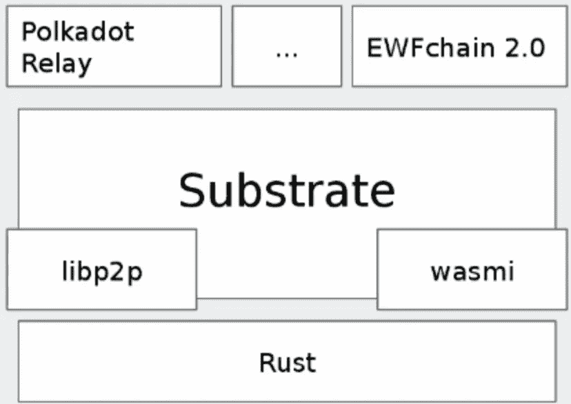

# 我的波尔卡多特，基板，和生锈的冒险

> 原文：<https://medium.com/coinmonks/my-polkadot-substrate-and-rust-adventure-50929ad69714?source=collection_archive---------6----------------------->

~dwulf

Polkadot Para-Chain

## 记录我的道路

这更像是对波尔卡多特生态系统的专业推进。通过加文·伍德的演讲和众筹拍卖的成功，我已经确信了它的真实性。

在经济上，我说到做到,《密码之神》杂志投资了 3000 美元，而 DOT 公司也立即投入了资金。

## 经济学路径

坦白地说，它是最容易上手的，虽然 polkadot.js 接口不是最好的，但我足够理解如何按照说明操作并让它为我工作。

将波尔卡多特团队几乎所有的初始种子资金投入 DOT，将财富分给宇宙团队，我认为宇宙团队拥有与波尔卡多特同等的能力，并且比波尔卡多特更灵活。其余的种子在 BTC 和 ETH。

我们的绿女巫 DAO，agent A.I .算法确定了未来的最佳策略，并为 2021 年至 2022 年的战争基金诱导了 x33 资本和稳定性的增长。

良好的稳定收益，即使是在熊市，与奥兹阿卡拉的黑客，露娜/UST 的正确欺诈。在大(任意)集中冻结比特币基地，摄氏，等账户期间。更不用说监管阴谋集团的疯狂，以及他们对新 CBDC 世界秩序的坚持。

如果我们要避免过度监管，那么我们必须关注第 0 层、第 1 层和第 2 层。第 3 层和以上是过于饱和的集中控制，比特币基地和摄氏是大美国为中心的，但即使是币安正在迫使 KYC 和冻结帐户。

底线是，*总是第 0 层*，这也是我选择工程道路的原因。

## 工程路径

保持它的唯一方法是了解它。了解铁锈和基底，手工制作或通过 github 了解对位链的真正底层机制。波尔卡多特中继链就在它所在的地方，副链给它添加了。Astar 实现了 WASM 和 EVM 的互操作性，Acala 通过 LDOT 实现了打桩灵活性，提供了绕过 28 天传统 DOT 打桩冷却时间的选项。Nodle 通过蓝牙提供了更灵活的 NODL 挖掘。还有很多其他的，PARA 等。

我曾经接触过 Rust，来自 Python 和 JavaScript lazy，但开始严格使用；在我从一名黑客变成一名工程师和编写正确代码的过程中，我更认真地打字。

还有 C/C++的早期暴露，这让我想要更多的保护，因为我知道我可能会因为一些 seg-fault 错误而搬起石头砸自己的脚或者毁掉整个网络。

Rust 是严格的，它通过强制所有类型借用与其自身和其他函数相关联的内存来占用所有内存。如果有任何内存错误，通过不能编译来消除所有内存错误。直接消除 99%的人为逻辑错误，留下 1%与坏库或硬件异常有关。

我从 udemy.com 订购了一门防锈课程，重温我在防锈方面可能忽略的任何东西。我还参加了即将于 10 月 27 日开始的关于 edx.org 的课程，名为波尔卡多特入门，由比尔·拉布恩和拉德哈克里希纳·达萨里教授。

此外，我还报名参加了 2023 年 1 月 10 日开始的真正的波尔卡多特学院，只是为了打基础。

所以在接下来的 6-7 周，一个半月，我会深陷其中，到最后会发生 3 件事。我将有一个工作和可操作的 Polkadot 验证器，对 Rust 和 Substrate 有更深的理解，并建立托盘，与奇偶校验，Acala，Astar 或 Nodle 的合同。

## 经济运行

对于手头的投资，在道，他们运行良好，尽管熊市。波尔卡多特与 LDOT 的赌注收益率高达 16%，ATOM/OSMOSSIS 流动性池的 APY 为 30%。两者都是复利，这意味着赚取的利息被重新投资于赌注和流动性池，这意味着更大的增长资本基础来赚取利息，奖励继续增加到更大的每日份额。分配给道成员的资本津贴，如果没有被消耗，也将被重新投资。所以如果你不使用它，刀不会失去它。

绿女巫刀的这个组件，在一个金库里，需要 5 个释放签名中的 3 个才能进入金库。

## 结论

熊市并没有让绿魔道毫发无伤，超过 30，000 美元的损失来自过度利用 DOT 和借入澳元购买 ACA，DOT 和 lcDOT。其他投资几乎弥补了这一损失。所以刀到年底应该能收支平衡。

BTC、DOT 和 ATOM 很便宜，34%的 BTC、33%的 DOT 和 33%的 ATOM 是游戏计划中的收购。收益率作为核心收入还不理想，尽管它已经大量补贴了许多剩余支出，包括租金、电话/数据和包括汽车维修在内的物流。收入还没有达到“去你的”钱的水平，也没有接近“去他妈的一切”的水平。

到今年 2022 年底，我应该准备好了，在 2023 年带着强烈的 Rust 原则，参加 Polkadot 的“官方”学院，这可能是另一个 4 周。这是一个捕捉所有的情况下，我错过了任何在 edx 上的波尔卡多特课程介绍。

我已经在 DevOps 为区块链之外的软件项目工作(web 开发，嵌入式物联网，其他项目。)，也为波尔卡多特和宇宙开发了几个链，我在波尔卡多特和基质的巩固将把我带到我希望的水平。

> 交易新手？试试[加密交易机器人](/coinmonks/crypto-trading-bot-c2ffce8acb2a)或者[复制交易](/coinmonks/top-10-crypto-copy-trading-platforms-for-beginners-d0c37c7d698c)