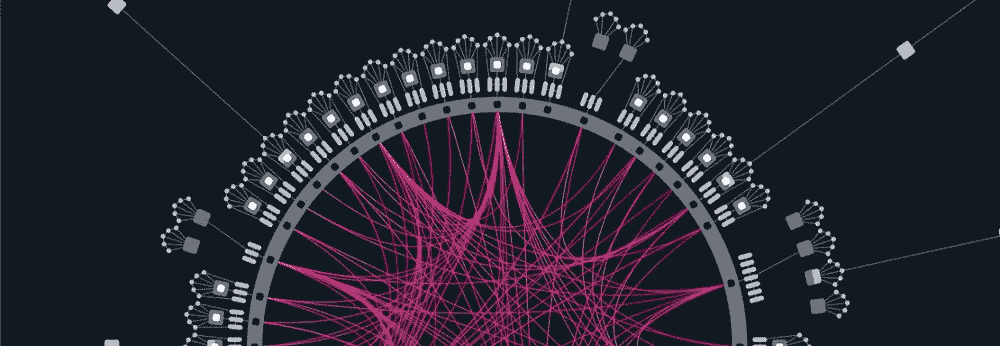
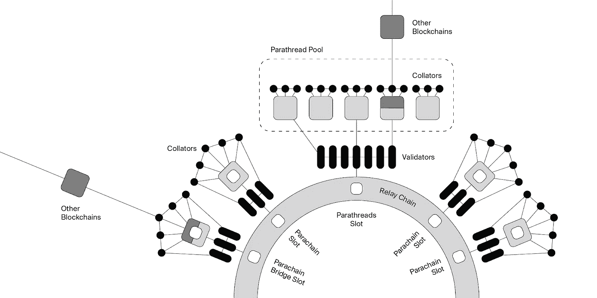
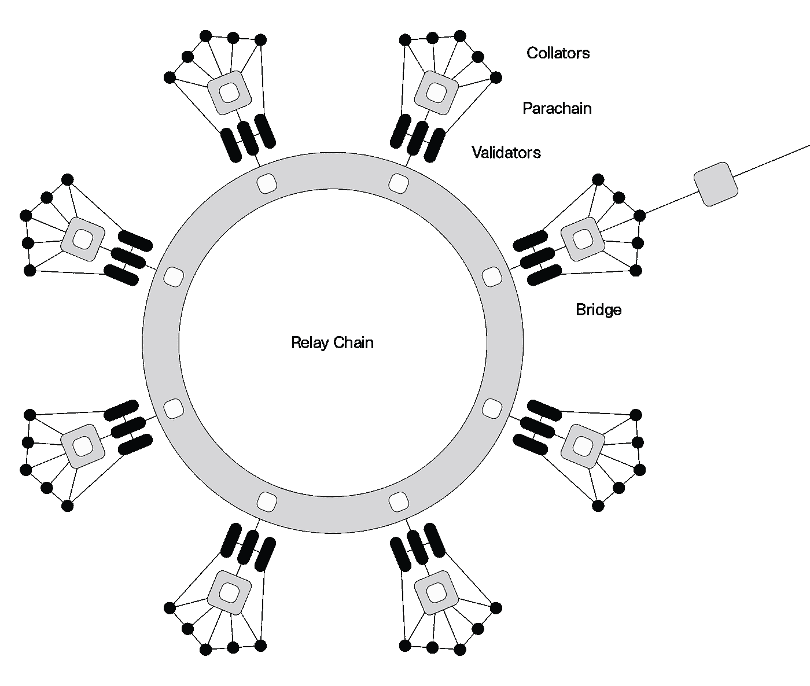
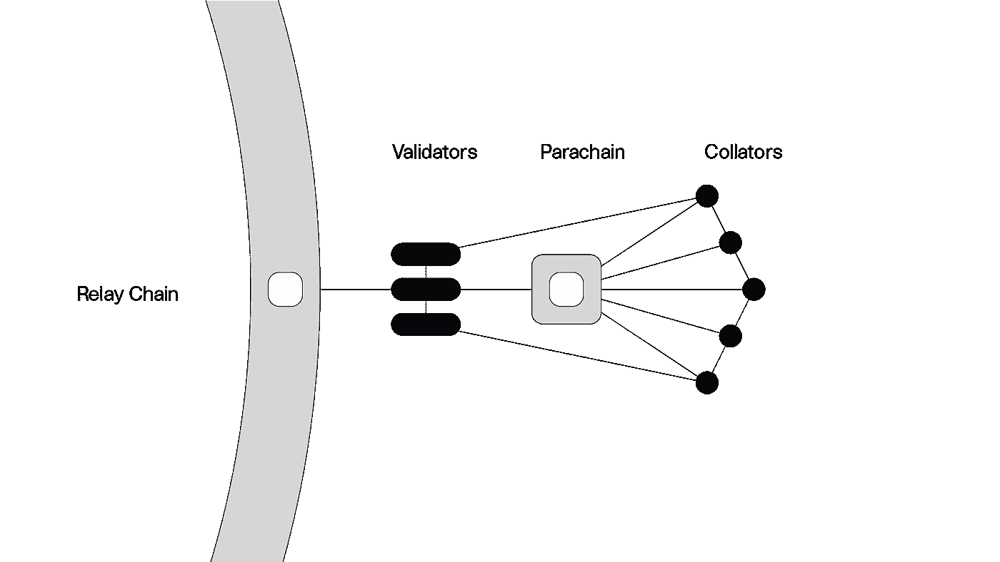
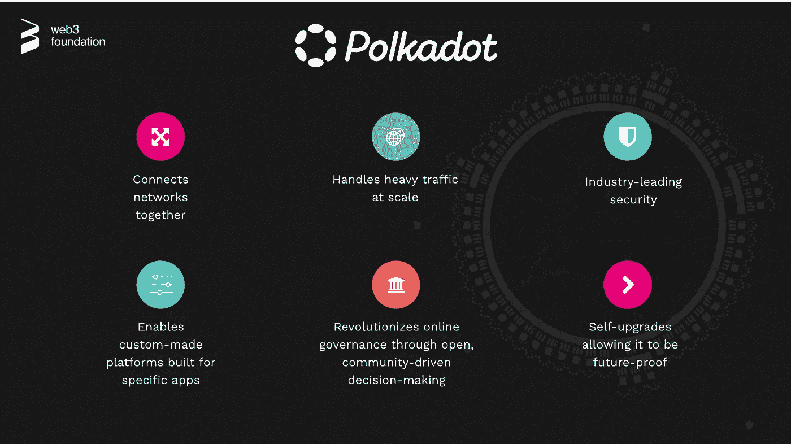

# 我的波尔卡多、基底和铁锈冒险:波尔卡多建筑

> 原文：<https://medium.com/coinmonks/my-polkadot-substrate-and-rust-adventure-polkadot-architecture-3e6a4c13e4f7?source=collection_archive---------5----------------------->

~dwulf

Polkadot Architecture

## 第一周

所以这是我上这门课的第一天，我决定把我的笔记放在媒体和网上，这样我就可以说明我学到了什么。这只是我上课时的笔记，以及对我已经知道的东西的评论和对与其他区块链的关系的评论。

## 链条的布局

Polkadot is a heterogeneous multichain with shared security and interoperability.

## 中继链——第 0 层区块链

中继链是波尔卡多特的中枢链。中继链故意具有最小的功能，例如，不支持智能合约。主要职责是协调整个系统，包括副链。其他具体工作委托给 parachains，它们有不同的实现和特性。

> 在第 0 层，故意施加最小的功能，如没有智能合约或其他程序，减少了第 0 层的攻击媒介。

## 副链和副螺纹

Polkadot 可以支持许多执行槽。这些插槽就像计算机处理器上的核心(例如，现代笔记本电脑的处理器可能有八个核心)。这些核心中的每一个都可以一次运行一个进程。Polkadot 允许这些插槽使用两种订阅模型:parachains 和 parathreads。副链有一个专用的插槽(核心),就像一个不断运行的过程。并行线程在一个组中共享槽，因此更像是需要被唤醒和运行不太频繁的进程。

> parachain/parathread 动态的一个优点是，由于 parachain 是由昂贵的拍卖过程决定的，这涉及标上 DOT 以获得 Polkadot 互操作性。而 parathread 允许在 Polkadot 互操作性上付费。这允许较小的或没有预算的项目参与进来。

## 验证器

验证器是中继链节点，如果被选入验证器集，会在中继链上产生块。通过奖励，他们被激励为网络的最大利益而行动。

> 这是每个人都想去的地方，运行一个活跃的验证器，在链上产生块，如果与网络一致，就以点的形式获得赌注奖励，如果不一致，就被削减。应该注意的是，提名者在验证者的有效质量及其被选为主动验证者的机会中起作用。验证者可以被视为雇主，提名者可以被视为雇员。

## 校对机

排序器是副链和中继链上的完整节点。它们收集副链事务，并为中继链上的验证器生成状态转换证明。它们也可以发送和接收来自其他副链的信息。

> 在验证器/命名器构建块的情况下，整理器验证块的证据，验证它确实是有效的块。

## 布里奇斯

区块链桥是一种允许任意数据从一个网络传输到另一个网络的连接。这些链通过桥是可互操作的，但是可以作为具有不同协议、规则和治理模型的独立链存在。在 Polkadot 中，网桥连接到中继链，并通过 Polkadot 共识机制进行保护，由整理器维护。

> 网桥是圣杯，是与其他网络及其各自的区块链真正互操作的机制。比如波尔卡多到宇宙。他们也是黑客大捞一笔的头号目标。

Polkadot 利用称为中继链的中央链与称为副链(并行链)的多个异构且独立的分片链进行通信。中继链负责为所有副链提供共享安全性，以及副链之间无信任的链间可交易性。换句话说，Polkadot 旨在解决的问题就是上面讨论过的问题:互操作性、可伸缩性，以及由于分割安全权力而导致的较弱的安全性。

## 副链—第 1 层区块链

副链是一种特定于应用程序的数据结构，它是全局一致的，并且可以被中继链的验证器验证。它们的名字来源于与中继链并行运行的并行链的概念。最常见的是，副链会以区块链的形式出现，但并不一定非要是真正的区块链。由于它们的并行特性，它们能够并行处理事务并实现 Polkadot 系统的可扩展性。它们完全由中继链保护，并且可以与其他副链通信。

副链由一个叫做整理器的网络维护者维护。整理器节点的作用是维护副链的完整节点，保留副链的所有必要信息，并产生新的候选块以传递给中继链验证器，用于验证和包含在 Polkadot 的共享状态中。collator 节点的激励是 parachain 的一个实现细节。

Detailed Parachain

> 它的设计非常优雅，这也是我被波尔卡多特吸引的原因。其他的副链，尤其是 Astar，正在与 EVM 和 WASM 合作，寻找一种方法来融合以太坊领域和它的区块链。

## 波尔卡多特—主要特点

Key Features

好的，大部分事情我已经知道了，但是最好把它们都集中在一个地方。

> 交易新手？试试[密码交易机器人](/coinmonks/crypto-trading-bot-c2ffce8acb2a)或者[复制交易](/coinmonks/top-10-crypto-copy-trading-platforms-for-beginners-d0c37c7d698c)