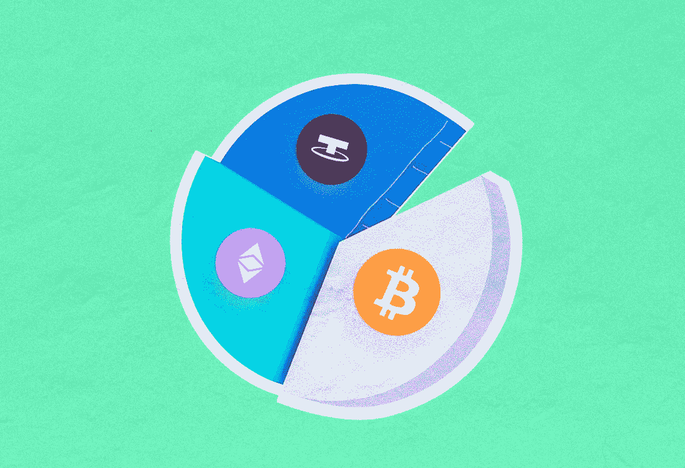

# 我认为我的投资组合将在 2023 年成为百万富翁。

> 原文：<https://medium.com/coinmonks/my-portfolio-that-i-think-will-make-a-millionaire-in-2023-c4e64b66a6da?source=collection_archive---------0----------------------->

今天是 2022 年 9 月 21 日，美联储将利率提高了 75 个点。预计今年不会有其他惊喜。考虑到完整的战争场景非常接近，事实上，2022 年最后一个季度和 2023 年将相当复杂。然而，我已经为 2023 年创建了一个投资组合，我认为它将在 1 年内，最迟在 2 年内，在成为百万富翁的水平上留下非常好的收入。我在这里创建的清单，**不是财务建议**。
在选择硬币时，我做了一个篮子，因为除了高风险的硬币，我还选择了低风险和高市值的硬币。让我们按顺序看看硬币:

*   FTX·托肯(FTT)

FTT，FTX 交易所的硬币，是第 24 大硬币(32 亿美元)，即时市值。它目前的价值为 79 美元，注册为 FTT·ATH，价值为 24 美元。我认为他将很容易看到 200 美元的可能大幅上涨。美国将大力支持增加硬币，我认为这是新的 BNB。

*   近似协议(NEAR)

紧随 FTT 之后，排在第 25 位。NEAR 的市值为 31.4 亿美元，目前为 40 亿美元。今年年初，它有机会通过大幅上涨吸引相当多的投资者，并将其价值提高到 20 美元。在接下来的拉力赛中有很大期待的 NEAR，在我看来是会让 SOL 和 AVAX 做出大涨的一个。

*   埃尔隆德

Egld 排名第 44。埃尔隆德的市值为 11.2 亿美元，是第二个硬币对，我认为在下一次反弹中，它将像 sol 和 avax 一样增加。(第一个我写的是近)。

*   网关令牌

GT，Gate.io 交易所的硬币，像币安青年队这样的潜力硬币在这里崛起，并在币安和比特币基地等主要交易所上市，目前是 4.26 美元，在我看来非常便宜。只要股市稳步前进，它就没有理由在两年内涨到 50-60 美元。事实上，这是我期待惊喜的硬币之一。

*   以太坊名称服务(ENS)

ENS 是我在 6 美元的水平时发现的，并添加到我的列表中，目前交易在 14 美元的水平。在以太坊网络上进行名称销售交易的 ENS，会随着市场的崛起而有较大的上升。随着以太坊的增加，会增加的非常快。在我看来，它甚至不需要一年就能达到 100 美元。

*   寿司

我期待惊喜的第二枚硬币是寿司，属于寿司互换的硬币。这个地方也在稳步发展，1.08 美元对这个地方来说真的是小菜一碟。考虑到它的所作所为，期望它尽快进入市值前 80 名(目前排在第 158 位)和两位数的市值并不是乌托邦式的期望。

*   外星世界(TLM)

该是一枚考验投资者耐心的硬币的时候了。TLM 在经历了大幅下跌后没有大的波动，表现出相当水平的波动，是我投资组合中百分比最低的两个硬币之一。但这枚我选择风险较大的硬币，1.5 年前看到 7.19 美元，现在的价值是 0.022。即使接近 ATH 值也超过 100 倍。这就是为什么我认为冒一点点风险去看一看是合乎逻辑的。

*   以太(ERN)

我购物车里的最后一枚硬币，ERN，是我认为风险第二大的硬币，所以我把它加入我的购物车，比例很低。考虑到其 ATH 价值为 74.19 美元，当前价值为 1.47 美元，我认为有 100 倍的上涨潜力。在选择这些项目时，在比特币基地上市是我的一个重要标准。除此之外，我检查项目，并通过查看它们是否对技术有贡献来评估它们。ERN 已被列入名单，作为一个硬币，通过这些标准，可以采取的风险。

这是我创造的篮子里的硬币。明年我会再看看他们的价值观，当我成为百万富翁时，我会更新这篇文章:)如果有你想让我评价或谈论的硬币或项目，你可以在评论中写下。感谢您的阅读:)

> 加入 Coinmonks [电报频道](https://t.me/coincodecap)和 [Youtube 频道](https://www.youtube.com/c/coinmonks/videos)了解加密交易和投资

# 另外，阅读

*   [最佳期货交易信号](https://coincodecap.com/futures-trading-signals) | [流动性交易回顾](https://coincodecap.com/liquid-exchange-review)
*   【Huobi 的加密交易信号 | [Swapzone 审查](/coinmonks/swapzone-review-crypto-exchange-data-aggregator-e0ad78e55ed7)
*   [最佳加密交易机器人](/coinmonks/crypto-trading-bot-c2ffce8acb2a) | [购买索拉纳](https://coincodecap.com/buy-solana) | [矩阵导出评论](https://coincodecap.com/matrixport-review)
*   [Coldcard 评论](https://coincodecap.com/coldcard-review) | [BOXtradEX 评论](https://coincodecap.com/boxtradex-review)|[uni swap 指南](https://coincodecap.com/uniswap)
*   [比特币基地评论](/coinmonks/coinbase-review-6ef4e0f56064) | [德里比特评论](/coinmonks/deribit-review-options-fees-apis-and-testnet-2ca16c4bbdb2) | [FTX 评论](/coinmonks/ftx-crypto-exchange-review-53664ac1198f)