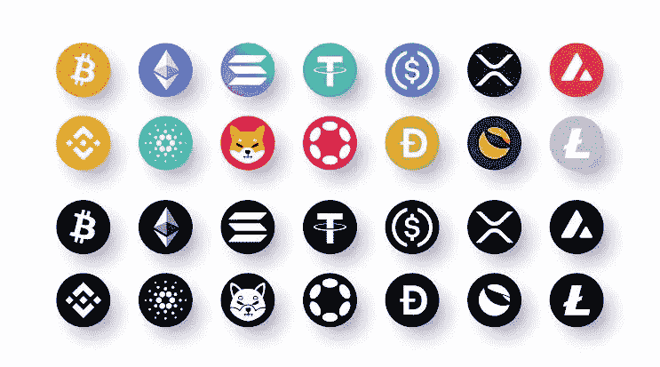

# 我的投资组合将在两年内在 Gate.io 股票市场获得 50 倍的收益。

> 原文：<https://medium.com/coinmonks/my-portfolio-that-will-earn-a-lot-in-2-years-on-the-gate-io-stock-market-aa6f505cce0?source=collection_archive---------8----------------------->

我认为每个人的投资组合中除了低风险的硬币之外，还应该有 5-10%的高风险、有潜力的硬币。因为如果你很早发现一个美好的项目，你可以看到不可思议的上涨。我从 Gate.io 选择这些硬币，我把它视为币安交易所学院。因为有我愿意损失的金额，我想知道两年不交易会有什么结果。我选择了这些硬币作为研究的结果，在诸如供应情况、项目特征、团队等标准之后。我预计这个篮子在 2 年内平均能赚 50 倍，但我投资了少量，因为风险很高。此内容不是理财建议。让我们来看看名单上的硬币。

*   弗洛基伊努(弗洛基)

在制作潜在名单时，迷因币是这里的必备物品。我选的是 Floki，作为一个社区是他们当中最强的。它有可能在即将到来的牛市中采取类似柴犬的举措。其瞬时值为 0.00000797 美元。如果币安列出它，我们可以看到它从这些零开始大量减少。

*   婴儿金币(Baby Doge)

我单子上的第二个也是最后一个迷因硬币。比 floki 风险大，但是当 meme 币上涨的时候，我预计会有一个惊喜的上涨。当前值:0.00000001343 美元。

*   穿山甲(巴布亚新几内亚)

这种硬币在上一个牛市中获得了大量的投资者。它仍然有很多支持和潜力。即使其即期价值接近 0.11 美元和 4.97 ATH，它也将增加近 50 倍。

*   NFTD 协议

在 NFT 升值的情况下可以获利的硬币。这是一个让你认为它远远低于其价值的项目，因为它包含在 Bnb 网络中。它的价值是 0.52 美元，ATH 是 22 美元。这是一笔不错的交易，如果 NFT 公牛队达到 40-50 美元的水平，也不会令人惊讶。

*   飞碟游戏(UFO)

作为一个去中心化的游戏平台，我觉得明年会呈现很大的增长。因为有些游戏项目涨幅不错，但能保住位置的不多。当游戏项目再次成为趋势时，这枚硬币会迅速升值。当前价值:0.00000218 美元

*   马哈道(马哈)

另一个潜在的项目是马哈道。其 ATH 为 25.59 美元，现值为 0.9934 美元。我认为 2023 年将很难看到这些水平。一年后会涨到 10 美元。

*   埃克塞德姆(XED)

这是一个即时价值为 0.06459 的项目，其从玩到赚的趋势已经获得了 444 美元的 ATH。很难再次达到这些值，但有可能通过新的开发达到 2 位数的水平。

*   玻色子协议

一个关于电子商务权力下放的项目。这一领域尚未出现增长，非常接近其最低水平。0.2352 的值在将来看起来很低。

*   单元格框架(单元格)

我觉得瞬间值为 0.2525 的细胞币，很有网桥的潜质。我猜一年后会涨到 5 美元。

*   德黑维(DHV)

这是名单上的两个硬币之一，我认为将随着 defi 趋势增加。它的价值是 0.8990 美元，但我认为它将在 2 年内达到 30 美元。

*   赛博(SBR)

茄属植物的交叉链稳定交换。当 SOL 再次崛起的时候，SBR 也会随之而去。它的值是 0.002390，我认为它的 ATH 是 1.12 美元。

*   DeFi 屈服方案(DYP)

第二个我认为会随着 defi 趋势增加的硬币是 DYP。它有很大的潜力，我预测它将在很短的时间内从 0.1573 达到 1-2 美元的水平，并在 2 年内增加到 20 美元。

*   普托科尔

对宠物起作用的项目供应量高于其他硬币。我选择这个的原因是选择不同区域的硬币，无论哪个趋势都有机会赢。因此，如果这里有一个趋势，就会有一个增长，除此之外，我不期望像其他人一样大幅增长，我把它作为一个惊喜硬币。当前价值:0.01087 美元

*   AIOZ 网络(AIOZ)

单子上的最后一枚硬币。这枚硬币也是一个更令人惊讶的项目，考虑到流通供应率，0.04965 美元非常低。到 2023 年，这一价值可能达到 0.1 美元，到 2024 年可能达到 1 美元。

这是我创造的投资组合中的惊喜硬币。明年我会再次审视它们的价值，并比较它们的潜力。如果有你想让我评价或提及的币或项目，可以写在评论里。感谢您的阅读:)

> 交易新手？试试[加密交易机器人](/coinmonks/crypto-trading-bot-c2ffce8acb2a)或者[复制交易](/coinmonks/top-10-crypto-copy-trading-platforms-for-beginners-d0c37c7d698c)