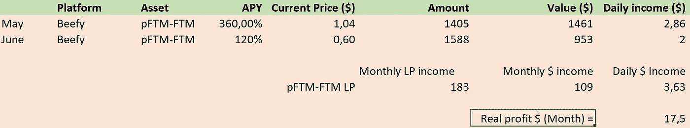
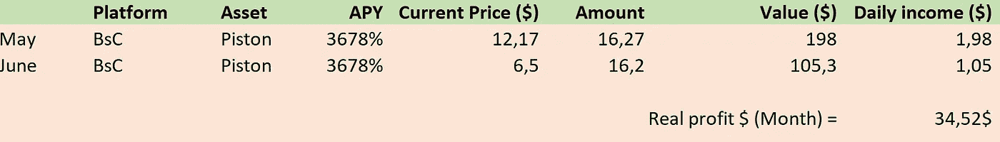
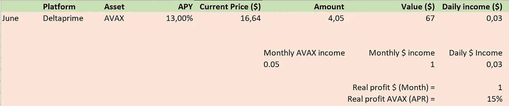
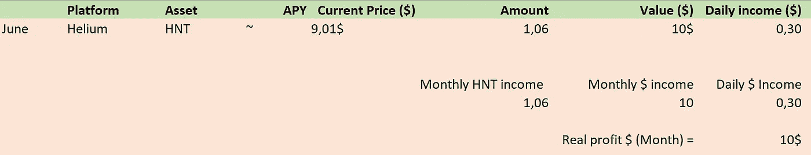
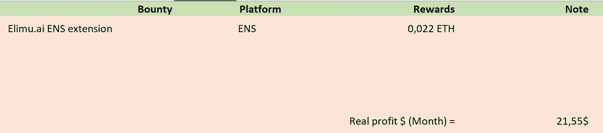
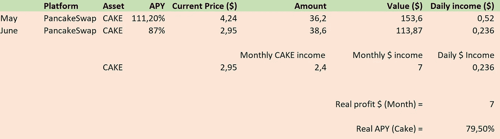
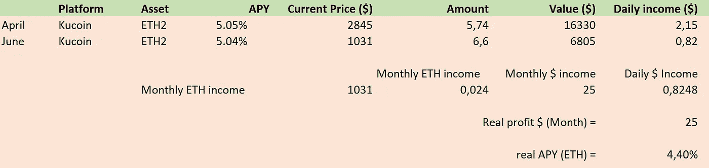

# 每月 100+$美元；我六月的半被动加密收入！

> 原文：<https://medium.com/coinmonks/my-semi-passive-crypto-income-of-june-a1261e8b5894?source=collection_archive---------1----------------------->

## 我做什么，从哪里来的！

# 被动收入

亲爱的冒险家们，大家好，欢迎回到新版的*“我假装通过 cryptos passive income 赚钱，而我的整个投资组合都是红色的”*系列…:’)这个月我们将有几个新条目，我个人对此非常兴奋！

尽管我在努力，但鉴于比特币和其他加密市场目前的价格走势，很难找到有良好回报的优质项目。尤其是现在，每一个商业模式不可持续的项目都在崩溃，投资这类项目的人都在艰难地倒下。我几乎没有看过任何关于滴滴或者其他“高产”节点的帖子。不过，这是好事！熊市会像流感一样，杀死所有不可持续的项目，把好的留下！

# 所以，结果！

## pFTM-FTM 流动性

pFTM-FTM on Beefy!

我们将从 pFTM-FTM 流动性头寸开始。这应该是本月的热门话题，T2 的终极流动性头寸将把我从熊市中拯救出来，但我错了。它拥有经典庞氏骗局所具备的一切。高回报，低风险，短期收益。令人难过的是，在 pFTM 失去与 FTM 挂钩之前，我们几乎坚持到了月底。一旦我卖出我的头寸，1 FTM 已经只有 0.85 pFTM，否则我可以从中赚更多。我能够在钉住汇率降到微不足道的 0.48 英尺之前卖出，所以我绝对不会推荐这项投资！我只赚了 17 美金的小利润，不值得冒这个险:)

> 交易新手？试试[密码交易机器人](/coinmonks/crypto-trading-bot-c2ffce8acb2a)或[复制交易](/coinmonks/top-10-crypto-copy-trading-platforms-for-beginners-d0c37c7d698c)

## 活塞令牌

Piston returns

**我向你呈现；我的另一个错误是…** 当滴滴疯狂起飞时，我决定“早点进入”并买入 piston token。它一开始表现很好，我的 300 美元很快变成了 370 美元，然后跌到了现在的水平。贪婪占了我的上风，所以我坐在这里，每隔一天就要求收回一点我的初始投资。我甚至不会把利润称为“利润”，因为它只是我最初存入的活塞令牌，再也无法收回。肯定 0/10，不会建议投资活塞！

## 增量质数

My avax deltaprime bonuses!

最后的新条目之一是 deltaprime。Deltaprime 是一个抵押不足的贷款平台，你可以拥有 500%的 TVL。这意味着你可以借出 4 倍的存款，这太棒了！他们还包括措施套利赌注奖励协议，所以这就是为什么它能够实现近 13%的赌注 APY！我应该写一篇关于 Deltaprime 如何工作的文章吗？👀

## 氦

My HNT rewards :DDD

本月的下一个新成员；我的新氦矿机！延迟 8 个月交货让我付出了高达 560 美元的代价，这让我失去了获得可观投资回报的任何机会。矿工得到了 1 HNT 多一点的回报！已经叫我百万富翁了…我在放置路由器时犯的一个错误是把它和另一个矿工注册在同一个地方，减少了我得到的奖励。我现在正在攒钱支付搬迁费，应该就在这个时候。让我们看看下个月是否会有所不同！

## 慷慨

My bounty bonuses!

这个月奖金方面没什么进展。上个月我在[做奖金赚了 800 美元，但是这个月我花在这上面的时间更少了。我还是设法做了一个 15 分钟的工作，支付了 20 美元，这很好。**做好准备不过，我正在准备一些报酬丰厚的奖金，下个月我会有很多时间去接受它们！**](/coinmonks/my-900-a-month-semi-passive-income-overview-of-may-34efff1d4b82)

## 蛋糕

还是那句话，蛋糕这个月表现稳定。2.4 蛋糕的利润让我印象深刻，除非你看看它的性价比——当然……APY 自推出储物柜以来一直萎靡不振，这是意料之中的，因为越来越多的人锁定，降低了 APY。我们仍然有 80%的真实 APY，所以对于被动收入，我肯定会推荐使用蛋糕金库！也许我应该在下一轮牛市重新计算我所有的利润？

## ETH2

My ETH2 returns on kucoin!

由于 ETH 在过去的一个月里损失了近 66%的价值，我在 Eth 上的被动收入也减少了。我用我的一些可用的菲亚特以这么低的价格买入 Eth，这样更高的金额从何而来。在那之后，这项投资就没什么进展了，相当无聊。因此，我会推荐这个加密和投资选项 10/10。越无聊越好，对吗？

# 所以总而言之

我仍然不富有，但是我们正在到达那里。**我这个月赚了 117 美元**，这不算多，但鉴于我们正处于熊市，我投资的总价值低于 10K，我们每月仍能获得 1%的可观收益，这绝对不算差！

你有什么问题，建议，主张，实现，汇总，准备，告诉我！我很乐意知道你的想法！

*看我上个月的故事* [*这里*](/coinmonks/my-900-a-month-semi-passive-income-overview-of-may-34efff1d4b82) *就知道五月份发生了什么！*

**其他链接:**

*   为了让我的故事对每个人都免费，请给我买杯咖啡吧！[https://ko-fi.com/igormd](https://ko-fi.com/igormd)
*   如果你想开始交易，可以考虑用我推荐的库币！[https://www.kucoin.com/r/rf/1de5d](https://www.kucoin.com/r/rf/1de5d)
*   想成为页面上的特色吗？给我发邮件！