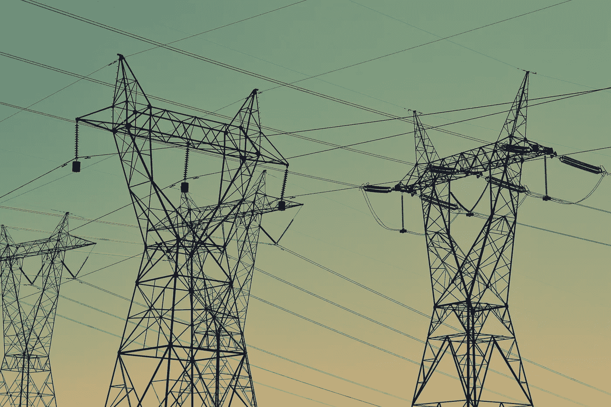

# 我的州允许天气杀死人

> 原文：<https://medium.com/coinmonks/my-state-is-allowing-the-weather-to-kill-people-713366ab3133?source=collection_archive---------22----------------------->

## 加密货币的繁荣可能是罪魁祸首。

Photo by [Fré Sonneveld](https://unsplash.com/@fresonneveld?utm_source=unsplash&utm_medium=referral&utm_content=creditCopyText) on [Unsplash](https://unsplash.com/s/photos/energy?utm_source=unsplash&utm_medium=referral&utm_content=creditCopyText)

2021 年 2 月，德克萨斯州遭受了一场巨大的全州范围的冬季风暴。随着气温下降，越来越多的人打开了暖气，这给电网带来了严重的压力。一些地区轮流停电，最终电力完全中断。超过 200 人死亡。