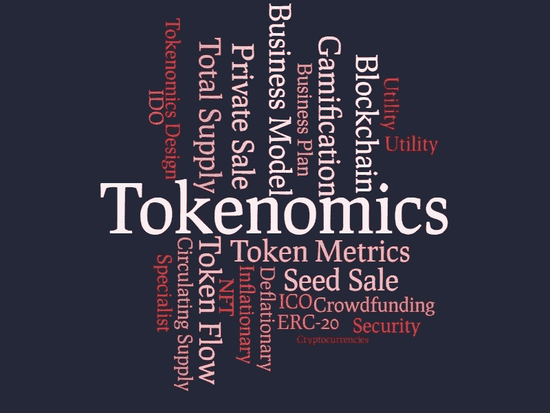

# 我创造和评估记号组学的策略

> 原文：<https://medium.com/coinmonks/my-strategy-to-create-and-evaluate-tokenomics-8b48dec2f088?source=collection_archive---------8----------------------->

Web3 和去中心化正在将令牌组学带入下一步。

当我从零开始设计一个记号组学或被要求评估一个记号组学时，我会考虑什么？

Tokenomics 是一个融合了 *Token* & *经济学*的新词。Token 不再是简单的一行代码，它拥有一些特性。Token 成为 Web3 /加密货币领域新兴项目的新指标，作为一种众筹形式和激励用户使用平台的工具。

我看到人们犯的第一个错误是赋予象征经济学太多的责任。首先，必须进行适当的产品设计，并且必须评估和重新评估清晰的(和数字设计的)商业模型。

产品设计、商业模式和商业计划通常是随后进行的，而在我看来，应该采取的正确方法是迭代模式。就像计算机和计算软件试图随机猜测一个问题的解决方案(使用收敛算法)一样，企业家往往过于相信他们的产品是有价值的，他们会从人们那里购买产品，并为联合创始人创造足够的现金流来维持业务。

在建立一家初创企业的不同阶段，会出现许多变量，最大的错误是认为令牌经济学将解决和优化所有这些变量。令牌组学将是另一个既能启动也能关闭引擎的工具。

但是让我们看看记号组学应该是什么样子。

首先，我们必须定义不同标记之间的一些差异，这些差异可以在标记组学中发挥作用。

实用令牌:这些是最常被利用的。在 2017 年 ico 的丛林泡沫之后，公用事业令牌正在几个不同的商业领域开始另一场热潮。它们不代表金融工具，它们不应该提供被动收入/收益，它们允许用户在生态系统中采取行动。

**安全令牌**:它们代表金融工具，通常需要接受国家(或国际)金融机构的监管。它们可以代表用于金融目的的房地产和其他资产的一部分、公司股票等等。他们的监管远比公用代币严格。

**NFT** :不可替代代币。它们代表一些特定的、不可分割的、不总是可互换的东西，因为它们通常代表不同的功能、不同的工具、权利或游戏角色。

我将要谈到的令牌组学将主要针对公用令牌(和辅助 NFT)，而对于安全令牌，动态主要与它们将代表的传统金融模型有关。

以下是我对“模仿记号经济学”项目提出的主要问题，

## 真的需要令牌吗？

首先，我们必须了解项目中是否真的需要令牌。采用内部令牌有几种方式:
—初始众筹
—扩大现有项目规模
—激励
—交易和/或数据私有化

令牌组学旨在涵盖所有这些方面，但其设计将基于不同的设计层，从宏观令牌组学到内部令牌流。

## **什么是令牌实用程序？**

在设计令牌组学时，对“令牌真的需要吗？”是，那么必须找到并设计令牌的特性/实用程序/应用程序。否则，为项目预融资(预售、种子销售、私人销售)的人面临的风险是，在上市后，代币将变得一文不值，造成巨大而持久的价格下跌。

## **那么这个代币打算用来做什么呢？**

*   服务、产品、资产、权利的内部采购
*   在 DAO(或同等机构)中的投票权
*   交换服务或数字产品的工具
*   获得专属服务

## **什么象征性行为？通货膨胀还是通货紧缩？**

我读到有人把通货膨胀定义为仅仅增加流通供给的象征。无论如何，如果一个通货膨胀标志的供给是有上限的，它应该被称为“有上限的通货膨胀标志”，由于流通供给的增加(使通货膨胀率随着时间的推移而降低)，通货膨胀率可能会随着时间的推移而降低。
下面是一个数值例子。

> 假设一个令牌的上限是 1000 个令牌。最初向市场发布 100 个令牌，每月发布 10 个令牌作为用户奖励。
> 第一个月，通货膨胀率为 10，发行的代币总数为 100，因此通货膨胀率为 10%。
> 第二个月，通货膨胀将是 10 个发行的代币，总共流通 110 个代币，因此通货膨胀率将是 9.09%。
> 仍有通货膨胀，但通货膨胀率在下降。

此外，由于一些燃烧机制，这种表征可能会导致局部通胀(意味着流通供给随着时间的推移而增加)，但总体上是通缩的。

燃烧机制通常存在于一些交易费用和其他使用机制中，但有几种方法可以使象征性通缩。

## **什么给项目带来价值？**

在包括令牌组学的加密货币项目中，必须防止大规模抛售，这可以通过几种方式实现。所有防止大规模抛售的策略的共同点是给予**代币持有者**好处，以进入专属区域、内容、服务等形式。

与股权众筹的巨大区别在于，当代币价格被淹没时，公司仍能从业务中获利，因此代币持有者会发现自己钱包里的东西一文不值。这就是为什么从一开始，顾问和项目创始人就必须以一种道德和智力诚实的态度，对令牌的未来用途有一个清晰的想法。

## 什么不同层次的记号组学？

宏观代币组学是代币在不同领域的划分:
—团队
—储备
—营销
—流动性池
—种子轮
—私人轮
— ICO/IDO…
—赌注(最终)
—奖励(最终)

这只是代币分配，只是代币经济学的第一层(宏观代币经济学)。

第二层不是资金分配(来自预融资和众筹)，因为这肯定是一个商业决策。第 2 层是所谓的**令牌指标**。
Token Metrics 字面意思是代币的度量:
—总共将发行多少代币？
—有上限供应还是无上限供应？
—多少位小数(如果有)？
—令牌将在哪个区块链上发行和/或桥接至哪个区块链？
—什么是可行权时间表？
—初始市值是多少？

在令牌组学的第 3 层**中，必须定义和设计令牌流**，以确保所有令牌在每个时刻都知道它们应该去哪里或停留在哪里。我目前用来设计安全令牌组学的工具是“零和游戏”，这是我在大学期间用化学反应堆学到的，当应用于令牌流时也完全有意义。我已经在我合作的项目中使用了它，它带来了一些有趣的见解。

## **快速、可扩展的生态系统应该追求什么样的特征？**

*快速便宜的交易*。为此，一些网络，如币安，多边形，阿尔格兰德和许多其他更好地表明比其他人。

*第 2 层解决方案*:生态系统的某个部分可以进行链外管理，以减少链上交易，并以特定的频率(秒/分钟)进行同步。

*易于使用的平台*:用户应该很容易获得平台的特性，并了解他/她可以通过本机令牌获得什么优势。

请记住，许多项目正在评估单个令牌的发行，但相反，应该建议他们创建一个双令牌，一个用于列表，另一个(类似的稳定硬币)用于内部使用，以避免服务的价格波动。仅供内部使用的稳定硬币可以用作价格的会计工具/测量单位，以避免价格变得太贵(如果本地代币上涨)或太便宜(如果本地代币价格下跌)。

治理可以是另一个“第二令牌”用例。一个用于执行内部活动的工具令牌和一个用于测量和分配投票权的治理令牌。治理令牌通常由 NFT 表示，比如在[土地安全](https://www.thelandsafe.io/)和其他生态系统中。

顺便说一下，令牌组学需要进行大量的思考，你可以向这方面的专家提出的最糟糕的问题是，根据白皮书或文字材料，对令牌组学“给出反馈”。

有几个方面需要考虑，通常，令牌组学唯一可见的层是“层 1”，有时是“层 2”，这意味着令牌的所有内部分布都是不可见的。

我希望这篇文章能帮助你理解什么是令牌组学，以及为什么要花很多精力去创造一个好的令牌生态系统。

如有任何问题，请随时联系我们，并与您认为可以从中受益的人分享这篇文章！

迈克

> 交易新手？试试[密码交易机器人](/coinmonks/crypto-trading-bot-c2ffce8acb2a)或者[复制交易](/coinmonks/top-10-crypto-copy-trading-platforms-for-beginners-d0c37c7d698c)