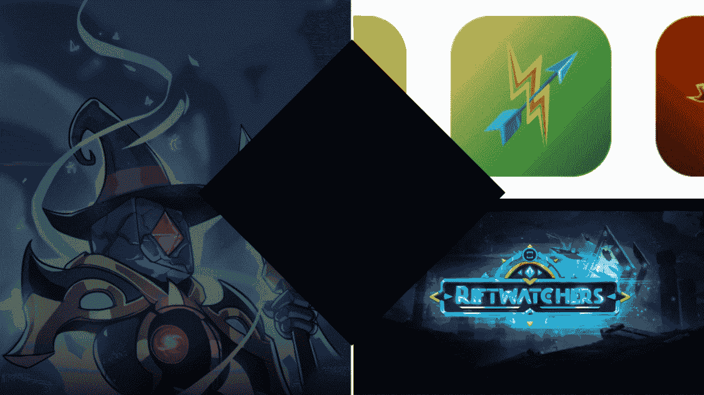
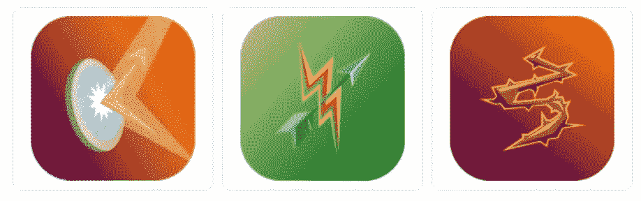
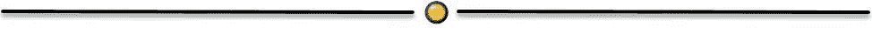
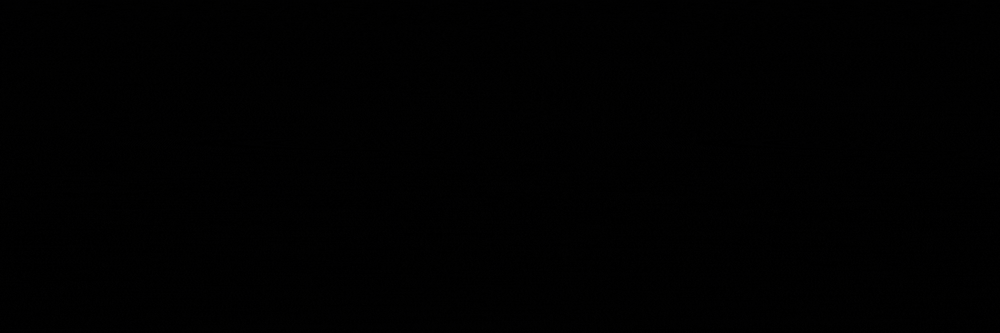

# 我对 3 个新规则集的看法

> 原文：<https://medium.com/coinmonks/my-thoughts-on-the-3-new-rulesets-9adb0f1b4160?source=collection_archive---------13----------------------->

Splinterlands 最近引入了 3 个新的规则集。

在过去的几周里，分裂之地发生了太多的发展和变化，这对我来说是游戏中最令人兴奋的部分之一。再加上一次加密崩溃，从事情的发展来看，我们在接下来的几个月里会经历一段时间。好消息是，我们的分散资产似乎保持良好。

你可能已经注意到了一件新的事情，那就是我们有了 3 个新的游戏规则集，让游戏变得更加有趣！！

[来源](https://docs.splinterlands.com/platform/release-notes)

这些是荆棘，魔法反射和回火。这些新的规则似乎让很多人感到惊讶，因为我们现在有太多其他分心的东西，如 Runis，中立召唤师，哦，还有 FTX 等的底部已经从加密市场中掉出来了。！

作为 Mylor Crowling 的超级粉丝，我对荆棘最感兴趣，因为我喜欢我的敌人在对我进行近战攻击时得到荆棘！我担心的是 Mylor 可能没那么有用，但事实似乎并非如此，Mylor 的租赁成本仍然非常高。

有了荆棘，我们现在需要非常小心使用近战攻击，因为它可能会让你损失惨重。我们可以用远程攻击或者魔法攻击来代替攻击吗？使用远程攻击，你也要冒不能从第一位置攻击的风险，所以需要谨慎。

另一个有趣的规则集是魔法反射。魔法攻击是如此受欢迎的攻击，以至于这真的可以对那些只使用魔法攻击的人造成打击。这是伟大的，你的团队然后配备了失败的召唤师的技能。

对于防守来说，是很棒的。但是当你进攻的时候呢？你是做什么的？当你不能使用魔法攻击时，用什么召唤师来配合好的 buffs？

用什么替换近战和远程攻击？这又是一个难题。我有时会被太多的远程攻击所困扰，而他们无法在第一位置战斗。

还击是一个对抗远程攻击的游戏规则。这可以很方便地对付佩拉柯·阿巴利斯特有时致命的双重打击远程攻击。

到目前为止，对我来说，这是最容易适应的规则，因为魔法和近战攻击对我来说是首选。虽然一些新的裂缝守望者卡有很强的远程攻击能力，但有时会让我迷惑。

你对新规则有什么看法？

你喜欢哪个，为什么？

感谢阅读。

**演职员表:**

使用来自[来源](https://splinterlands.com/)的图像在 Canva 中创建的标题图像。
除非另有说明，所有图像均来自[来源](https://splinterlands.com/)。

**签约夹板地:**

**我们来连线:** [mypathtofire](https://linktr.ee/mypathtofire)

> 交易新手？试试[密码交易机器人](/coinmonks/crypto-trading-bot-c2ffce8acb2a)或[复制交易](/coinmonks/top-10-crypto-copy-trading-platforms-for-beginners-d0c37c7d698c)