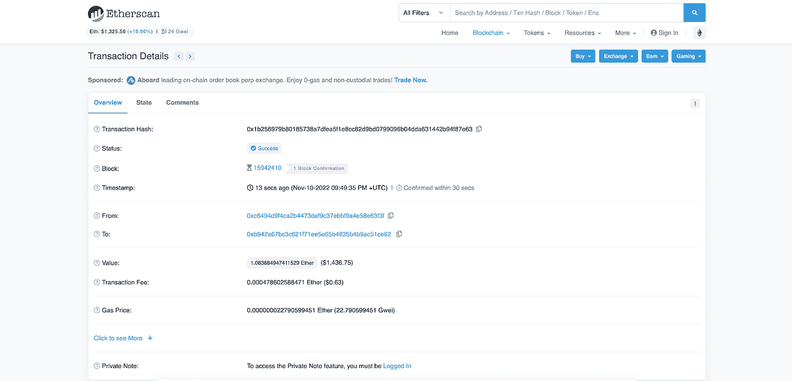
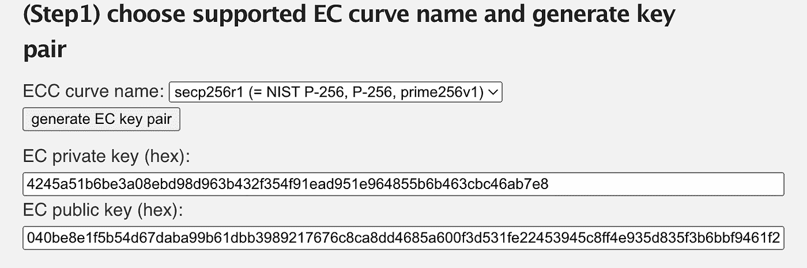
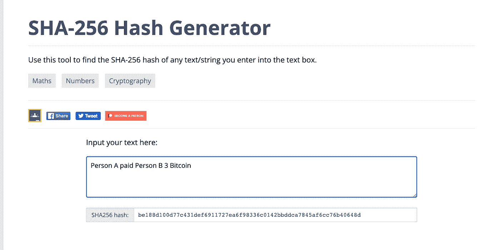
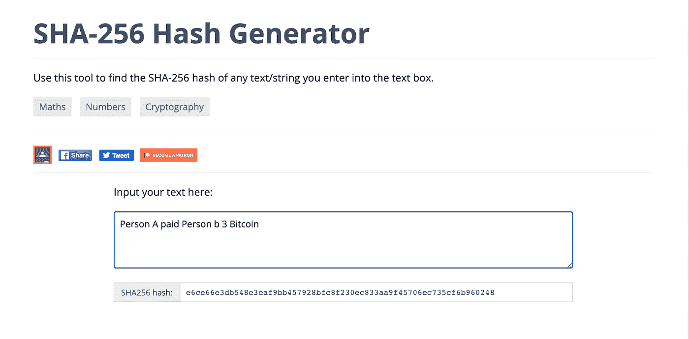
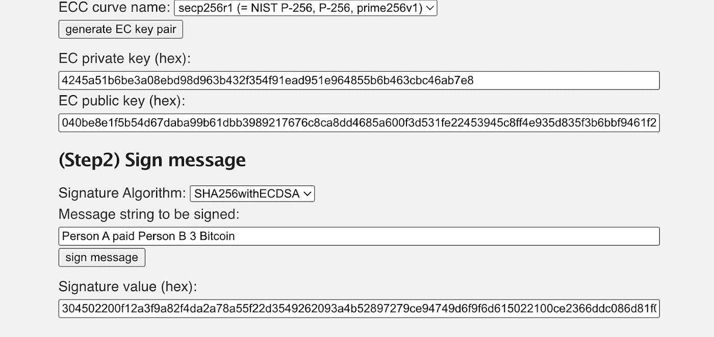

# 我对 FTX 崩溃和监管的技术解释的思考

> 原文：<https://medium.com/coinmonks/my-thoughts-on-the-ftx-collapse-and-a-technical-explanation-of-custodianship-4b6c9b794ca1?source=collection_archive---------7----------------------->

FTX 垮台背后的肮脏细节

许多人认为上周关于 FTX 的新闻是野生密码行业有史以来最令人震惊的事件。在不到一年的时间里，FTX 国际从以 320 亿美元的估值筹集了 4 亿美元，到申请破产。山姆·班克曼-弗里德是 FTX 密码交易所和阿拉米达研究定量交易公司的创始人。在仅仅一个[日](https://cryptoslate.com/sam-bankman-frieds-net-worth-fell-93-in-1-day-loses-billionaire-status/)，班克曼-弗里德的净资产从 160 亿美元下降到 9 . 91 亿美元。这个被认为是加密金童的人，从这个行业的顶端跌落到一个很快就会被关进监狱的贱民。

意外崩溃的故事始于 2022 年 7 月，全球最大的加密交易所和 FTX 的早期投资者[币安](https://www.nytimes.com/2022/11/08/technology/binance-ftx-deal-crypto.html#:~:text=the%20industry's%20volatility.-,Binance%2C%20the%20world's%20largest%20cryptocurrency%20exchange%2C%20said%20it%20had%20reached,the%20edge%20of%20another%20meltdown.)出售了其在该公司的股份。这笔 21 亿美元的交易是用现金和 FTT 代币完成的，后者是 FTX 的交换代币。随着 FTX 迅速成长为一个突出的竞争对手，这一分离似乎是竞争对手的合理分道扬镳。仅在 2021 年，总部位于巴哈马群岛的私人控股公司 FTX [公布了](https://www.businessofapps.com/data/ftx-statistics/#:~:text=FTX%20made%20%24388%20million%20net,than%20it%20made%20in%202020.)3 . 88 亿美元的净收入，高于上年的 1700 万美元。

11 月初，Bankman-Fried 的交易公司 Alameda Research 的一份泄露的资产负债表显示，FTT 代币“[主导了](https://capital.com/alameda-ftt-holdings-sbf-trading-collateral)”该公司的资产，代币被用作其高风险加密贷款业务的抵押品，FTX 的热度开始上升。虽然阿拉米达拥有 FTT 本身并不违法，但这种情况包括班克曼-弗里德的加密交易所和交易公司之间异常密切的关系。11 月 6 日，币安首席执行官赵昌鹏透露了他清算该公司所持 FTT 股份的计划，似乎对双方的关系有了更多的了解。赵[发推文](https://twitter.com/cz_binance/status/1589283421704290306?ref_src=twsrc%5Etfw%7Ctwcamp%5Etweetembed%7Ctwterm%5E1589283421704290306%7Ctwgr%5E0f1d6141cbe3571e7638d6dbb2defc4548418ba7%7Ctwcon%5Es1_c10&ref_url=https%3A%2F%2Fcointelegraph.com%2Fnews%2Fftx-and-binance-s-ongoing-saga-everything-that-s-happened-until-now)，“由于最近曝光的一些事情，我们决定清算我们账上剩余的 FTT。”在接下来的 72 小时里，FTT 的大甩卖导致代币价值暴跌 [~80%](https://coinmarketcap.com/currencies/ftx-token/) 。

在此期间，FTX 经历了一次大规模的银行挤兑，因为用户试图从客户资产总额 160 亿美元中提取 50 亿美元。对 FTX 来说，从流动性的角度来看，客户挤兑不应该是一个大问题。正如《华尔街日报》报道此事的一篇文章中所引用的，“一家交易所在让客户获得存款方面真的不应该有问题，”驻英国的经济学家弗朗西斯·科波拉说。“它不应该对这些资产做任何事情。它们应该放在那里，这样人们就可以使用它们了。”然而，11 月 10 日，FTX 暂停了客户提款，暗示存在重大流动性担忧。然后在一次投资者会议上，班克曼-弗里德[透露](https://www.wsj.com/articles/ftx-tapped-into-customer-accounts-to-fund-risky-bets-setting-up-its-downfall-11668093732?mod=hp_lead_pos5)阿拉米达研究公司“FTX 借出了价值数十亿美元(100 亿美元)的客户资产来资助高风险的赌注”。根据美国[证券法](https://www.cnbc.com/2022/11/13/sam-bankman-frieds-alameda-quietly-used-ftx-customer-funds-without-raising-alarm-bells-say-sources.html)，未经同意出借客户资产是非常非法的，并且直接违反了 FTX 的服务条款，该条款规定，“您账户中的任何数字资产都不是 FTX 交易公司的财产，也不应或可能被出借给该公司；FTX 贸易不代表或对待用户账户中的数字资产属于 FTX 贸易。”

11 月 11 日，FTX 和阿拉米达研究申请第 11 章破产。然而，故事并没有就此结束，仅仅一天后，FTX [证实](https://www.cnn.com/2022/11/12/business/ftx-hack#:~:text=Elliptic%20said%20although%20the%20theft,Miller%20said%20in%20a%20tweet.)一名黑客窃取了大约 4 . 73 亿美元的资产。班克曼-弗里德也辞去了首席执行官的职务，FTX 现在正在接受刑事调查。

**我对崩溃的看法:这对加密市场意味着什么**

随着 FTX 的崩溃，加密市场随着比特币(BTC)在 7 天内下跌 22%而暴跌。BTC 的价格跌至约 15，700 美元的两年低点，随着整个加密市场市值下降约 10%，市场其余部分也跟着下跌。

缺乏对集中交易的可见性和未能保护投资者直接要求美国证券交易委员会监管加密行业。过去，ICO 泡沫、Voyager Digital、Celsius、3 Arrows Capital、Blockfi 以及现在的 FTX 的崩溃，显示出与 2008 年金融危机的相似之处。当时，信用违约掉期在很大程度上不受监管，疏忽的贷款政策和缺乏对银行的清晰可见性加剧了市场的崩溃。与 2008 年类似，缺乏对集中化公司的可见性要求进行监管，SEC 有必要要求对集中化交易所进行审计，并有必要出示储量证明。

虽然区块链是一项革命性的技术，与互联网的发明有相似之处，但投资者信心的崩溃可能会产生巨大的影响。投资加密货币的好处是，世界上最大的资金池仍未暴露于市场。由于缺乏明确的政策和现货加密 ETF，数万亿美元的机构资本处于观望状态。(目前密码市场总市值约为 8000 亿美元)。明确的政策和受监管的证券为机构资金以及数百万等待受适当监管的加密证券的散户投资者提供了分配机会。

然而，我认为，加密崩溃进一步推迟了全行业的机构投资和现货 ETF，这正是 FTX 脆弱的确切原因。从本质上讲，加密本应归个人所有，但一次又一次，托管、集中的加密公司未能妥善保护投资者的资产。尽管现货 ETF 允许投资者在不需要自己持有资产的情况下暴露于加密货币，但提供 ETF 的中央实体需要克服存储加密货币的技术难题。这种新形式的监管缺乏明确的可见性和安全挑战，这为密码怀疑论者反对短期恢复提供了有力的论据。然而，从长远来看，监管和适当的安全措施可能会为下一轮加密牛市提供机会。

**加密货币的问题和它有价值的原因是一样的**

所以你可能会想:为什么 FTX 能够操纵客户资金，数亿美元是如何被盗的，拥有 crypto 到底意味着什么？加密货币的问题和它有价值的原因是一样的。代币是完全数字财产的第一种形式，在这种财产中，用户对其资产拥有唯一的所有权。在区块链网络上拥有代币与在银行里储存数字资金截然不同。当用户将资金存入银行时，用户要对控制系统的中央中介负责。银行可以拒绝客户提款或将用户资金借给其他方。加密货币很有价值，因为在区块链网络中，代币的所有权完全由用户控制，不受制于任何中央机构。

在技术层面上，拥有加密货币是一项革命性的数学进步，可能很难完全理解。在其核心，区块链是一个数字分类账，跟踪区块链地址(钱包)之间的令牌转移。区块链由验证器网络维护，验证器是独立拥有的计算机，用于跟踪和更新系统状态。这些独立的参与者各自存储一份分类账，并不断进行通信以同步他们存储的记录。区块链利用由数学证明组成的共识协议来确保分类帐的有效性，并且匿名网络参与者的不良意图不会影响网络。这允许区块链存储公开的、可验证的、不可变的信息，而不依赖于中央机构来维护/更新网络状态。

虽然令牌只是数据，但拥有加密货币并不等同于在传统服务器上存储数据。加密资产不会存储在您的计算机或某个中央位置，事实上，作为令牌的数据不会存储在任何单一服务器中。相反，存储在每个单独的分类账副本上的数据只是区块链地址之间令牌转移的历史。加密货币的所有权仅仅是当一个令牌最后交易到一个特定的区块链地址，并且个人拥有必要的“密钥”来控制该地址。这意味着所有权是个人主义的，直接与控制这把“钥匙”联系在一起。

这种所有权机制是由一种称为椭圆曲线加密的公钥、私钥加密形式决定的。每当一个新的区块链地址被实例化时，一个以密码方式生成的 256 位数字(称为私钥)就与该地址相关联地被创建。该密钥的功能类似于密码，并允许所有者成为其区块链地址的唯一拥有者，因为交易令牌的唯一方式是知道私钥。

关于私钥如何证明区块链地址所有权的数学原理的更多细节将在本文的附录中解释，但是现在，需要注意的重要一点是，这种通过私钥拥有数字财产的机制是一个完全陌生的概念。由于令牌不存储在任何单一位置，因此不受制于中央实体的权威，用户现在可以无可争议地拥有数字财产(令牌)。在社交媒体网络、银行系统和视频游戏平台上，用户数据不归个人所有。相反，控制网络的中央机构有能力操纵用户的财产。区块链允许用户不变地拥有数据而没有被操纵的机会，因为网络没有单一的所有者。然而，这个系统的缺点是，用户是唯一负责保护他们的资金。私钥需要存储在安全的离线环境中，因为这些信息的暴露将允许恶意参与者错误地认证交易并控制个人的区块链地址。

**那么 FTX 是如何变得脆弱的呢**

FTX、比特币基地、币安、北海巨妖、双子星等密码交易所本质上就像商业银行。虽然这些集中交易所的主要业务是允许用户购买/出售资产，但这些平台类似于银行，它们存储用户的资金。这对于安全地存储客户的私钥提出了极其困难的技术挑战。

与欺诈性银行交易不同，区块链交易是不可逆的。如果你的银行账户被盗用，恶意行为者通过信用卡向自己支付了数千美元，你只需打电话给你的银行，理论上银行会采取措施恢复交易。此外，[联邦存款保险公司](https://www.fdic.gov/resources/deposit-insurance/brochures/deposits-at-a-glance/#:~:text=The%20standard%20insurance%20amount%20is,in%20different%20account%20ownership%20categories.)为存款人提供高达 25 万美元的保险。在加密货币交易中，没有中介来逆转欺诈活动。如果一个人的区块链地址的私钥被一个恶意的参与者泄露，该恶意的参与者现在可以代表该地址认证交易。

在 FTX 的案例中，交易所代表客户存储私人密钥。有了这些信息，Bankman-Fried 就有能力对用户的资产为所欲为。此外，关于 FTX 黑客事件，一定是有人潜入了公司的存储库，获取了客户的私钥。有了这些敏感信息，黑客就能够代表这些区块链地址进行交易，并给自己发送数百万美元。

**那么集中交易如何存储你的私人密钥**

像存储任何其他形式的敏感数据一样，好的加密交换将您的私钥存储在加密的离线存储中。根据比特币基地的说法，该公司[将](https://help.coinbase.com/en/coinbase/other-topics/legal-policies/what-does-coinbase-do-with-my-digital-assets)存储在“98%以上的离线资产，存放在安全、有守卫的冷藏设施中”(这里的资产，比特币基地指的是私人密钥)。理论上，离线存储可以防止基于网络的漏洞，因为存储不像传统的云数据那样暴露在互联网上。然而，交易所本身连接到互联网，以及其他离线存储的桥梁，这为黑客提供了机会。

**所有权和安全私钥存储的困境**

区块链最初的设计意图是让个人成为其资产的唯一所有者。私有密匙并不意味着由密码交易所或政府机构存储在中央服务器中。然而，进退两难的是，自我监管是一项技术挑战，就像互联网的早期一样，新技术对用户来说很难使用。像比特币基地这样的交易所用意良好，因为它们旨在通过为 Web 3 提供 Web 2 接口来降低进入的技术壁垒。注册一个集中的交易所，就需要为传统的用户名/密码系统存储你的私人密钥。

在加密中，所有权的安全形式是个人主义的，市场上的许多产品都提供这种自由。任何加密钱包都必须具备以下两个要素。

1.钱包必须是“非保管的”

非托管意味着钱包的创建者不会为您存储私钥。相反，以安全的方式存储私钥取决于个人。

2.钱包一定是“冷”的。

与热钱包相反，冷钱包意味着私钥存储在脱机环境中。这可以防止密钥暴露于基于 web 的漏洞。冷藏钱包能够将交易发送到区块链，而不需要私钥离开冷藏的安全区域。

今天符合这两个标准的大多数钱包被称为硬件钱包。这些设备本质上是超级 USB，并将私钥存储在加密的离线环境中。它们允许用户在参与 Web 3 生态系统的同时确保其私钥的安全性。硬件钱包的突出例子是 Ledger、Trezor 和 NGrave。

**附录——加密交易背后的数学原理**

一个快速的警告，这部分变得非常技术性。阅读前最好对区块链的工作原理有个初步的了解。这篇[彭博](https://www.bloomberg.com/features/2022-the-crypto-story/?leadSource=uverify%20wall#keys-coins-drive-dump)的文章是一篇关于区块链技术的优秀入门文章。有了预先警告，让我们深入研究私钥如何让个人成为其资产的唯一所有者。



“从”和“到”地址的任意变量:

```
address A = 3685cf9da3eb23c3c82c23cde008b30e6b822fb2ccfe5a27c1ac596bc99450fd:27
address B = 1FWQiwK27EnGXb6BiBMRLJvunJQZZPMcGd
```

在上面的以太坊交易中，地址 A 向地址 B 发送了 0.14367159 BTC。您看到的分配给变量地址 A 和地址 B 的大型字母数字字符串是区块链地址。这些字符串是完全唯一的，并作为钱包的“用户名”使用。区块链地址“本质上”也是众所周知的公钥的简称。公钥是一个很大的字母数字字符串，它是从私钥中数学推导出来的。更具体地说，公钥是通过将私钥输入到特定的单向密码函数中而得到的。使用公钥(区块链地址)的缩短版本作为钱包的“用户名”的原因是为了使标签更容易阅读。然而，将区块链地址视为基本的公钥是合适的。

**钱包一代**

当区块链地址 A 被实例化时，第一步是生成私钥。以太坊软件使用一个随机数生成器，从集合[1，2^256].]中选择一个数字 2^256 是一个令人难以置信的大数字，其发音的开头是 115 [quattuorvigintillion](https://keys.lol/) 。称之为 K(整数)的私钥被插入到等式中， **K = k * G** ，其中 G 是(x，y)形式的生成点。输出是(x，y)形式的唯一的 K，其中(x，y)对中只有一个坐标被分配给公钥，从而建立公钥、私钥对。

然而，这个等式的关键之处在于，它不是典型的乘法。相反，运算“*”被称为椭圆曲线点乘。这个单向的(不可逆的)运算是在特定的曲线上完成的:*y*=(x*+7)在素数(𝔽 p)的域上。*尽管对椭圆曲线乘法为什么不可逆的完整解释超出了本文的范围(完整解释:[这里是](https://blog.cloudflare.com/a-relatively-easy-to-understand-primer-on-elliptic-curve-cryptography/))，但它是密码学的一个重要方面。使用不可逆函数来生成公钥、私钥对的重要性在于，这允许公钥(函数的输出)被放心地用作公共区块链地址，而不用担心私钥(输入)容易被推断。

*关于不可逆性的侧面注释*

如果你想更好地理解不可逆，看看另一个不可逆函数，模运算。其定义为: **r = x mod n** ，其中 r = x 除以 n 的余数(例如:10 mod 3 = 10/3 的余数，等于 1)或(例如—14 mod 2 = 14/2 的余数，等于 0)。模运算是不可逆的，因为给定一个输出，除了猜测和检查之外，没有数学运算/算法来求解输入。比如拿函数来说: **r = x mod 3** 。如果我告诉你“r=1”，那么就没有办法确定 x 的精确值。x 的值可以是 4，7，10，13，等等，直到无穷大。(4 模 3 = 1，7 模 3 = 1，10 模 3 = 1)。这一点很重要，因为想象一下，如果等式改为 **PubKey = PrivKey mod 3** 。PubKey 变量可以用作钱包的“用户名”,因此对任何人都是公开的，而 PrivKey 变量“secret key”是不可推断的。虽然椭圆曲线加密比模运算复杂得多，但不可逆特性同样适用。

**交易**

既然我们已经建立了钱包生成和创建公钥、私钥配对的过程，那么直观的问题是，在没有中央中介管理传输的情况下，这种加密机制如何实现交易？流程类似于去银行转账给另一方。为了做到这一点，银行将需要验证您实际上是发送帐户的所有者，并且正在批准将资金发送到接收帐户的交易。在加密交易中，这些相同的标准通过数学证明来满足。更具体地说，区块链地址(公钥)的所有者可以通过使用私钥来提出新的交易，以加密的方式证明他们实际上是钱包的所有者。

当向网络提出新交易时，请求必须包含交易消息(即:“地址 1 付费地址 2 x 金额”)和数字签名。特定公钥的数字签名是将私钥输入 ECDSA(一种特定的加密函数)时的给定输出。数字签名用作数学证明，因为它只能通过使用私钥来创建。因此，每当交易伴随有数字签名时，就有可能验证提出新交易的个人确实知道私钥并且已经批准了新的资金转移。

该过程的概述如下图所示(暂时忽略 SHA-256)，但本质上，一条交易消息(即:Person A paid Person B 3 Bitcoin)是通过使用 ECDSA 方程中的私钥生成数字签名来加密的。

由于任何人都可以通过计算两个结果来证明交易的有效性，因此该交易是可验证的。1.对事务消息运行 SHA-256 的结果。2.使用公钥解密数字签名。如果这两个结果匹配，那么验证者可以从数学上证明创建数字签名的个人拥有私钥，而无需该个人暴露私钥本身。


让我们通过一个例子更详细地介绍一下这个过程。首先，我们将使用椭圆曲线乘法(曲线上的点)生成一个示例公钥、私钥对



为简单起见，我们现在将公钥称为“人 A”。现在我们有了区块链地址的公钥和私钥对，交易流程的第一步是通过 SHA-256 运行交易消息。SHA-256 是一个哈希函数，它被定义为“一个数学过程，接受任意大小的输入数据，对其执行操作，并返回固定大小的输出数据。”哈希函数是一种特殊的数学现象，它的输入很难从输出中猜测出来。这是因为输出总是固定长度，与输入相比是伪随机的。

请注意下面两个哈希的区别。



尽管消息仅在“B”的大小写上有所不同，但输出却大相径庭。该属性在验证过程中至关重要，因为它确保原始消息不会被以任何方式操纵。如果交易没有被散列，则个人可以在创建数字签名之后简单地改变交易消息来说些别的事情，并且交易的验证仍然有效。

既然我们有了公钥、私钥对和散列消息，下一步就是生成数字签名。散列后的消息和私钥被插入加密函数，ECDSA 签名算法: ***签名*=k^(-1)∗(hash+r∫privkey)(mod n)**

[忽略 k 和 r，本质上是随机生成的数字，涉及到更多的数学知识]

以下是签名示例:



“签名值”是通过获取消息，运行 SHA-256，然后将散列消息的值、私钥、k 和 r 插入到 ECDSA 签名算法中而生成的。

现在交易准备好提交给网络，数据将特别包括 1。原始交易报文和 2。数字签名。

为了验证交易的有效性以及人 A 实际上是私钥的所有者，可以运行 ECDSA 验证算法。该过程使用公钥解密数字签名，并将结果与通过 SHA-256 运行事务消息的输出进行比较。

结果 1——散列消息，即:SHA-256 对“个人 A 向个人 B 支付了 3 个比特币”

```
Result 1 = be188d100d77c431def6911727ea6f98336c0142bbddca7845af6cc76b40648d
```

结果 2 — ECDSA 验证算法(使用公钥解密数字签名的过程)

```
Digital Signature = 304502200f12a3f9a82f4da2a78a55f22d3549262093a4b52897279ce94749d6f9f6d615022100ce2366ddc086d81f05b416c8ce2d1ecea73bb0fd8afe59dab2e3c10031e2a34d
s1 = digital signature-1 (mod 257)
R' = (hash * s1) * G + (r * s1) * pubKey
Result 2 = x coordinate of R
Result 2 = be188d100d77c431def6911727ea6f98336c0142bbddca7845af6cc76b40648d
```

请注意，结果 1 ==结果 2，从该信息中，可以从数学上验证交易的发起者确实知道私钥，因此是钱包的所有者。

> 交易新手？试试[密码交易机器人](/coinmonks/crypto-trading-bot-c2ffce8acb2a)或[复制交易](/coinmonks/top-10-crypto-copy-trading-platforms-for-beginners-d0c37c7d698c)