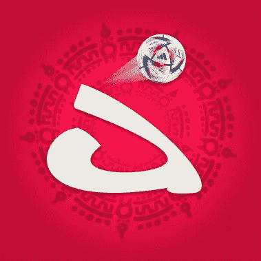

# 我对弹射加密平台的看法

> 原文：<https://medium.com/coinmonks/my-view-of-the-catapult-crypto-platform-7e5191bf9283?source=collection_archive---------51----------------------->

Catapult 是一个易于使用的多链筹款和大使平台，适用于所有阶段的 Web3 项目，与区块链生态系统的多链钱包和交叉营销解决方案相集成。Catapult 是一个投资、营销和活动平台，专为社区打造。Catapult 为其投资者提供 lockdrops、IDOs 和 communicty care 计划。几个月前，他们进行了一次更名，将他们的平台名称从 catapult 上的 2dao 改为。这个平台在币安智能链上运行，这里的交易费用比以太坊主网要低得多。这款 launchpad 与众不同的地方在于，在 catapult 上，你不需要持有 launchpad 的令牌，也不需要任何层级就可以投资。Catapult 的目标是在 99%的 rekt/交付不足情况下保护用户的资金。catapult 平台开发加锁、初始 dex 产品，以及私人和种子轮。根据通货紧缩模型，这个平台在锁死期间烧掉它的代币。在这些 lockdrop 中，1%的费用由 lock drop 的参与者以$CPLT 代币支付。我举个例子来完整解释一下:lockdrop 参与者在池 X 中锁定了 10000 个令牌 30 天。30 天后，将有可能从池 X 中解锁 9900 个令牌，100 个令牌将被烧毁。

> 交易新手？在[最佳密码交易所](/coinmonks/crypto-exchange-dd2f9d6f3769)上尝试[密码交易机器人](/coinmonks/crypto-trading-bot-c2ffce8acb2a)或[复制交易](/coinmonks/top-10-crypto-copy-trading-platforms-for-beginners-d0c37c7d698c)

这个平台有一个名为“双周文摘”的周刊，感兴趣的社区成员有机会阅读关于 catapult 项目或其合作伙伴的最新消息。我个人真的很喜欢这份 BI 每周文摘时事通讯，因为你并不总是有空闲时间来掌握脉搏，并且总是理想地检查每件事情，所以这种浓缩的知识有助于你节省时间。适用于 Catapult 的示例项目:

1.“月光”

2.《姆克儿》

3.“次液体”

4.“丢弃”

5.“欧 MEE”

6.“极小”

7.“社会的”

8.《无依之地》

9.“伊娃”

10.“铁鸽子”

11.“YouMinter”

12.《街头》

13.“阿玛拉”

14."达格"

15.“瓦尔哈拉弗特”

当我们想介绍这个项目的 idos 时，有一个社区护理计划，在特殊情况下最终可能会涵盖您的资金，在这个计划中有以下条款和条件:

1.IDO 和 TGE 之间的范围不得超过 1 个月。如果违反这一规则，Catapult 团队将在社区中发起投票，以将投资返还给用户。

2.项目团队必须在上市前将 100%的代币转让给 Catapult，或者提供一份授权合同，其中规定了及时的代币解锁日期。

3.社区护理保护对每批都有效，直到分发了 50%以上的代币。

a.如果在交易开始后的前 24 小时内，代币价格未能系统地稳定在接近 IDO 价格的任何位置，我们将有权启动退款。如果在下一批时，价格低于 IDO，团队也将启动退款。

b.对于“低于 IDO 价格”, Catapult 团队建议理解一种情况，即当令牌价格系统地无法关闭 IDO 价格附近的较高时间框架蜡烛线。

c.根据 tokenomics，如果项目团队在 TGE 发出 50%以上的代币，那么前 24 小时的预期价格结果应该高于 IDO 价格。否则，弹射团队可能会启动退款。

4.所有代币必须根据授权计划锁定。流动性要求将根据具体项目来确定，但通常情况下，项目团队需要提供至少占总筹款额 5%的流动性。必须锁定流动性，直到分发公共回合的最后一批代币。如果出现任何违规或意外情况，用户将获得退款。

5.Catapult 团队将验证项目是否有协议、流动性保护服务和智能令牌合同审计，以排除额外的令牌铸造、漏洞和其他关键问题。

6.在 IDO 上收集的资金将按照收到的代币百分比并根据公共轮的代币分配计划分批转移到项目团队。如果出现不当行为、违反上述规则以及其他不可预见的情况，资金可能会退还给投资者。

7.在项目团队的不专业行为给他们的社区造成经济损失的情况下，Catapult 保留部分或全部退款的权利。

感谢您阅读我的媒体文章。重要链接:

 [## CREW | web 3 社区的头号操作系统

### 向您最喜爱的 web3 社区投稿，赢取代币、NFT 和其他令人惊叹的奖励。

catapult.crew3.xyz](https://catapult.crew3.xyz/invite/CHW9tKURELok21PK3poWO)  [## 不和-与朋友和社区聊天的新方式

### 不和谐是通过语音、视频和文本进行交流的最简单方式。聊天，闲逛，和你的朋友呆在一起…

不和谐. gg](https://discord.gg/NcJbU3Fw)  [## JavaScript 不可用。

### 编辑描述

twitter.com](https://twitter.com/catapult_ac)  [## 弹射平台

### Catapult 是一个易于使用的多链筹款和大使平台，用于 Web3 项目的所有阶段，集成…

medium.com](https://medium.com/catapult-platform) 

> 加入 Coinmonks [电报频道](https://t.me/coincodecap)和 [Youtube 频道](https://www.youtube.com/c/coinmonks/videos)了解加密交易和投资

# 另外，阅读

*   [3 商业评论](/coinmonks/3commas-review-an-excellent-crypto-trading-bot-2020-1313a58bec92) | [Pionex 评论](https://coincodecap.com/pionex-review-exchange-with-crypto-trading-bot) | [Coinrule 评论](/coinmonks/coinrule-review-2021-a-beginner-friendly-crypto-trading-bot-daf0504848ba)
*   [莱杰 vs n rave](/coinmonks/ledger-vs-ngrave-zero-7e40f0c1d694)|[莱杰 nano s vs x](/coinmonks/ledger-nano-s-vs-x-battery-hardware-price-storage-59a6663fe3b0) | [币安评论](/coinmonks/binance-review-ee10d3bf3b6e)
*   [加密交易机器人](/coinmonks/crypto-trading-bot-c2ffce8acb2a) | [Bingbon 评论](https://coincodecap.com/bingbon-review)
*   [Bybit Exchange 审查](/coinmonks/bybit-exchange-review-dbd570019b71) | [Bityard 审查](https://coincodecap.com/bityard-reivew) | [Jet-Bot 审查](https://coincodecap.com/jet-bot-review)