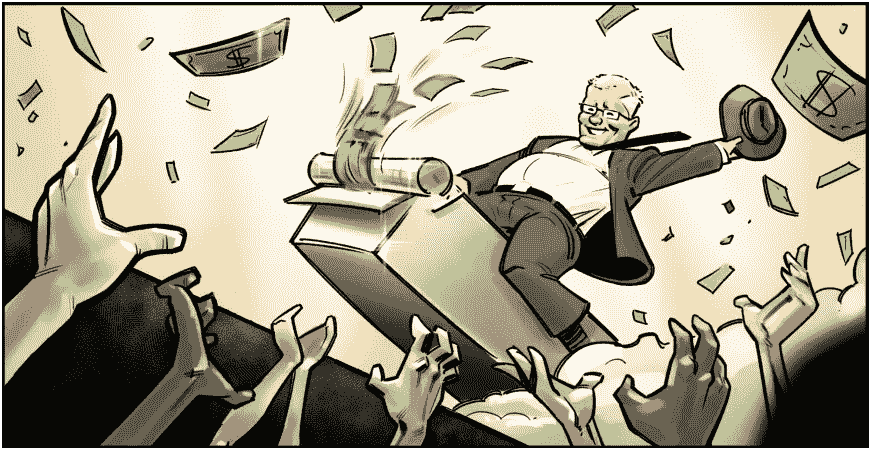

# 神话破灭:卡尔达诺不像目前的菲亚特系统

> 原文：<https://medium.com/coinmonks/myth-busting-cardano-is-not-like-the-current-fiat-system-41bade360eb9?source=collection_archive---------23----------------------->

像卡尔达诺这样的 PoS 网络，据说和现在的菲亚特系统是一样的。这是因为如果有人很富有，他们可以购买大量的硬币，从而永远保留权力。另外，富有的投资者也永远越来越富有。另一个担心是，硬币将由集中交易所持有，因此它们将为人民决定。