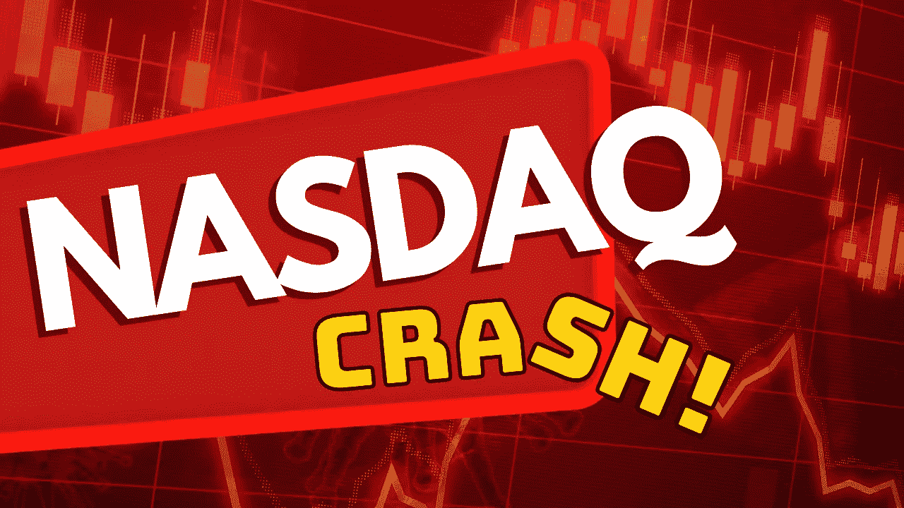
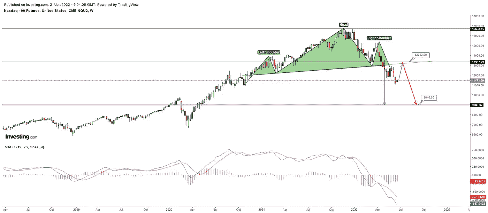
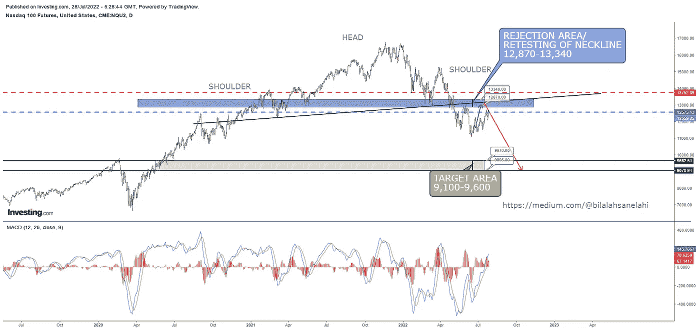
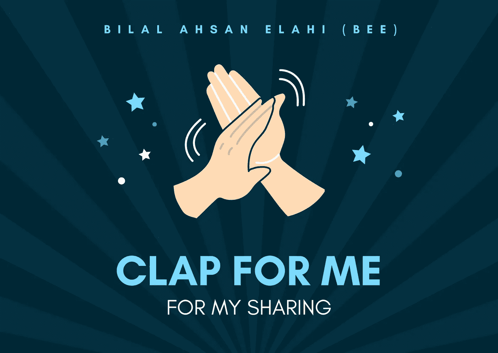

# 纳斯达克——不可避免的 30%的崩盘即将到来(个人观点)

> 原文：<https://medium.com/coinmonks/nasdaq-an-inevitable-30-crash-is-on-the-cards-personal-opinion-b8e21af15f94?source=collection_archive---------9----------------------->

本文分享作者对纳斯达克 100 期货的个人观点。这是个人观点，可能是错误的。在进行任何交易之前，咨询你的独立财务顾问。

# 关于我:

我的职业圈叫我蜜蜂。我是一名金融分析师。我喜欢头肩底图案。我已经练习 HNS 超过六年了。纳斯达克 100 指数期货(CME:nq2)目前有一个 HNS，我不会错过它的！

# 回顾一下:

2022 年 6 月 24 日，我分享了我之前对纳斯达克交易在 11471 点的看法。我的观点是:

在颈线被打破并开始下跌后，通常会有一个“重新测试颈线”的举动。"如果重新测试颈线，纳斯达克可以测试 12，870-13，340 之间的范围."

上一篇文章链接:[https://bilalahsanelahi . medium . com/Nasdaq-an-accessible-crash-is-incoming-a-personal-opinion-e 70 f 6 b 73 e 812](https://bilalahsanelahi.medium.com/nasdaq-an-inevitable-crash-is-incoming-a-personal-opinion-e70f6b73e812)

我画了这张图表:

[https://tvc-invdn-com.investing.com/data/tvc_53a979612e87cf0793e4ae8d699f4419.png](https://tvc-invdn-com.investing.com/data/tvc_53a979612e87cf0793e4ae8d699f4419.png)

我画的图表显示了一条蓝色的线，向上指向今天市场的娱乐水平。

正如我所说的那样，市场运行良好。目前正接近我的目标范围。别忘了，纳斯达克指数已经比目标区域高出 9%。

# 接下来是什么:

当前的走势可以被称为“回撤”或“重新测试颈线”这可能会延续到 12，870 到 13，340 的范围。然而，第一个要求的 12 600 人的目标已经实现。

12870 到 13340，在我看来是我画的 HNS 模式的复试/拒试区域。根据我的分析，纳斯达克指数将从既定水平受到打击，并可能大幅下跌，在未来几个月内失去 30-35%的市场。

是的，你没看错——30%到 35%的下跌空间。看一看:

Access the chart here: [https://tvc-invdn-com.investing.com/data/tvc_e550e3d2ade23c703a84dc4e193d5f30.png](https://tvc-invdn-com.investing.com/data/tvc_e550e3d2ade23c703a84dc4e193d5f30.png)

# 你应该怎么做:

我个人不会提出任何建议或推荐。但是，我可以分享我将要做的事情:

我将等待两件事情发生:

A.纳斯达克进入 12870 到 13340 的区间。一旦完成，我会在这个范围内慢慢卖出。我给全看的止损是连续两天纳斯达克收盘在 13760 上方。

B.我将等待纳斯达克指数跌破 12100 点，这是下跌的热点。只有纳斯达克在进入指定范围前拒绝，我才会走这个方向。这样的话，我的止损就是 12600。

**我的目标是什么:**

在这两种情况下，我对纳斯达克的目标是 9100 至 9600 点之间的指数。我对自己的观点仍然很有信心，因为我多年来一直这么做，周线图很难打破。但是，这并不意味着我不会错。情况变了。观点出了问题。止损永远是把损失降到最低的关键。

# 这一切应该在什么时候发生:

我认为纳斯达克指数的顶部应该在 2022 年 8 月之间的任何地方。我瞄准的下行应该在 2022 年 9 月到 2023 年 1 月之间对我们可用。s

# 免责声明:

我是一名金融分析师，分享观点仅供学习和参考。我不是你的顾问，你也不应该根据我的工作进行交易。在进行任何金融交易之前，一定要咨询你的独立财务顾问。我假设市场参与者的任何交易都没有造成损失或损害。

# 最后:

如果你喜欢我的作品，请为我鼓掌！这将有助于我接触更多的人。这也会提高我的士气，我会分享更多我的工作！非常欢迎您的评论。也欢迎你不同意我的观点！

干杯！

> 交易新手？试试[加密交易机器人](/coinmonks/crypto-trading-bot-c2ffce8acb2a)或者[复制交易](/coinmonks/top-10-crypto-copy-trading-platforms-for-beginners-d0c37c7d698c)