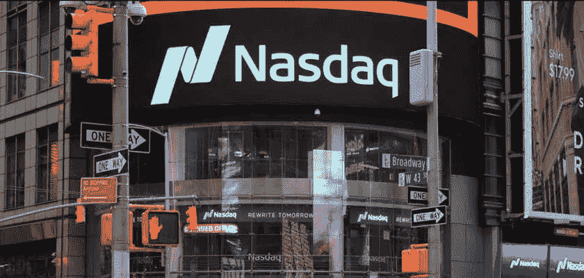

# 纳斯达克数字资产部门将为机构投资者提供加密服务

> 原文：<https://medium.com/coinmonks/nasdaq-digital-assets-unit-will-offer-crypto-for-institutional-investors-84d40b1fa4bb?source=collection_archive---------37----------------------->

总部位于纽约的证券交易所纳斯达克(Nasdaq)正通过其数字资产部门向加密服务领域扩张。世界第二大证券交易所正在尝试加密货币。但是，这些加密托管服务只为机构投资者保留，并且仅限于比特币和以太坊。此时，机构投资者似乎不太愿意进行任何长期的秘密投资。然而，如果突然出现牛市，他们胆小的态度会变得非常危险。因此，纳斯达克今年一直表现不佳，这是一个安全的赌注。

## **所有人登上加密列车！**

据[彭博](https://www.bloomberg.com/news/articles/2022-09-20/nasdaq-makes-first-big-crypto-push-to-lure-institutional-clients)报道，纳斯达克将向蓝筹投资者提供比特币(BTC)和以太坊(ETH)托管服务。因此，他们的托管服务目前正等待纽约金融服务局的批准。加密托管服务将成为纳斯达克数字资产部门的一部分，这是该交易所的新成员。

根据这份报告，纳斯达克聘请艾拉·奥尔巴赫(Ira Auerbach)担任新的纳斯达克数字资产部门的负责人。Auerbach 是 Gemini 加密交易所的前高管。他把双子座咄咄逼人的营销文学带到了聚光灯下。在使用“下一次革命”和“大规模机构采用”等术语时，奥尔巴赫试图掀起波澜。

“我们相信，下一波革命将由大规模机构采用来推动。我想不出还有比纳斯达克更好的地方来将这种信任和品牌带入市场。”奥尔巴赫说。

虽然为机构投资者提供加密托管服务，但纳斯达克绝不是加密领域的竞争对手。本质上，纳斯达克提供的是他们的名字和 51 年的历史。目前还不清楚纳斯达克希望以多快的速度扩大他们的服务，但至少现在，他们不会以任何方式对竞争构成威胁。

## **纳斯达克数字资产部门**

显然，纳斯达克高管已经在谈论新部门未来的扩张。尽管如此，一切都将取决于市场的状况。纳斯达克执行副总裁兼北美市场负责人 Tai Cohen(想象一下他的工资！)表示，他们没有立即启动密码交易所的计划。尽管如此，他们正计划扩展他们的加密相关服务。

“监护权是基础。在托管之后，我们可以开始开发其他解决方案，提供执行服务、流动性服务，并考虑如何支持新市场。”科恩说。

至于房间里的大象，科恩确实谈到了即将出台的[加密法规](https://blog.hi.exchange/white-house-on-digital-assets/)。根据科恩的说法，纳斯达克将接受加密法规，因为这是对机构投资者的要求。

“我们知道如何在监管制度下运营，我们会继续根据规则进行创新。当监管到来时，我们会欣然接受。机构希望我们在这个框架下运作。”

纳斯达克的托管服务将在纽约金融服务部门批准后推出。

> 交易新手？试试[密码交易机器人](/coinmonks/crypto-trading-bot-c2ffce8acb2a)或者[复制交易](/coinmonks/top-10-crypto-copy-trading-platforms-for-beginners-d0c37c7d698c)