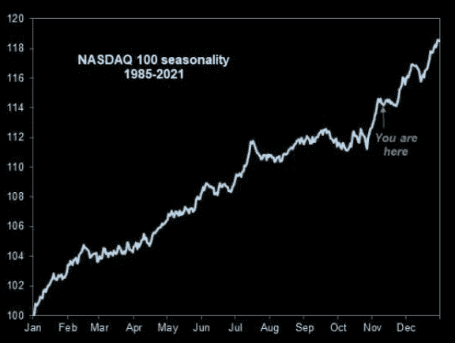

# 纳斯达克及时崩溃，每个人都做空黄金，什么会上涨…

> 原文：<https://medium.com/coinmonks/nasdaq-melt-up-right-on-time-everyones-short-gold-what-goes-up-c0b5f94caa81?source=collection_archive---------35----------------------->

嘿，我是基兰！市场又将迎来新的一周，以下是需要注意的关键事件，以及来自投资银行的最有趣的宏观研究。我希望能在本周的[贸易挑战](http://www.traderseed.io/)中与你交谈，并且一如既往，如果你有任何问题，请在下面给我留言。

# 每周观察列表

在上周美国通胀数据弱于预期以及随后的风险反弹之后，本周我们将看到美国消费者在周三公布零售销售数据时的表现。我们还将看到 10 月份生产者价格通胀、工业生产、新屋开工和成屋销售数据。

FTX 加密交易所的余波可能会继续成为头条新闻，应该密切关注，以判断蔓延的程度。金融系统的这一高杠杆部分正日益瓦解，可能会给加密领域内外的市场参与者带来灾难。

# 宏观视角

**纳斯达克崩盘。非常准时。**季节性再次发挥了神奇的作用。根据过去 36 年的情况，这是正常的季节性模式。

纳斯达克看起来很便宜。纳斯达克 100 指数中的中值公司现在的价格与销售比率为 4.2 倍(低于一年前的 8.5 倍)，是 2016 年以来的最低水平。

美国银行的“牛”(牛市)(熊市)仍为 0。尽管科技股反弹，估值走软，但市场情绪仍然根深蒂固，处于极度熊市区域。这可能意味着大多数市场参与者仍在做空股票，错过了反弹。短时间挤压的所有材料都准备好了。

**上去的，必然下来。**20 世纪 70 年代以来的资产泡沫。加密也不例外…

**加密市值从 3 万亿到 0.8 万亿。**放大看加密泡沫显示巨大的财富损失。这次主要是零售。

**做空黄金。在上周 CPI 之后的所有变动中，黄金看起来最令人印象深刻。有趣的是，黄金多头无处可寻，而管理资金仍处于空头。有人要卖空吗？**

**运价暴跌。正如上周的 CPI 报告所示，随着需求减弱，支出转向服务业，我们看到供应链继续正常化。航运需求继续下滑，海运价格上个月又下降了约 20%。这是一个领先指标，也是假期前通胀的一个可喜进展。**

我希望你觉得这很有趣，很有用。我每周一写这份简讯，所以**一定要关注我**！像往常一样，把风险管理放在第一位，安全交易，保持敏捷。

祝你一周愉快！
基兰
**www.traderseed.io**

想交易本周的市场吗？ 100k 程序从 **$75** 开始！！点击这里查看新节目 [**！**](http://www.traderseed.io/)

[**查看节目**](http://www.traderseed.io/)

> 交易新手？尝试[加密交易机器人](/coinmonks/crypto-trading-bot-c2ffce8acb2a)或[复制交易](/coinmonks/top-10-crypto-copy-trading-platforms-for-beginners-d0c37c7d698c)