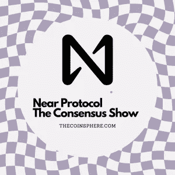

# 近似协议—完整概述

> 原文：<https://medium.com/coinmonks/near-protocol-complete-overview-895a9bb777d?source=collection_archive---------55----------------------->

[For the best Crypto News in the world, visit TheCoinSphere.com](http://thecoinsphere.com/)

欢迎来到共识秀，在这里我涵盖了世界上最流行的加密货币，并为您提供不带偏见的信息，以帮助您达成自己的共识。

欢迎来到近距离协议的世界！

NEAR Protocol 是一个开源的、分散的平台，用于构建和部署可伸缩的、分散的应用程序(dApps)。