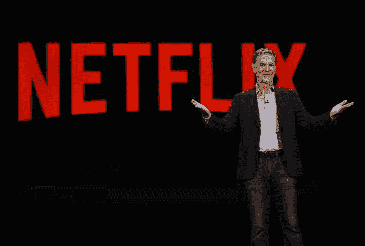

# 网飞趋势可能意味着更多的用户下降，尽管点击内容-巴克莱

> 原文：<https://medium.com/coinmonks/netflix-trends-may-mean-more-subscriber-downside-despite-hit-content-barclays-66e1c1064196?source=collection_archive---------47----------------------->

巴克莱表示，尽管最近回归节目有所增长，但网飞(纳斯达克代码:NFLX)可能会失去比管理层所表示的更多的订阅量。
这是因为从整体流媒体趋势来看，流媒体先锋最近表现不佳，而竞争对手迪士尼+(纽约证券交易所代码:DIS)在以下方面表现相对强劲…