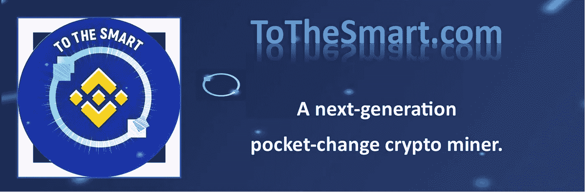
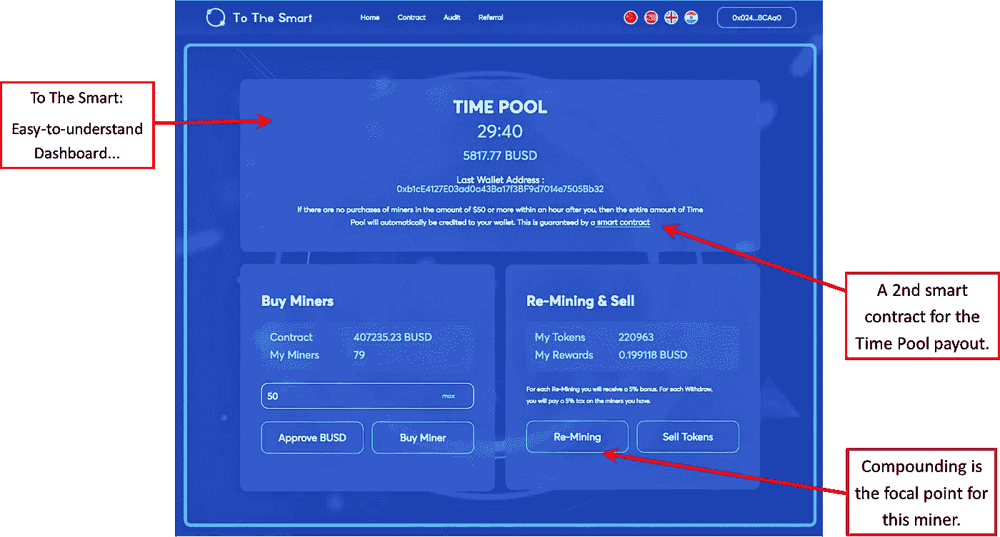
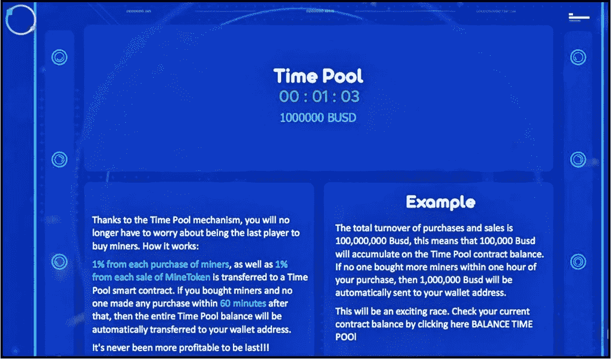
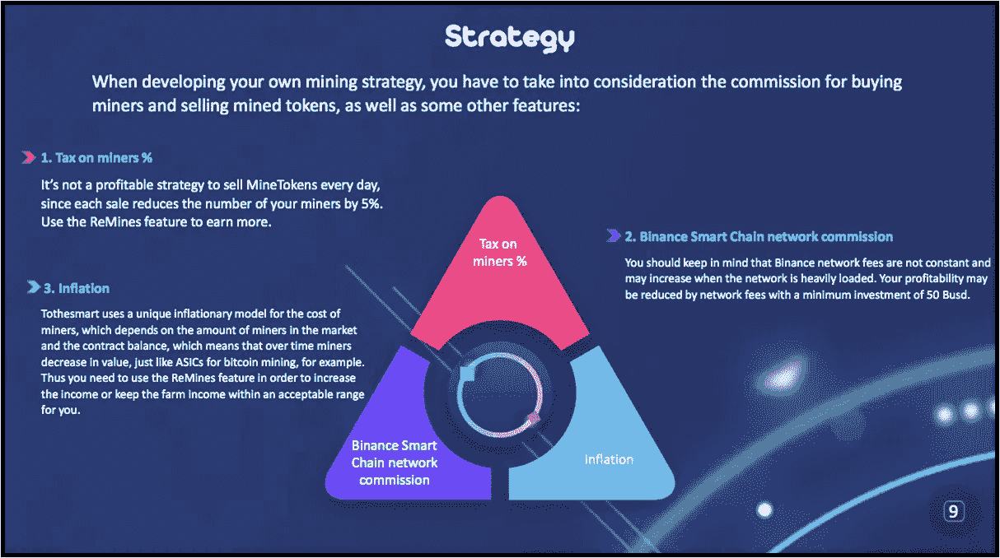
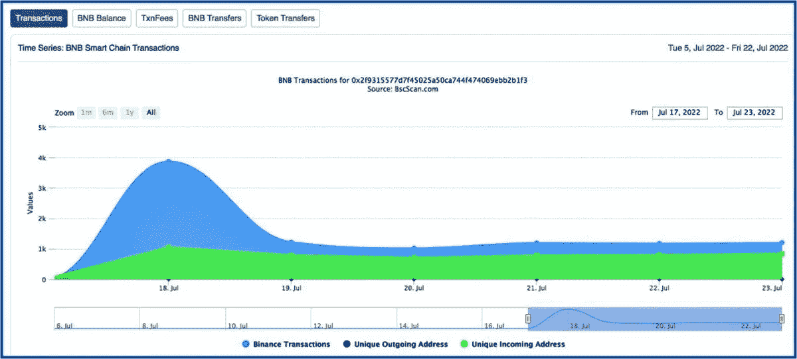
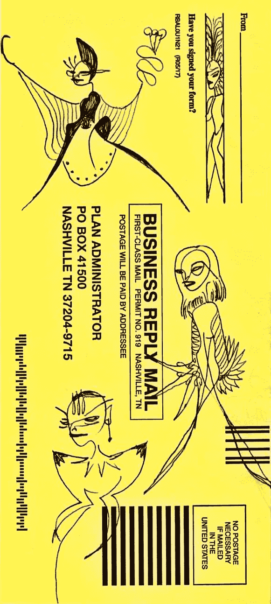

# 新的每日 5%投资回报率加密赌注平台，具有新一代可持续发展特性

> 原文：<https://medium.com/coinmonks/new-5-roi-crypto-miner-staking-platform-with-next-gen-sustainability-features-1401006b376f?source=collection_archive---------6----------------------->

## 这不是你父母的点滴矿工——欢迎来到最新的长期被动收入投资门户网站…

## ToTheSmart.com 刚刚出生 6 天…

这是一个新的游戏赚取赌注平台，提供 5%的每日投资回报&建立在币安智能链上。它遵循一种独特的数学算法，基于挖掘比特币和其他加密货币挖掘的成功模式。

> 我探索和剖析新的口袋改变加密矿工协议。我要么把它们拆开，要么决定投资这个项目，鼓励它们的可持续性和持久性。

对于这个项目，我已经阅读了详尽的白皮书 Hazecrypto audit 我去过 BscScan 的智能合同数据库，查看时间戳、TVL、每日/每小时的客流量以及其他交易信息。

The ToTheSmart crypto miner Dashboard.

## 合成

当你与这个矿工复合时，有内置的**可持续性机制**。了解复利(每日)创造更多矿工:

你需要 100 个矿工来提取你的收益而不被罚款。我的好友账户以 100Busd 开始&给我提供了 57 名矿工；今天他们有 79 名矿工。我要复合几天，直到我达到第一个 100 名矿工的平台期。

> 在强制复利之后，成功撤回当然是对一个工作中的加密矿工的最后考验之一——我可以轻松地开始提取我的一些回报吗？

由于 ToTheSmart 仍然是一个全新的零钱包矿工，我还没有到那一步——在我能够退出之前，我还有几天的复利。当我这么做的时候，我的回报应该已经是一周内 15%的投资回报率了。由于复利，这个百分比在接下来的一周增加到将近 25%

在收集我的回报之前，我需要计算下一个 100，200，等等。复利每天都在为我这样做，所以我不需要从口袋里拿出更多的钱来投资，除非我选择这样做。

当你拥有 1000 名矿工时，你似乎就掌握了这个地方:你可以随时撤退，再也不用担心矿工的数量了...

> 来自 devs:加密货币项目用来稳定其令牌组学的一个关键因素是令牌燃烧。我们已经把它作为# TOTHESMART 经济中的一种游戏机制。
> 
> 玩挣钱游戏**的玩家需要遵循一定的再采矿策略来增加收入并防止矿工被烧伤。🔄每一个采矿周期都应该增加 100 名矿工来强化你的农场。**

如果你必须在你的矿工达到下一个 100 名矿工的高峰之前拿走你的收入，你将被课以重税。如果你不继续复合回到协议中，你确实可以得到你的钱，只是回报慢得多。

## 时间池支付

Smart 引入了时间池支付，这是**协议中内置的另一个可持续发展机制**。

秘密口袋改变矿工的挑战之一是，他们并不总是鼓励足够的持续参与。我们都希望投资者继续利用矿工，并告诉他们的朋友。

如果一家矿商表现不错& the 仍在上涨，我会投资，但如果我认为它开始下跌，我就不会投资。

时间池对此有所帮助。它是这样工作的:如果你买了矿工&在那之后的 60 分钟内没有人购买，那么时间池余额将被存入你的钱包。

因此，当我投资下一笔价值 50 美元的 Busd 时，我希望没有人会在我之后一个多小时内立即投资。这是一个简单的彩票，不买票就玩…

## 更多了解…

从白皮书中，我很欣赏开发者创建一个单独的页面来解释和鼓励复合。一句很棒的台词是:

> “随着时间的推移，矿商的价值会下降，就像比特币采矿专用集成电路一样。**因此你需要使用 ReMines 功能来增加收入**或将农场收入保持在你可以接受的范围内。”

对我来说，这澄清了每日复利的必要性:当我不复利时，我的农场价值下降，当我复利时，价值应该上升。停止复利&你会失去农场的…

ToTheSmart compounding strategy spelled out for easy comprehension…

我开了一个常用的基本账户，在那里我存了 50 美元的试水费。然后，我观察和检查了一个星期的网站。

由于这个项目看起来相当可靠和聪明，我从另一个零花钱矿工那里刮了 100 美元，创建了我的第二个账户，Buddy 账户，这是 Prime 账户的推荐账户。几乎总是&很快，来自好友账户的推荐奖金为我的主账户提供了投资回报…

到目前为止，我喜欢这个矿工&没有看到大的缺点。因为这仅仅是个开始，我还在记笔记&每天都在学习。一直关注 TVL &交易量和客流量的增长，下面的图表看起来很有希望。

The To The Smart pocket-change crypto miner had a great initial bump. After that, it is not a straight line…notice that the interaction with the miner is still increasing steadily each day, which is absolutely what we want to see.

只有 6 天的时间，每小时唯一的传入地址图表-矿工的英尺流量-从第一天开始就一直在增加…我将继续关注每天/每周/每月的进展。口碑和积极的投资者参与这个口袋里的变化加密矿工是什么将保持强劲，希望未来几年。我会一直看着它。

**跟着我** …thx 阅读。

# 无耻的插头

点击查看[ToTheSmart.com。](https://tothesmart.com/?ref=0x024ee915c2BF9d12F98b750119051A752e18CAa0)

 [## ToTheSmart

### 玩游戏赚取建立在币安智能链区块链上的采矿农场。购买矿工，开采 MineToken，并将其兑换为…

tothesmart.com](https://tothesmart.com/?ref=0x024ee915c2BF9d12F98b750119051A752e18CAa0) 

> [*dinobusd . finance*](https://dinobusd.finance/?ref=0x66ab1C0978Df3AC4c9cfa0b9e8bd6EcE4B57Ee9d)*是我最喜欢的&最富有成效的零花钱矿工。我只投资我已经研究过的项目&我觉得写起来很舒服。整篇文章点击 DinoBusd，直接带你到那个投资平台；使用该平台将为我提供一点金钱上的好处…谢谢。*

 [## 迪诺布斯矿工

### DinoBusd——可持续发展是我们让您获得更高利润的关键

dinobusd.finance](https://dinobusd.finance/?ref=0x66ab1C0978Df3AC4c9cfa0b9e8bd6EcE4B57Ee9d) 

只玩不需要的。在放弃你辛苦挣来的零花钱之前，请把这次谈话当作你整体研究的一小部分。

谢谢你走到这一步。我希望你能在这篇关于我们生活的疯狂的密码世界的文章中找到一些有价值的东西。总是很高兴有你跟着我

我哥们什么都画！我称之为他的账本系列。我喜欢下面的场景…

> 交易新手？尝试[加密交易机器人](/coinmonks/crypto-trading-bot-c2ffce8acb2a)或[复制交易](/coinmonks/top-10-crypto-copy-trading-platforms-for-beginners-d0c37c7d698c)