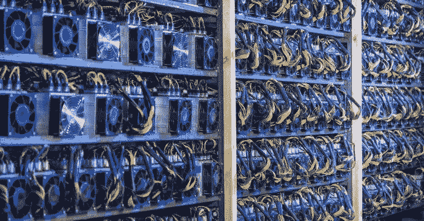

# 新 BMC 报告:比特币网络 59.5%依靠可再生能源

> 原文：<https://medium.com/coinmonks/new-bmc-report-bitcoin-network-runs-59-5-percent-on-renewable-energy-f77b527f9142?source=collection_archive---------37----------------------->

由于巨大的能源消耗，比特币网络在媒体和政治上面临越来越大的压力。这个行业本身现在提出了一项倡议，表明比特币比你想象的更环保。来自所谓的**比特币采矿委员会**的[新报告](https://bitcoinminingcouncil.com/bitcoin-mining-electricity-mix-increased-to-59-5-sustainable-in-q2-2022/)甚至显示该网络 59.5%依靠可再生能源运行。

# 比特币能源组合越来越可持续

每个季度，比特币采矿委员会都会发布比特币能源组合的新数据。本季度，比特币的能源组合中有 59.5%是可再生能源。

这一数字比 2021 年第二季度高出 6%，比 2022 年第一季度高出 2%。

此外，比特币采矿委员会补充说，这些数字使比特币采矿成为世界上最可持续的行业之一。

有趣的是，比特币采矿委员会的成员甚至使用 66.8%的可再生能源。

目前，这群矿工持有**总股份**的 50.5%。在这种能源组合下，比特币网络比德国、韩国、美国和许多其他国家更具可持续性。

# 比特币挖矿效率越来越高

同样值得注意的是，比特币挖掘总体上变得更加高效。与 2021 年第二季度相比， **hashrate 增长了 137%，而能耗仅增长了 63%。**

这样，网络的效率提高了 46%。比特币矿业委员会在 YouTube 活动[上分享了更多关于行业发展的细节。](https://www.youtube.com/watch?v=9ISSe8A3pVc)

在这次活动中，董事长迈克尔·塞勒谈到了这样一个事实，即比特币挖矿目前的效率比八年前提高了 5，814%。

此外，比特币采矿仅占全球 34.8 万公斤二氧化碳排放量的 0.09%。此外，比特币目前仅消耗全球能源供应的 0.15%。

除此之外，迈克尔·塞勒抓住这些数字表明，许多关于比特币网络的说法已被证明是错误的。

> 交易新手？尝试[加密交易机器人](/coinmonks/crypto-trading-bot-c2ffce8acb2a)或[复制交易](/coinmonks/top-10-crypto-copy-trading-platforms-for-beginners-d0c37c7d698c)

事实上，过去人们预测比特币将在这个时候消耗掉世界上所有的能源。迄今为止，从这些数字来看，这显然还没有发生。部分原因是比特币挖矿变得更加高效。

# 能效之战 100%聚焦于能源消耗

马拉松数字公司的首席执行官弗雷德·泰尔表示，采矿效率是“恶性循环”的一部分，这使得 T2 的产业“越来越有效率”

在同一个 YouTube 活动中，Thiel 继续分享马拉松数字公司的效率之战百分之百集中在能源消耗上，因为能源是最大的成本。“当能源价格上涨时，它迫使我们变得更有效率，”弗雷德·泰尔说。

随着比特币价格的上涨，对采矿硬件的需求也在增加，最终推动了创新。

缓慢但肯定的是，效率更高的机器将利润更低的机器挤出市场。因为那个过程，比特币挖矿行业变得越来越有效率。

比特币网络带来的这些效率提升正值包括伊丽莎白·沃伦在内的六名美国议员致信美国环境保护署(Environmental Protection Agency)和能源部之际。

这些信件包括要求美国矿业公司报告他们的排放和能源组合。

*原载于 2022 年 7 月 21 日 https://bitnewsbot.com***。**