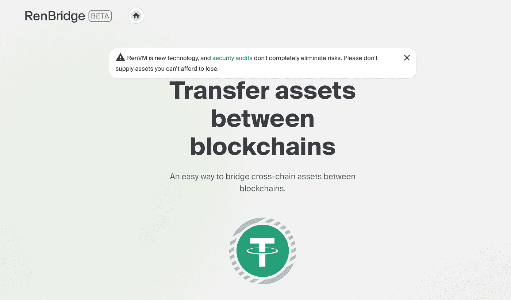

# 新的 DeFi 加密犯罪和利用

> 原文：<https://medium.com/coinmonks/new-defi-crypto-crimes-exploits-90d492d35ec8?source=collection_archive---------35----------------------->

[Image Credit: B Klug](https://www.flickr.com/photos/85783274@N00/7016111651)

写关于新兴的分散金融世界(DeFi)的文章，重点是洗钱和欺诈，有点像“不给糖就捣蛋”。每个房子(或者在我的情况下，每个星期)提供更多的糖果，或者在我的情况下，与我选择的节拍相关的新闻。每周《DeFi 市场新闻》都会披露与价值数百万美元(USD)的加密资产从加密交易所被盗以及 NFT 世界正在发生的无数阴谋有关的金融谋财害命事件。由于这种金融谋财害命的旋转门，洗钱活动在过去几年中激增。

与 2020 年相比，2021 年的数字洗钱活动增加了 30%,其中通过加密手段洗钱的金额总计 86 亿美元，正如我们已经令人厌烦地讨论过的，加密手段是完美的洗钱工具。多亏了 DeFi，我们现在正经历着洗钱的黄金时代。此外，有才华的软件开发人员正在不断推出新的 DeFi 工具和平台，这些工具和平台旨在比去年同期推出的 DeFi 工具更安静、更有效地清洗肮脏的比特币。事实上，这是本周影响 DeFi 的最热门的两个方案:过渡性贷款和闪贷。

## **铁索桥**

Cross chain bridges 是一种连接不同区块链并允许用户在区块链之间转移不同加密货币的技术，目前非常热门。窃贼们正在以光速和惊人的规模入侵链条，窃取资金，然后通过其他桥梁清洗他们的非法密码。上个月，Nomad 桥遭到黑客攻击，窃贼偷走了价值 1.9 亿美元的密码。流浪者之桥连接了许多区块链，包括以太坊和雪崩，所以这个消息震动了一个相当大的社区。

在[接受《财富》杂志](https://fortune.com/2022/09/12/law-enforcement-defi-exploits/)采访时，DeFi-Yield 的联合创始人迈克尔·罗斯纳问记者，“你还能去哪里，在没有追索权的情况下偷到真正大量的钱？”在后来的采访中，他补充道，“两个连锁店之间交换的价值越多，大麻就越有吸引力，你就会想要攻击它。”

我不知道那件事，但我知道这种情况不能再继续下去了，或者更久。如果硬币公司、游戏公司和密码交易所不开始实施真正的安全和严格的措施来打击腐败，这些桥梁也确实为用户提供了积极的好处，但很快就会发现自己在财政部的黑名单上。

由于这些桥本质上是开放的平台，用户的硬币会自动与其他硬币混合在一起，因此没有办法追踪在这个舞台上洗钱的钱。一个例子是一个名为 [RenBridge](https://bridge.renproject.io/welcome) 的商业桥梁，自 2020 年以来，该平台显然已被用于洗钱超过 5.4 亿美元。请查看其主页下方弹出的安全公告。伦布里奇不适合我们这些输不起的人。至少消息是真实的！

## **闪贷**

打开洗钱机！

首先，[什么是闪贷](https://learn.bybit.com/defi/what-is-a-flash-loan-attack/)？这是一种不需要任何抵押品的贷款，只能通过加密货币来完成，并要求接受贷款的人以快速的方式全额偿还贷款。用户正在快速套利这些贷款，其中一些人获得了可观的利润。这些贷款之所以如此吸引人，除了无需抵押之外，还在于如果交易中出现问题，这些贷款将被视为无效。风险相当低。

然而，快速贷款[攻击](https://learn.bybit.com/defi/what-is-a-flash-loan-attack/)是指有人滥用特定平台的智能合约安全性，在一个交易所操纵新购买的加密资产的价格，然后在不同的加密交易所转手并快速转售。整个过程快得令人难以置信，让小偷在不留痕迹地离开之前多次重复这一过程。到目前为止，闪贷攻击[被认为](https://cryptosec.info/defi-hacks/)窃取了价值超过 15 亿美元的密码。这太疯狂了。

上周发生了针对前面提到的雪崩区块链的闪贷攻击，罪犯获得了超过 370，000 美元的加密资金，这些钱可能在此后不久就被区块链的一座桥冲走了。我是说，真的很简单。与其他闪贷攻击相比，雪崩盗窃相对较小，但它确实发生在上周。这可能是少数几个，甚至是许多，还没有被报道的事件之一。对于一个发展如此迅速的 DeFi 市场来说，这似乎是意料之中的事情，从全局的角度来看，要跟上它的发展几乎是不可能的。

DeFi 现在是终极移动目标。

*   结束

> 交易新手？尝试[加密交易机器人](/coinmonks/crypto-trading-bot-c2ffce8acb2a)或[复制交易](/coinmonks/top-10-crypto-copy-trading-platforms-for-beginners-d0c37c7d698c)