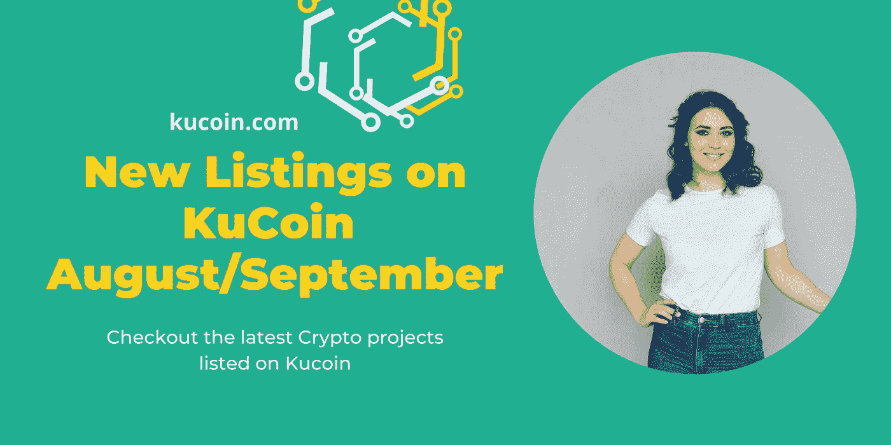

# KuCoin 上的新列表(8 月/9 月)

> 原文：<https://medium.com/coinmonks/new-listings-on-kucoin-august-september-cad8002dbb76?source=collection_archive---------18----------------------->

Kucoin 是 Altcoin 领域领先的加密交易平台，一直热衷于包括新推出的加密/令牌。这种包容性是该平台在[加密市场](https://www.kucoin.com/markets)中脱颖而出的原因。哦，这是你想露营的地方，如果你想找到下一个加密宝石的话。

***库币之所以能在密码交易所行业证明自己，得益于以下几个因素:***

*   它囊括了各类投资者，通常被称为“*人民交易所*”。
*   它是排名第一的替代硬币交易所，拥有 700 多项资产和 1200 个交易对。它也是一些加密宝石如 KMA，BLOK，CHMB，VR 和 DAO 的家园。
*   它有一个跨越国家和地区的超过 2000 万用户的后院，提供现货交易、保证金交易、赌注、期货、P2P 交易和贷款服务。
*   根据 CoinMarketCap 和 CoinGecko 的统计，Kucoin 是排名前五的加密交易所。

我最近在 KuCoin 上做了一个“*7 月/8 月*”的新列表。这篇文章只是上一篇文章的延续。

1.  **NFT-ETF -hiSAND33** -这是一个 ERC-20 令牌，由 Fracton 协议提供支持，代表捆绑包的 1/1，000，000 所有权，通常在 Fracton 协议的元交换池中有 3x3 沙盒。它得到 HISAND33/USDT 交易对的支持。

Fracton 协议代表了一种 NFT 流动性基础设施，其特点是两步细分(ERC721-ERC1155-ERC20)，旨在为所有类型的 NFT 提供无许可流动性。

*   总供应量:800 万 his 和 33
*   发行价格:_
*   交易时间:2022 年 8 月 24 日 10 点(世界协调时)

**2。Dogechain (DC)** — Dogechain 推动 Dogecoin 将游戏、NFTs 和 Defi 等加密应用程序引入 Dogecoin 社区。这是因为 Dogecoin 无法支持这些应用程序中的任何一个；因此 Dogecoin 来解决这个问题。有了 Dogechain，Dogecoin 持有者获得的机会比单纯持有更多。

*   总供应量:10 亿 DC
*   发行价格:0.0001 美元
*   交易时间:2022 年 8 月 27 日 10 点(世界协调时)

**3。元宇宙。网络&位。国家(NEER)**——这是新的多元宇宙 *(L1 区块链和草间弥生智能合约平台*)让非技术用户能够创建自己的元宇宙，市场&NFT。

*   总供应量:1 亿 NEER
*   初始市值:684 万美元
*   发行价格:0.3 元
*   交易时间:2022 年 8 月 30 日 12:00(世界协调时)

**4。ThunderCore (TT)** -它采用超高速第 1 层公共区块链，热衷于为其充满活力的生态系统带来精英执行和经济高效的可扩展性。

它的目标是为下一代艺术家、密码建造者和在 Web 3、NFT、Defi 和 GameFi 中创作的梦想家提供一个经过战斗考验的家园。这是通过其验证的体系结构、4，000 TPS 和强大的开发支持实现的。

*   总供应量:100 亿 TT
*   市值:51539876 美元
*   发行价格:0.029318 美元
*   交易时间:2022 年 9 月 1 日 9 点(世界协调时)

**5。raven coin(RVN)**——raven coin 描绘了一个开源的、去中心化的、社区驱动的、证明有效的区块链协议，它本质上是建立在比特币的代码分叉上的。

它带来了可交易的区块链资产的特性，特别是专注于简单的管理和发行，这些资产通常代表商品、证券、NFT 和房地产等现实世界的资产。本质上，资产是通过焚烧本币(RVN)创造的。

*   总供应量:21 301 804 400 越南盾
*   市值:305，203，955 美元
*   发行价格:_
*   交易时间:2022 年 8 月 31 日 10 点(世界协调时)

**6。NFT ETF-hi ENS3**——这个 ERC-20 令牌代表 Fracton 协议的 ENS3 元交换池中一个(3 位数)en 的 1/1，000，000 所有权。实际上，每投入一个 3 位数的 en，hiENS3 的总供应量就增加 100 万。或者，从库中取出每 3 位数的 en，hiENS3 的总供应量减少 100 万。

*   总供应量:600 万套 3
*   交易时间:2022 年 9 月 5 日 10 点(世界协调时)

**7。Mechaverse (MC)** - Mechaverse 代表一个由 Mechaverse 实验室开发的附属游戏-fi 项目。(*一个 Web3 娱乐平台*)。Mechaverse 以一款 Web3 时代的元次元策略游戏——Fi 为特色，本质上武装了众多日本知名 IP 的 NFT 授权。

Mechaverse 背后的团队包括视觉设计、加密、游戏开发和出版、区块链、金融、媒体、数字艺术和品牌推广方面的经验丰富的专业人士。

*   总供应量:2 亿立方米
*   市值:30 万美元
*   发行价格:0.1 元
*   交易时间:2022 年 9 月 7 日 12:00(世界协调时)

**8。Meta Apes(PEEL)**——Meta Apes 带来了一款免费游戏和赢赚(MMO)战略游戏，为移动设备开发，是目前第一款在 BNB sidechain 上开发和推出的游戏。

Meta Apes 的设计目标是打造一款独特的 Web3 游戏，将 Web2 功能和 Web3 游戏融为一体，从而吸引传统玩家和 P2E 玩家。

*   总供应量:67，594，413 皮
*   市值:11028516 美元
*   发行价格:0.04 元
*   交易时间:2022 年 9 月 8 日 10 点(世界协调时)

**9。汗水经济(SWEAT)-** 汗水钱包是增长最快的 DApp，在 4 个月内拥有超过 1300 万用户。SWEAT 为 Sweat Wallet 应用程序提供了燃料，该应用程序是数百万用户的 Web3 门户。对汗水的需求源于:

1.  *效用* -投注奖励，平台代币福利&游戏化。
2.  *购买和燃烧* -由汗水基金会收入资助

*   总供应量:210 亿汗
*   市值:410 万美元
*   发行价格:0.00714 美元
*   交易时间:2022 年 9 月 13 日 9 点(世界协调时)

10。NTF ETF hio DBS——它是一个 ERC-20 令牌，代表 Fracton 协议的元交换池中 odb 的 1/1，000，000 所有权。它目前由希奥德布斯/USDT 交易对支持。

*   总供应量:3200 万希奥德布
*   交易时间:2022 年 9 月 14 日 12:00(世界协调时)

**11。Caduceus (CMP)** - Cadeceus 代表了一种用于分散式边缘渲染的元宇宙协议，提供了一种基础设施级的开放式区块链平台，专为在元宇宙和分散式数字世界中创造价值而构建。它采用了分散渲染、面向元宇宙开发者和创造者的 3D 渲染技术以及边缘计算。

*   总供应量:10 亿公吨
*   市值:2.1 亿美元
*   发行价格:0.08 元
*   交易时间:2022 年 9 月 15 日 10 点(世界协调时)

**12。Pixie (PIX)** - Pixie 是世界上第一个基于加密的照片和视频分享社交平台，结合了 SocialFi 概念。它通常被称为 Tiktok 和 Instagram 的加密版本。本质上，参与社交活动(发帖和点赞)会为你赢得一些 PIX 代币。该平台目前拥有 30k 日活用户和超过 700 万条帖子，成为 Web3 时代最大的社交平台。

*   总供应量:1000 亿像素
*   发行价格:0.005 美元
*   交易时间:2022 年 9 月 20 日 10 点(世界协调时)

13。Metaplex(MPLX)——meta plex 恰好是世界上最大的 NFT 生态系统，由开源的 meta plex 协议提供支持；快速成长的创作者平台。在短短一年的时间里，利用 Metaplex 技术的创作者和艺术家已经获得了超过 1B 美元的收入和超过 3B 美元的二次销售收入。它目前由 KuCoin 上的 MPLX/USDT 交易对支持。

*   总供应量:10 亿 MPLX
*   发行价格:0.35 美元
*   交易时间:2022 年 9 月 20 日 00:00(世界协调时)

**14。NTF-ETF hiDOODLES** -这是一个 ERC-20 令牌，代表 Fracton 协议的元交换池中存在的涂鸦的 1/1，000，000。它在库币上得到希多尔斯/USDT 交易对的支持。

*   总供应量:2100 万 hiDOODLES
*   交易时间:2022 年 9 月 22 日 12:00(世界协调时)

**15。sand clock(Quartz)**——这款基于区块链的金融应用是世界上第一款为大众开发的用户可编程收益率优化器；然而，它对 power crypto 用户来说还是很有用的。Sandclock 带来了机上灵活性、自动化和对用户存款的高 APYs。用户基本上可以轻松地捐赠、储蓄、投资和支出稳定的收入。

Sandclock 的目标是成为下一个 5000 万非加密用户过渡到 Web3 的入门渠道。

*   总供应量:1 亿石英
*   市值:25，839，563 美元
*   发行价格:一元
*   交易时间:2022 年 9 月 26 日 10 点(世界协调时)

16。EthereumPoW (ETHW) -简称 ETHW，是以太坊区块链与以太坊合并的硬分叉。随着最近合并的完成，以太坊已经过渡到了风险证明，分叉版本仍然是工作证明。

*   总供应量:122，444，717 ETHW
*   市值:1398761437 美元
*   交易时间:世界协调时 2022 年 9 月 26 日 9 点

**17。AgeOfGods(AOG)**——AgeOfGods 脱颖而出，成为下一代 NFT 动作卡牌游戏，其全部收入用于从市场回购代币。收入来源包括 NFT 交易版税、游戏内购买和 BiSwap 等合作伙伴关系。

*   总供应量:2.7 亿 AOG
*   市值:150 万美元
*   发行价格:0.12 元
*   交易时间:2022 年 9 月 30 日 12:00(世界协调时)

**18。获取。fi(ACQ)**——它提供了一个将 Web3 和投资结合起来的平台，为所有人开发了一种新的财富积累模式。这两种相互关联的产品包括:

1.  第一个加密 M&A 市场
2.  投资池使散户投资者能够获得网络 3 公司、现实世界资产和传统业务的所有权。

获取。Fi 本质上是把 APY 从现实世界的创收企业放在链上，让每个人都可以访问。

*   总供应量:3 亿 ACQ
*   发行价格:0.1 元
*   交易时间:世界协调时 2022 年 9 月 28 日 15:00

## 结论

成为 KuCoin 的一员意味着可以在最新的加密和元宇宙项目登陆月球之前直接访问它们。拥有一个 KuCoin 账户肯定会让这个过程变得更容易。从今天开始，继续努力！

[***在这里开个 Kucoin 账户> >***](https://www.kucoin.com/ucenter/signup?rcode=rP1HTX2)

***关联披露:*** *本帖可能包含关联链接* s。

> 交易新手？试试[加密交易机器人](/coinmonks/crypto-trading-bot-c2ffce8acb2a)或者[复制交易](/coinmonks/top-10-crypto-copy-trading-platforms-for-beginners-d0c37c7d698c)