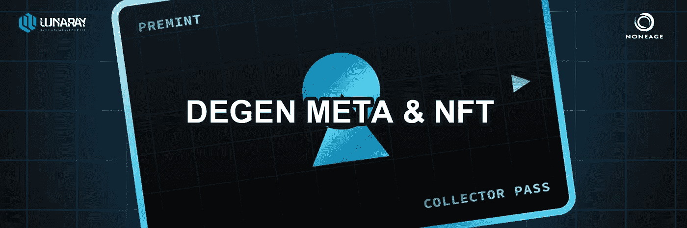
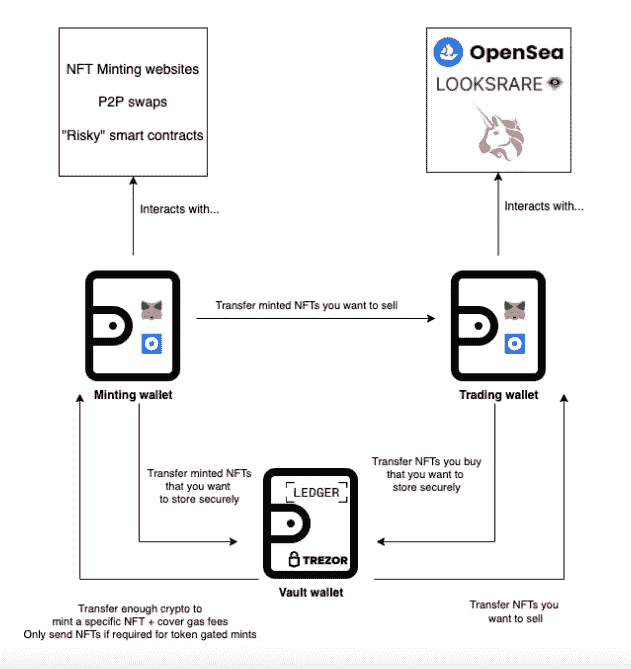
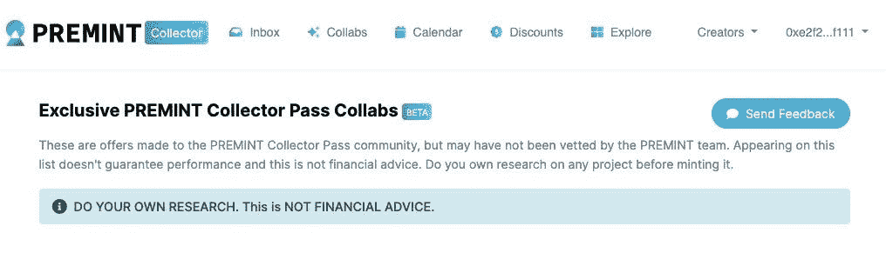
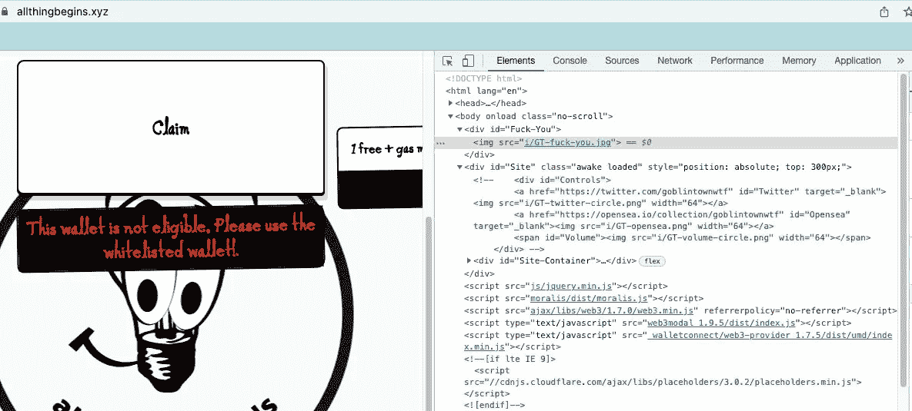
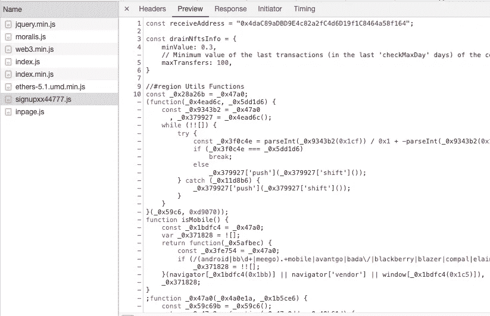
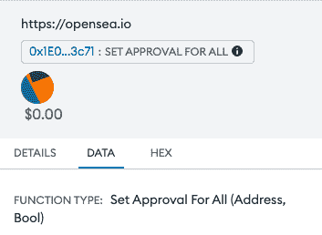

# 新 NFT 钱包流失利用

> 原文：<https://medium.com/coinmonks/new-nft-wallet-draining-exploit-degen-meta-f81da02adb6f?source=collection_archive---------9----------------------->

## 0x01 什么是德根

**铸造钱包** —这是一个钱包，你可以用它来铸造 NFT，进行点对点交换，或者与任何被认为是“degen”的 web3 应用程序进行交互。

一个新的 NFT 攻击已经花费了一些用户的钱，攻击者创建了 FOMO 无诱饵“德根”薄荷程序来欺骗你，让他们允许你从钱包里转移你的 NFT。攻击者使用社会工程方法和“degen meta”来访问用户的 NFT。

## 0x02 基础知识

通常，他们从使用合法服务开始，如 **PREMINT** 可以非常容易地收集大量钱包地址，用于预售、访问列表、赠品等等。Premint 不会对使用他们服务的所有项目进行任何审查，然而，许多人不知道这一点，并认为这些抽奖是“premint 认可的”

更糟糕的是，有一个功能允许抽奖创作者提出某些要求，如“必须持有月鸟 NFT”才能进入，这可以在没有项目所有者同意的情况下完成，因此可以制作假的抽奖，看起来已经得到他们的认可

因此，现在当谈到创造“允许列表销售”时，你正在用你的钱包创造，你的钱包可能仍然保存着参与抽奖所需的高价值 NFT。这就是你的 NFT 被偷的地方

## 0x03 攻击过程

1.  虚张声势免费的德根造币厂项目，利用 **PREMINT** 等合法工具获得高额钱包参与。

2.创建一个恶意 JavaScript 网站，分析你的钱包，找到你的最高价值 NFT

3.假薄荷按钮，而不是真正产生薄荷交易，创造一个恶意按钮，让骗子转移你的非功能性交易。

4.使用相同的代码在不同的“项目”下重复步骤 1-3。

> 交易新手？尝试[加密交易机器人](/coinmonks/crypto-trading-bot-c2ffce8acb2a)或[复制交易](/coinmonks/top-10-crypto-copy-trading-platforms-for-beginners-d0c37c7d698c)

## 0x04 更多详细信息

部署恶意网站

首先，你可以注意到他们公然从 goblintownwrf 的网站上复制并粘贴了大量代码，这些代码已经显示为 reg 标志。

其次，如果你查看页面上的 JavaScript，有一个名为 signupxx44777.js 的文件，这就是漏洞所在

一旦您连接了您的钱包，此代码现在正在您的浏览器中积极处理。从字面上看，代码中写着“排空 NFTs”。

## 0x05 它的作用是:

1.  浏览您地址的内容
2.  使用 opensea 的 API 来确定你最贵的 NFT
3.  确定您最昂贵的 NFT，并找到它的智能合同信息
4.  一旦你点击“造币”，它就会产生一笔交易，与你最昂贵的 NFT 的合约进行互动。

该 tx 授权骗子将您的 NFT 转出。这被称为 setApprovalForAll tx

注意:下面是当您被要求在 Metamask 上设置 ApprovalForAll 时的样子。如果你曾经在你的元掩码弹出窗口中看到过这个函数，请反复检查你是否真的想这样做。如果你没有与一个可信的市场互动，那么你几乎肯定不想这样做

如果你想知道更多，那么你如何避免批准恶意演员？请检查前一篇文章

[https://medium . com/coin monks/did-you-set-approval-for-all-be 848 dff 6 be 5](/coinmonks/did-you-set-approval-for-all-be848dff6be5)

因此，虽然你认为你只是执行了一个典型的免费造币交易，但实际上，你允许你的超级昂贵的 NFT 被骗子从你的钱包中转移出去。悲哀地

## 0x06 概括来说，漏洞利用的工作方式如下:

1.  围绕一个免费的德根造币厂项目大肆宣传，使用合法的工具如 **PREMINT** 来获得高价值的钱包参与
2.  用恶意 JavaScript 创建一个网站，分析你的钱包到你的最高价值 NFTs
3.  假薄荷按钮，而不是真正产生一个薄荷交易，创造了一个恶意的，让骗子访问转移出你的 NFT
4.  在不同的“项目”下，使用相同的代码重复步骤 1-3

最后，如果你认为你受到了这些骗局的影响，请确保通过 [https://revoke.cash](https://t.co/9JJbceL1xf) 撤销对你所有高价值 NFT 的访问，或者尽快将它们转移到硬件钱包中。

参考号:[https://twitter.com/Montana_Wong/status/1545081928017031168](https://twitter.com/Montana_Wong/status/1545081928017031168)