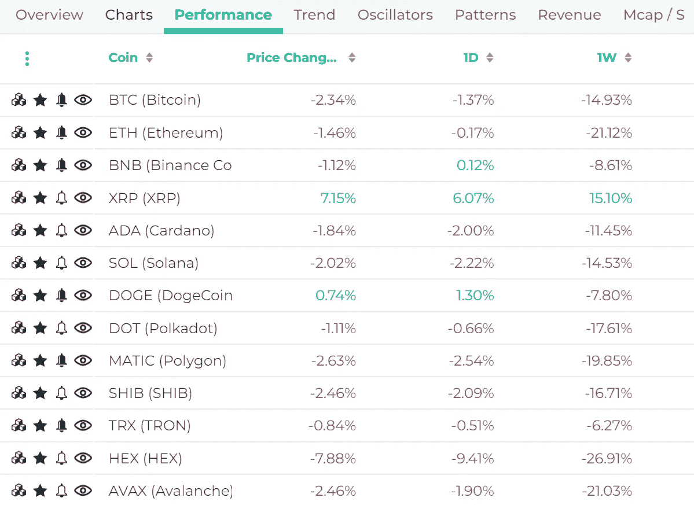
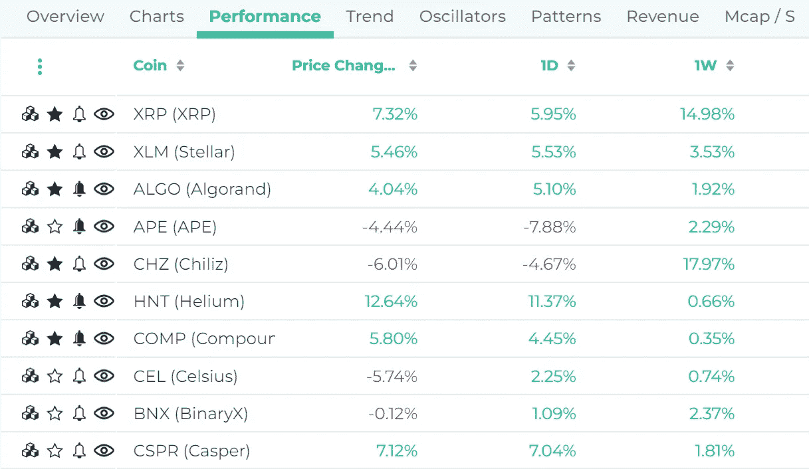
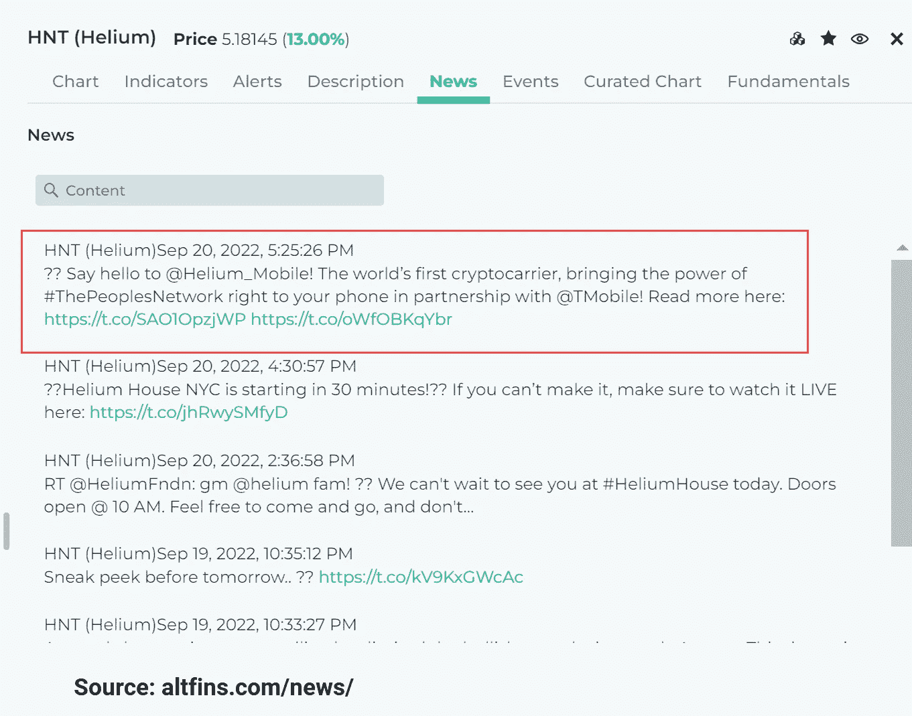

# 新的贸易显示。押注赢家(相对表现优异者)

> 原文：<https://medium.com/coinmonks/new-trade-revealed-betting-on-winners-relative-outperformers-d600526bafab?source=collection_archive---------57----------------------->

Source: [altFINS](https://altfins.com/education)

在最新的 Richard 视频中，他解释了他如何搜索具有“相对实力”(即表现优异者)的硬币，以及他对今天推动氦气价格的重大新闻的看法。

过去几天密码价格很贵。自从 ETH 合并和美国通胀数据出来后，ETH 下跌了 20 %, BTC 下跌了 15%:

Source: altFINS

**然而，一些硬币已经设法跑赢了:**

Source: altFINS

这些跑赢大盘的公司显然做了一些正确的事情，即使在整体市场下跌期间也吸引了买家。通常有一些基本的原因导致他们的代币价格偏离市场，表现出相对的力量。当市场向上波动时，这种情况可能会放大。

筛选这种相对强度可以作为额外挖掘、调查和分析的良好起点。

一枚这样的硬币引起了我的注意，那就是氦(HNT)。查看新闻发现了一些即将到来的大催化剂。

氦于 2013 年推出，专注于连接物联网设备，但基于区块链的版本于 2019 年推出，并被命名为氦网络。在推出的 3 年内，它现在包括 73，000 个城市中的近 100 万个热点！！创建这样的网络覆盖通常需要数十亿美元的投资和年复一年的基础设施建设。

Source: altFINS

这个想法是，任何人都可以贡献他们的 WiFi 或移动设备并共享带宽，为此他们可以获得奖励令牌。另一方面，消耗该带宽的公司或个人必须购买和刻录 HNT 才能获得网络信用，这允许用户通过氦网络传输数据字节，并用于区块链交易费。

氦网络已经被公司和企业用于许多用例，如监测空气质量。

2022 年 3 月，这个项目背后的实体 Nova Labs 获得了 Tiger Global、Andreessen Horowitz 等大型风投公司的 2 亿美元投资，甚至还有德国电信等战略投资者。这使得该公司的估值超过 12 亿美元。与此同时，氦的市值目前只有 6 亿美元左右。

这笔投资将用于在氦网络上构建生态系统，并在此基础上构建新的应用。

氦移动将于 2023 年初推出。今天(9 月 20 日)，该公司宣布氦移动——这是建立在氦网络之上的，氦网络是最大的分散式无线网络。氦移动每月只需花费 5 美元。我在 altFINS Screener 的 HNT 详情部分的新闻选项卡下找到了这条新闻:

Source: altFINS

到目前为止，该公司已将其大部分资源用于建设网络，本质上是激励人们参与网络，扩大热点覆盖范围。

但现在它将推出移动语音和数据服务，与威瑞森、沃达丰、美国电话电报公司等竞争。，这将推动对 HNT 代币的更大需求。

公告的重要部分是它与 T-Mobile 合作，在美国提供全国覆盖。所以，服务应该很有竞争力。

> 交易新手？试试[加密交易机器人](/coinmonks/crypto-trading-bot-c2ffce8acb2a)或者[复制交易](/coinmonks/top-10-crypto-copy-trading-platforms-for-beginners-d0c37c7d698c)