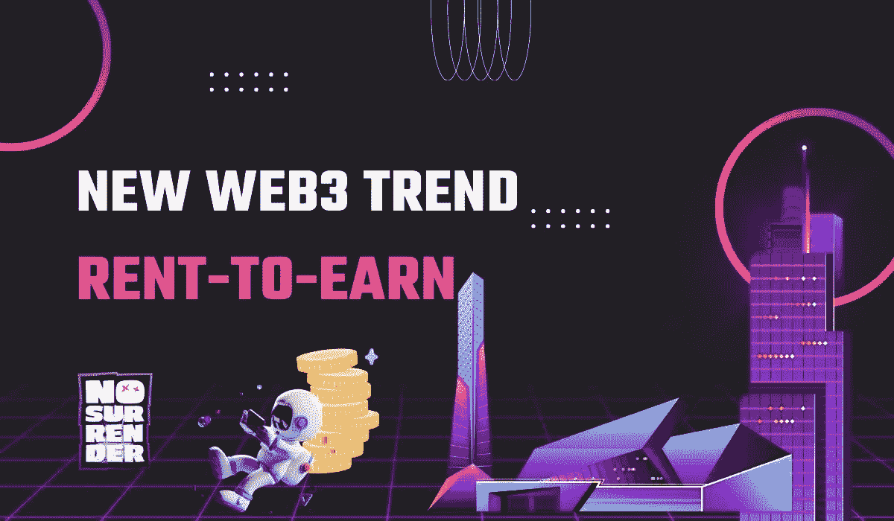
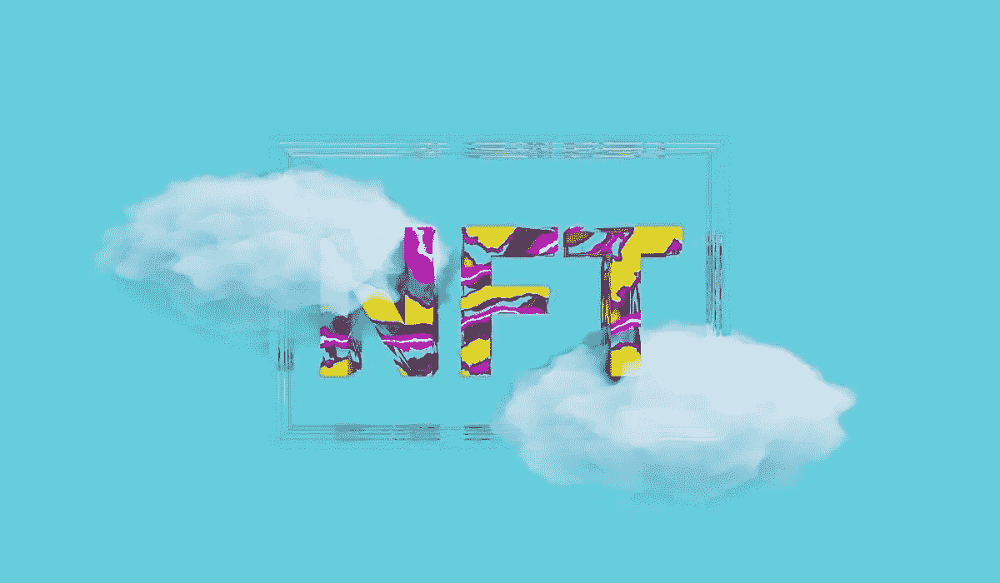
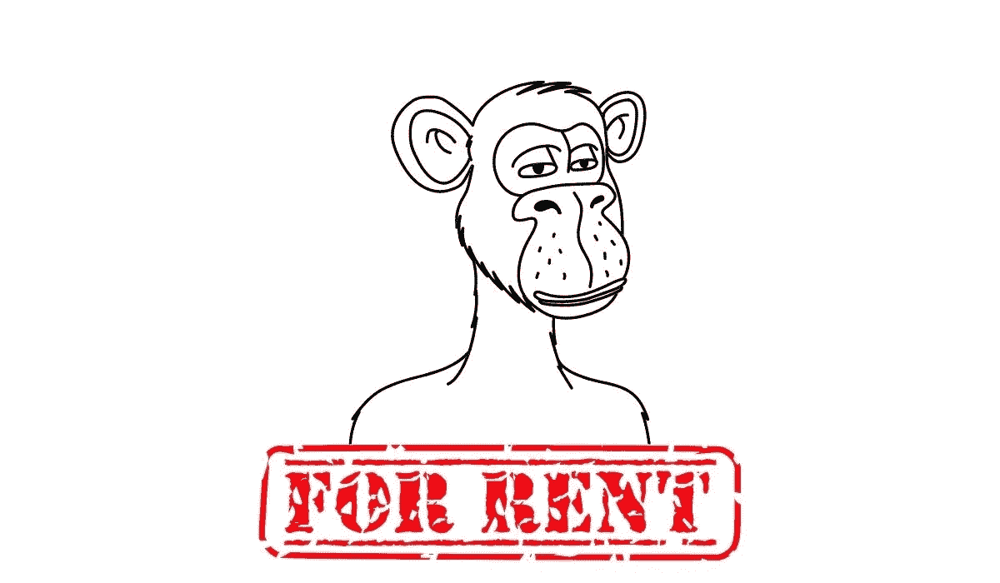
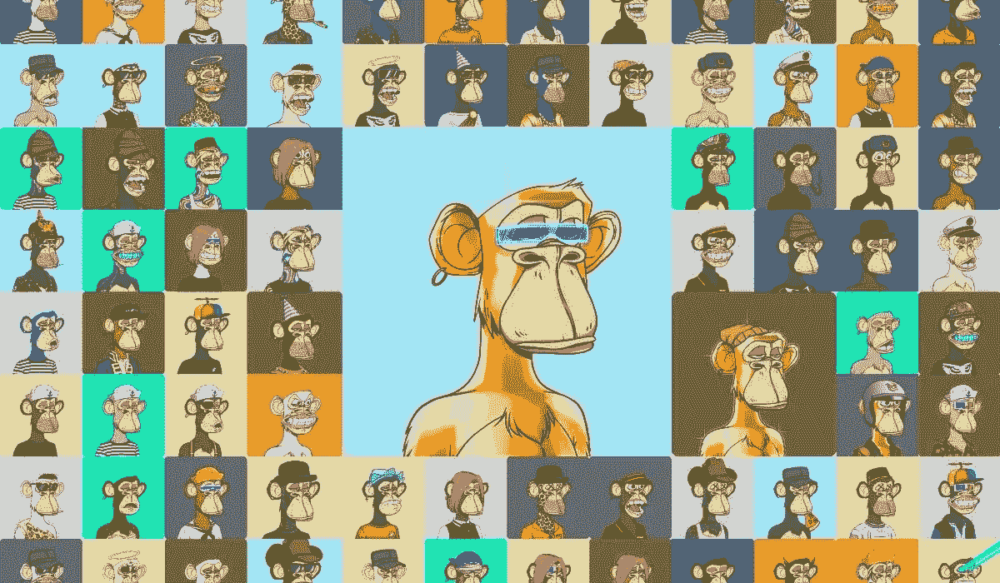

# 新的 Web3 趋势租金收入

> 原文：<https://medium.com/coinmonks/new-web3-trend-rent-to-earn-20b78be2f5e2?source=collection_archive---------2----------------------->

*你对被动收入模式有什么看法？哪个最好？*

在今天的经济危机中，购买量非常高，可以获得一些临时使用的房产的借款人和想要评估其房产的租房人生活在同一个生态系统中。那么，你有没有注意到每天都在发展的租房概念是如何在一个广阔的区域内传播的呢？

首先，随着对房屋和住宿的需求而被纳入我们日常生活的租房，通过进入其他具有高购买力的部门而继续发展。如今，从车辆到衣服，一切都可以出租。租房，一开始直接关系到购买力，随着日常的发展，对于拥有房产并需要短期使用的人来说，成了双赢。

其次，随着它的发展，租赁扩展到各个领域。在那之后，随着 NFT 和网络 3 经济的加入，它爆发了。好奇 NFT 租房的目的是什么？让我们找出答案。

# NFT 租了什么？

*租一辆 NFT 可以让你从它的优点中获益，而无需做出购买它的财务承诺。*

不管我们喜不喜欢，每样东西都有一个 NFT。有许多来自不同商业领域的 NFT 项目，如 [**耐克的游戏**](/blockchain-biz/5-brands-that-jump-on-the-nft-bandwagon-60dbf3005a74)[**星巴克的奖励**](/blockchain-biz/starbucks-web3-project-f28e5f17200a)[**NFT 服装**](/blockchain-biz/5-brands-that-jump-on-the-nft-bandwagon-60dbf3005a74) 等等。当您深入探索 NFT 空间时，您有机会发现更多独特的代币产品。即使这些代币优惠可以是独特的和多种多样的，这些优惠的共同点是独特优惠的高价格。

购买和收藏 NFT 并不便宜。即使是来自知名项目(如 Bored Apes 和 Cryptopunks)的最便宜的 NFT 也不会以普通人可以承受的价格出售。NFT 租赁在这种情况下出现了。因此，这意味着出租代币，并为用户提供暂时体验拥有 NFT 并利用其优势的机会。

# NFT 租房的目的是什么？

在 NFT 的环境中，租赁创造了一种二级经济，在这种经济中，非功能性租赁通常只是闲置在用户的钱包里。它为租房者提供了一个被动收入来源。例如，你必须购买一个 NFT 飞鱼俱乐部，其功能类似于会员令牌，才能在美国商人加里·维纳查克的会员专属餐厅飞鱼俱乐部用餐。当租赁者不使用他们的会员资格时，他们可以将其出租给其他人并从中获利。

[**NO Surrender Heroes**](https://app.adjust.com/nw8swri?redirect=https%3A%2F%2Ftwitter.com%2FNoSurrenderHero)

对于借款人来说，NFT 租赁提供了一种低成本的选择，可以利用 NFT 提供的一些服务，而不必花费数百或数千美元来购买这些服务，例如访问仅限会员的优质内容。再看 [**无投降英雄**](https://app.adjust.com/nw8swri?redirect=https%3A%2F%2Ftwitter.com%2FNoSurrenderHero) ，比如。Web3 游戏让玩家可以进行竞争性的 PvP 比赛，并有机会赢得相同英雄的胜利。出租**不投降英雄** NFT 将允许拥有由更高级英雄驱动的甲板的承租人从他们的持有物中赚钱。对于借款人来说，这类似于从在线目录中租赁一个英雄——你在短期锦标赛中战斗，然后归还。不需要长期承诺！

第三，在 NFT 租赁的概念之后，一个新的 web3 游戏概念出现了:**租金收入**。

在游戏世界里，租金收入是一个相对新颖的概念。在 P2E 的生态系统中，租金收入是区块链博彩的一种不同方式，加密货币公司正在开发创造性的方法来使用它。这些出现在 Web3 游戏行业的租金赚取服务也产生了影响。

# 什么是租金收入

租金收入背后的想法很简单。它的工作方式类似于现实世界中的租赁。参与者购买物品，如游戏中的资产，然后出租给其他玩家。此外，租赁使得缺乏资金购买游戏设备的人更容易参与游戏中独特的事情。

让我们以一个玩家在开始游戏前必须购买至少一个角色和一件武器为例。或者，假设玩家可以从免费的游戏内资源开始。然而，问题是他们不太强大，不会让玩家超越第一级。玩家必须在每个场景中投资一些游戏中的物品。此外，稀缺性会影响定价，这与现实世界非常相似。

在区块链，游戏中的物品以非功能物品的形式出现。NFT 的价格随着其稀有程度而上涨。这些费用可能会为新的竞争者设立很高的进入壁垒。然而，租金赚取系统降低了障碍。

# 从 NFT 租赁过渡到 Web3 租赁

我们已经 [**提到过**](/blockchain-biz/where-can-i-get-inspiration-for-web3-revenue-models-should-i-go-back-to-2008-c70eed5cafcb) 一种更可持续的经济模式将会用 F2P 取代 P2E 概念。

F2P 指的是在线游戏的商业模式，游戏设计者不向参与游戏的用户或玩家收费。这些模式中的经济通常基于广告或游戏内销售，如升级、特殊能力、特殊物品和扩展包的支付。

由于 NFT 需要开始玩新游戏，所以不可能让成千上万的新用户加入，因为玩家必须首先试玩游戏，发现它们有吸引力，才能决定长期玩下去，并成为定期付费的客户。这就是为什么我相信 NFT 租赁将使 P2E 游戏成为 Web3 游戏世界中更可持续的经济。

# Web3 游戏的潜在租赁系统

## 1.升级**或进化其他拥有的非战斗单位**

在战斗游戏中，RPG 在战斗中相互作用，协同工作。你可以把你的角色合并到一个新的更强大的等级，通过燃烧他们。这种合并通常是通过游戏内令牌或 NFT 来完成的。

## 2.**参加特殊的游戏内活动**

你可能需要一个 NFT 来参加游戏中的定时事件和比赛。此类活动和比赛竞争激烈，并充满了积极的用户奖励。租一个 NFT 来赢得独特的奖励和在你玩的游戏中频繁竞争的机会可能是有意义的。

## 3.使用其他玩家的角色

当你参加锦标赛或特殊战斗时，你需要一个单独的角色来匹配你的牌组中的牌并使它们变得更强吗？在这种情况下，降低你在非常有利的锦标赛或特殊战斗中的成功率是非常不合理的，因为你没有这个角色。所以租一个你需要的角色，争取赢！

**多和我们呆在一起；** [**碎碎念**](https://app.adjust.com/nw8swri?redirect=https%3A%2F%2Ftwitter.com%2FNoSurrenderHero) **|** [**中等**](/@nosurrenderheroes)