# 最新 DeFi 投资产品👀

> 原文：<https://medium.com/coinmonks/newest-defi-investing-products-7e2901a1220d?source=collection_archive---------4----------------------->

[https://velvet.capital/](https://velvet.capital/)

## 朋友们，你们好！

作为街区的新成员，我们继续向你们介绍自己是很重要的。我们来到这里，因为我们对 DeFi 充满热情，并希望通过帮助下一个十亿加密用户实现财务独立，让世界变得更加美好！我们的跨链 DeFi 资产管理协议将彻底改变 DeFi，使其比以往任何时候都更简单、更时尚、更安全！任何人都可以像专业人士一样投资，用天鹅绒。资本！

但是不要相信我们的话！[币安实验室](https://www.binance.com/en/blog/ecosystem/binance-labs-to-invest-in-seven-projects-from-the-mvb-accelerator-program-coled-by-bnb-chain-9156786679786782462)刚刚从他们最有价值的建造者项目中选择了我们作为投资对象！我们是 700 多名申请者中被选中的 7 人之一。未来是**天鹅绒**！

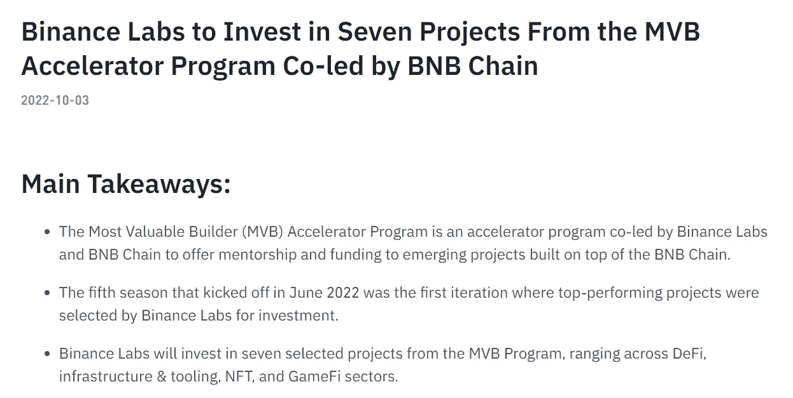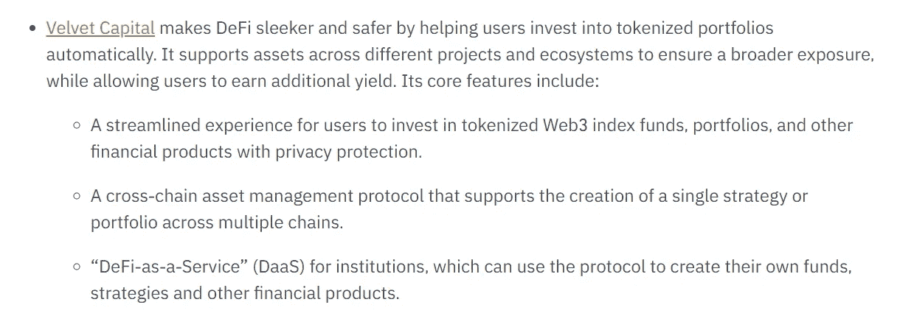

[Binance Labs PR](https://www.binance.com/en/blog/ecosystem/binance-labs-to-invest-in-seven-projects-from-the-mvb-accelerator-program-coled-by-bnb-chain-9156786679786782462)

# 我们的产品

在我们的上一篇文章中，我们向你展示了如何最好地设置你的天鹅绒。资本组合[这里](/@velvetcapital/defi-asset-management-getting-started-with-velvet-capital-7bc24697e687)。现在，我们想花几分钟时间解释一下 V1 上提供的产品。

请记住，我们的协议是从长远考虑制定的。我们将不断增加新产品和功能。最终，您将能够使用 Velvet.Capital 在链上部署任何类型的投资组合和策略。我们致力于提供无与伦比的灵活性、定制化和多样化。

对你想提供的产品有想法吗？请告诉我们，我们将为您打造:)

# **蓝筹股组合**

蓝筹投资组合是由市值最高的 5 种加密货币组成的同等权重的投资组合，不包括稳定货币。这个投资组合权重相等，每两周重新平衡一次。

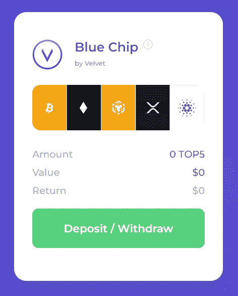

> **持有量**:比特币 20%，以太坊 20%，币安 20%，卡尔达诺 20%，XRP 20%

## 我为什么要买蓝筹股投资组合？

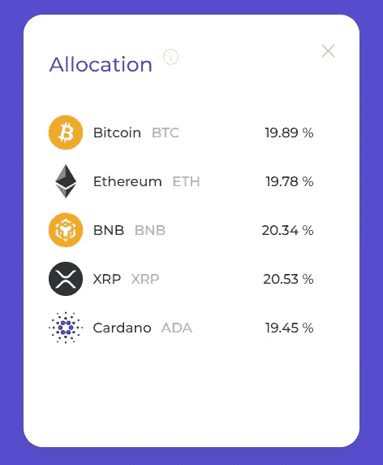

蓝筹股投资组合非常适合任何希望被动进入市场的投资者。

在股票方面，这个投资组合相当于亚马逊、苹果、微软、谷歌和 Saudi Aramco(世界上市值最大的五家公司)的指数。

在加密市场，你会想要一个同等权重的指数，而不是一个按市值加权的指数，是因为对比特币的过度敞口。比特币占整个加密货币市场的 40%左右。因此，以市值加权的指数将拥有过大的比特币配置。

## **控股:**

**比特币:BTC (20%)**

有史以来第一种加密货币，市值 3720 亿美元。这是一种工作货币的证明，总供应量为 2100 万英镑(约 200 万英镑有待开采)，每 4 年开采奖励减半。到目前为止，比特币价格的涨幅都在一半左右(2012/13 年、2016/17 年和 2020/21 年)。

比特币仍然是最广为人知的加密货币，大多数购买加密货币的人都倾向于从比特币开始。

**以太坊:ETH (20%)**

市值 1600 亿美元的第二大加密货币。ETH 是为以太坊网络提供动力的加密货币，以太坊网络是一个具有智能合约功能的开源分布式计算平台(这就是为什么你可以制作 dApps、DeFi 协议和 NFT 协议)。ETH 最近在 9 月份进行了“合并”,成为一个股权证明(PoS)区块链。

**币安:BNB 20%**

BNB 是币安密码交易所的交换令牌。最初它是作为以太坊区块链上的 ERC 20 资产推出的，但现在已经转移到币安智能链(或 BNB 链)。BNB 代币给所有者折扣交易费，可用于支付和投资 BNB 链上的新 ICO。

**卡尔达诺:阿达(20%)**

ADA 是推动开源 PoS 区块链 Cardano 区块链的加密货币。ADA 目前的市值是 140 亿美元。Cardano 由 ETH 联合创始人查尔斯·霍斯金森(Charles Hoskinson)创立，是竞争对手。卡尔达诺专注于缓慢的开发和科学论文，这常常让投资者对区块链开发的缓慢感到不满。

**涟漪:XRP (20%)**

Ripple 是一个“资金转移网络”，XRP 是他们的本地加密货币，目前市值为 230 亿美元。Ripple XRP 是一个开源和分散的区块链，旨在以快速的交易速度和低成本减少金融系统中的摩擦。Ripple XRP 区块链也在开发智能合约功能，以与以太坊竞争。

# **十大投资组合**

我们的前 10 大投资组合与蓝筹股投资组合的想法类似，但不是前 5 大占 20%的权重，而是按市值给你前 10 大加密货币的 10%的权重，不包括稳定货币。这个投资组合的权重相等，每两周重新平衡一次。

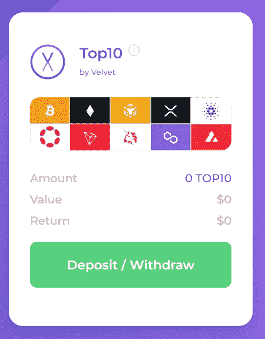

> **持股** : BTC (10%)、瑞士联邦理工学院(10%)、BNB (10%)、XRP (10%)、阿达(10%)、DOT (10%)、MATIC (10%)、TRX (10%)、AVAX (10%)、UNI (10%)

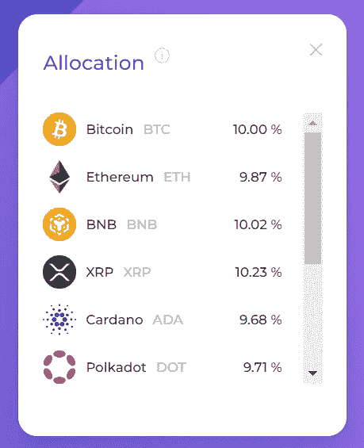

这种投资组合为投资者提供了比蓝筹股更高的回报，因为低市值资产的波动性高于比特币和以太坊等大盘股，但仍能让你在大型项目中进行配置。

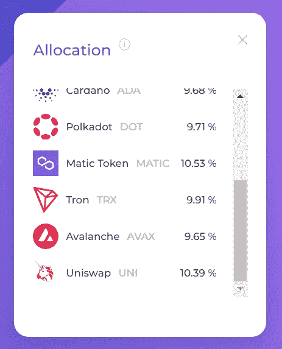

对于排名前 10 的投资组合，你将不会获得维纳斯投资组合的额外收益。

## **控股:**

**波尔卡多:圆点(10%)**

DOT 是 Polkadot 网络的本地资产，它是一个开源协议，目前市场价值为 70 亿美元。Polkadot 促进了数据和资产的跨链传输。Polkadot 旨在通过在几个不同的区块链上处理交易，将我们带入一个多链世界。

Polkadot 允许开发人员利用共享的安全模型启动链和应用程序，而不需要担心吸引足够多的挖掘器/验证器来保护他们自己的链。此外，Polkadot 的 parachains 可以使用网桥与比特币和以太坊等外部网络连接。

创:TRX (10%)

TRX 是 Tron 的本地资产，Tron 是一个具有智能合约功能的去中心化、开源区块链。由于 dApps 的高交易吞吐量和低交易费用，这证明了区块链专注于 dApps 的开发。TRX 的市值为 55 亿美元。

**多边形:MATIC (10%)**

Polygon 是一个第二层以太坊扩展解决方案，允许开发者以低交易成本创建 dApps，并解决以太坊区块链上的高气费问题。MATIC 可以下注以获得额外收益并保护多边形网络。MATIC 目前的市值为 67 亿美元。

**雪崩:AVAX (10%)**

Avalanche 是以太坊的开源第 1 层区块链竞争对手，专注于交易速度和可伸缩性。雪崩区块链每秒可以处理大约 4500 个事务，是最快的区块链之一。AVAX 是雪崩区块链的原生加密货币。AVAX 目前的市值为 50 亿美元。

Uniswap: UNI (10%)

Uniswap 是在以太坊区块链上运行的 DEX(去中心化交易所)。UNI 是 Uniswap 的治理令牌，用于对所有协议更改进行投票。UNI token 本身并不赋予您任何获利的权利。Uniswap 是交易量最大的指数，市值为 49 亿美元。

# **维纳斯投资组合的收益率**

此投资组合是为那些希望从其投资组合中的代币赚取额外收益的人而创建的。该投资组合由 10 种加密货币构成，这些货币的权重相等，每两周重新平衡一次。该投资组合通过向 Venus Protocol 贷款获得额外收益。

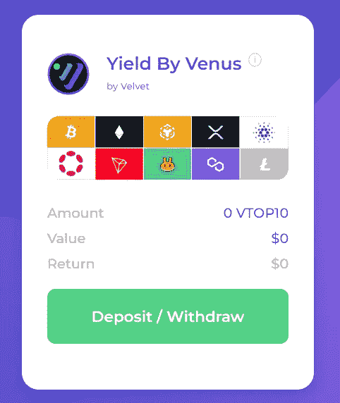

> **持股** : BTC (10%)、瑞士联邦理工学院(10%)、BNB (10%)、XRP (10%)、阿达(10%)、DOT (10%)、TRX (10%)、CAKE (10%)、MATIC (10%)、LTC (10%)

Venus 是 Velvet.Capital 的第一个产量农业合作伙伴。我们的 Venus 整合将基本上允许 Velvet。在投资组合/指数中持有资产以赚取额外收益时，将代币借给 Venus 协议的资本。然后，当用户从投资组合中提取时，代币将从 Venus 协议中自动赎回，用户将获得额外的利息(这将已经显示在投资组合余额中)。用户将从协议中获得投入的令牌以及一些额外的利息！

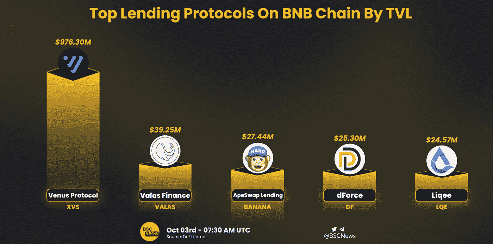

## 产量是如何产生的:

尽管贷款、提供流动性和押注某些加密资产可以在正常价格升值之外获得额外收益。

对于新的加密投资者来说，DeFi 收益率令牌通常更难分析，因为随着更多回报的承诺，风险会增加许多倍。

Our ‘Yield By Venus’ Portfolio in Action :)

这些协议中的许多往往是高风险的投资，所以我们与 Venus 这样的首要协议合作，创建我们的高产农业组合，为您提供 DeFi 高产农业的回报，同时降低这种既定协议带来的风险。

要阅读更多关于产量农业的内容，请查看我们的文章“[用产量农业在你的加密投资组合中创造被动收入](/velvet-capital/generating-passive-income-on-your-crypto-portfolio-with-yield-farming-da4948ceec4c)”。

## **控股:**

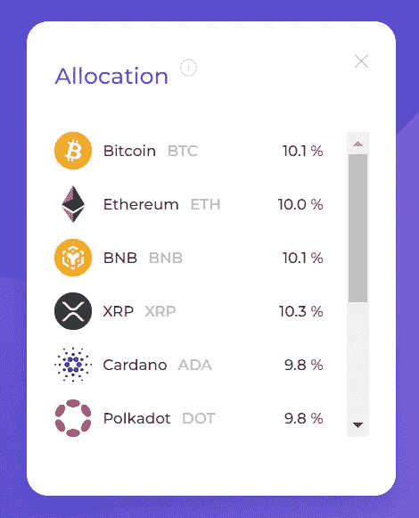

要获得对 BTC、瑞士联邦理工学院、BNB、XRP 和 ADA 的简要描述，请查看蓝筹股投资组合的持有情况。

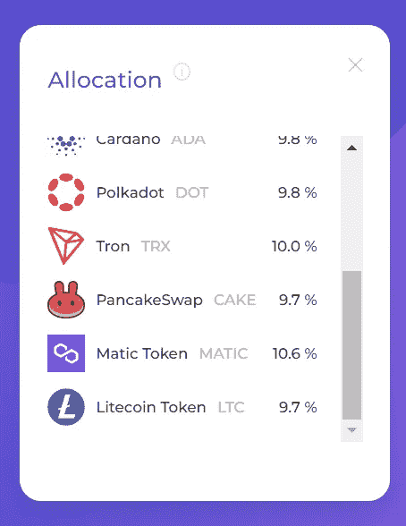

要了解对 DOT、TRX 和 MATIC 的描述，看看前 10 大投资组合的持股情况。

**煎饼互换:蛋糕(10%)**

PancakeSwap 是 BNB 链上最大的 DEX(分散式交易所)。cake 是煎饼掉期的原生加密货币资产，允许用户交易 BEP20 代币，提供流动性以赚取交易奖励，并下注以赚取更多蛋糕代币或其他币安项目的代币，CAKE 目前的市值为 6.46 亿美元。

**莱特币:LTC (10%)**

莱特币起源于 2011 年比特币代码中的一个分叉，被称为第二古老的加密货币。LTC 是莱特币区块链公司的固有资产。LTC 是为了纠正比特币交易费用高、交易时间长的缺点而制定的。这个想法是，LTC 将用于 Litecoins 当前 37 亿美元的市值。

# 现在就开始投资！

> 早期采用者和支持者将获得奖励！令牌发布和 NFT 发布即将推出！

Getting Started Demo

要开始，请前往[https://velvet.capital/](https://velvet.capital/)并点击主屏幕上的“启动应用”按钮。这应该会将您重定向到[https://app.velvet.capital/](https://app.velvet.capital/)。

完整教程在此:[https://medium . com/@ velvet capital/defi-asset-management-getting-started-with-velvet-capital-7bc 24697 e687](/@velvetcapital/defi-asset-management-getting-started-with-velvet-capital-7bc24697e687)

# 加入天鹅绒家族！

别忘了在[推特](https://twitter.com/Velvet_Capital)、[领英](https://www.linkedin.com/company/31423126/admin/)上关注我们，并加入我们的[不和](https://discord.gg/heXYgFZuGw) & [电报](https://t.me/velvetcapital)以获取更多更新！我们希望听到你的声音，不要害羞。

让我们一起建设吧！

直到下一次，

干杯！

天鹅绒。Capital 是一个跨链的 DeFi 资产管理协议，帮助个人和机构(DeFi 即服务)创建令牌化的指数基金、投资组合和其他具有额外收益的金融产品。我们的可定制投资组合跨链和生态系统运作，以提供最广泛的市场暴露。我们利用现代投资组合理论和高度审查的产量农业来放大你的回报。

欲了解更多信息，请访问[https://velvet.capital/](https://velvet.capital/)，或发送电子邮件至 info@velvet.capital

###

> 交易新手？尝试[加密交易机器人](/coinmonks/crypto-trading-bot-c2ffce8acb2a)或[复制交易](/coinmonks/top-10-crypto-copy-trading-platforms-for-beginners-d0c37c7d698c)