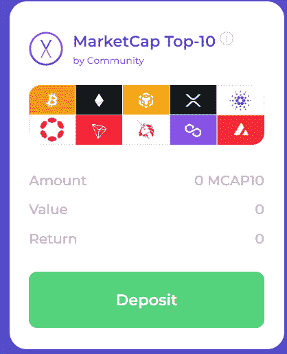

# DeFi 世界最新最热的社区组合

> 原文：<https://medium.com/coinmonks/newest-hottest-defi-investing-products-a29a80a63912?source=collection_archive---------6----------------------->

[https://app.velvet.capital/](https://app.velvet.capital/)

# 致敬，地下天鹅绒(那是你-我们的 OGs。我们现在这么叫你…你在这里第一次听到)！

就在你认为它不可能变得更好的时候，我们为你准备了一些“新的热点”,新鲜出炉——确切地说是新的组合产品。你可以在这里了解我们的前三款产品[。这些新的很相似，只是重量不同。](/coinmonks/newest-defi-investing-products-7e2901a1220d)

我们情不自禁，我们爱 DeFi，想与世界分享。我们的跨链 DeFi 资产管理协议将彻底改变 DeFi，使其比以往任何时候都更简单、更时尚、更安全！任何人都可以像专业人士一样投资，拥有[天鹅绒。首都](https://velvet.capital/)！

# 我们的产品

请记住，我们的协议是从长远考虑制定的。我们将不断增加新产品和功能。最终，您将能够使用 Velvet.Capital 在链上部署任何类型的投资组合和策略。我们致力于提供无与伦比的灵活性、定制化和多样化。

对你想提供的产品有想法吗？[告诉我们，我们会建造它:)](https://docs.google.com/forms/d/e/1FAIpQLScIFfe40DLT3x14FECK03tk03d3BYpPXMH-OJXanltEiyN2cw/viewform)

# 蓝筹股投资组合

“蓝筹市值”投资组合是由市值最高的 5 种加密货币(不包括稳定货币)组成的投资组合。该投资组合的权重与其市场资本总额的百分比成比例。

> **:比特币 60%，以太坊 30%，币安 6%，XRP 2%，卡达诺 2%**

# *我为什么要买蓝筹股投资组合？*

**

*这种投资组合使得任何投资者，无论是新手还是精明的投资者，都能相对容易地进入市场。与其加权的前身不同，该指数更能反映市场情绪。也就是说，你强调顶级硬币(BTC，瑞士联邦理工学院)，同时仍然从其他 3 个硬币中获得一些优势和多样性。*

*在股票方面，这个投资组合相当于亚马逊、苹果、微软、谷歌和 Saudi Aramco(世界上市值最大的五家公司)的指数。*

# *持有量:*

***比特币:BTC (60%)***

*有史以来第一种加密货币，市值 3720 亿美元。这是一种工作货币的证明，总供应量为 2100 万英镑(约 200 万英镑有待开采)，每 4 年开采奖励减半。到目前为止，比特币价格的涨幅都在一半左右(2012/13 年、2016/17 年和 2020/21 年)。*

*比特币仍然是最广为人知的加密货币，大多数购买加密货币的人都倾向于从比特币开始。*

***以太坊:ETH (30%)***

*市值 1600 亿美元的第二大加密货币。ETH 是推动以太坊网络的加密货币，以太坊网络是一个具有智能合约功能的开源分散计算平台(这就是为什么你可以制作 dApps、DeFi 协议和 NFT 协议)。ETH 最近在 9 月份进行了“合并”,成为一个股权证明(PoS)区块链。*

*币安:BNB (6%)*

*BNB 是币安密码交易所的交换令牌。最初它是作为以太坊区块链上的 ERC 20 资产推出的，但现在已经转移到币安智能链(或 BNB 链)。BNB 代币给所有者折扣交易费，可用于支付和投资 BNB 链上的新 ICO。*

***卡尔达诺:阿达(2%)***

*ADA 是推动开源 PoS 区块链 Cardano 区块链的加密货币。ADA 目前的市值是 140 亿美元。Cardano 由 ETH 联合创始人查尔斯·霍斯金森(Charles Hoskinson)创立，是竞争对手。卡尔达诺专注于缓慢的发展和科学论文，经常让投资者对区块链发展的缓慢感到不满。*

***涟漪:XRP (2%)***

*Ripple 是一个“资金转移网络”，XRP 是他们的本地加密货币，目前市值为 230 亿美元。Ripple XRP 是一个开源和去中心化的区块链，旨在以快速的交易速度和低成本减少金融系统中的摩擦。Ripple XRP 区块链也在开发智能合约功能，以与以太坊竞争。*

# *市值前 10 名投资组合*

*我们的前 10 大投资组合与蓝筹股投资组合的想法类似，但是，它不是以 20%的权重排名前 5 位，而是按市值排名前 10 大加密货币中的每一种货币的权重为 10%，不包括稳定货币。这个投资组合的权重相等，每两周重新平衡一次。*

**

> ****控股*** *: BTC (56%)、ETH (29%)、BNB (6%)、XRP (2%)、阿达(2%)、DOT (1%)、MATIC (1%)、TRX (1%)、AVAX (1%)、UNI (1%)**

****

*鉴于低市值资产的波动性高于比特币和以太坊等大盘股，这种投资组合比蓝筹股有更高的上涨空间，但仍能让你在大型项目中进行配置。*

# *持有量:*

***波尔卡多:点(1%)***

*DOT 是 Polkadot 网络的本地资产，它是一个开源协议，目前市值为 70 亿美元。Polkadot 促进了数据和资产的跨链传输。Polkadot 旨在通过在几个不同的区块链上处理交易，将我们带入一个多链世界。*

*Polkadot 允许开发人员利用共享的安全模型启动链和应用程序，而不需要担心吸引足够多的挖掘器/验证器来保护他们自己的链。此外，Polkadot 的 parachains 可以使用网桥与比特币和以太坊等外部网络连接。*

*创:TRX (1%)*

*TRX 是 Tron 的原生资产，Tron 是一个具有智能合约功能的去中心化、开源区块链。由于 dApps 的高交易吞吐量和低交易费用，这证明了区块链专注于 dApps 的开发。TRX 的市值为 55 亿美元。*

***多边形:MATIC (1%)***

*Polygon 是一个第二层以太坊扩展解决方案，允许开发者以低交易成本创建 dApps，并解决以太坊区块链上的高气费问题。MATIC 可以下注以获得额外收益并保护多边形网络。MATIC 目前的市值为 67 亿美元。*

***雪崩:AVAX (1%)***

*Avalanche 是以太坊的开源第 1 层区块链竞争对手，专注于交易速度和可伸缩性。雪崩区块链每秒可以处理大约 4500 个事务，是最快的区块链之一。AVAX 是雪崩区块链的原生加密货币。AVAX 目前的市值为 50 亿美元。*

***Uniswap: UNI (1%)***

*Uniswap 是在以太坊区块链上运行的 DEX(去中心化交易所)。UNI 是 Uniswap 的治理令牌，用于对所有协议更改进行投票。UNI token 本身并不赋予您任何获利的权利。Uniswap 是交易量最大的指数，市值为 49 亿美元。*

# ***立即开始投资！***

**早期采用者和支持者将获得奖励！令牌发布和 NFT 发布即将推出！**

## *入门演示*

*[https://velvet.capital/](https://velvet.capital/)*

*要开始，请前往[https://velvet.capital/](https://velvet.capital/)并点击主屏幕上的“启动应用程序”按钮。这应该会将您重定向到[https://app.velvet.capital/](https://app.velvet.capital/)。*

*完整教程在此:[https://medium . com/@ velvet capital/defi-asset-management-getting-started-with-velvet-capital-7bc 24697 e687](/@velvetcapital/defi-asset-management-getting-started-with-velvet-capital-7bc24697e687)*

# *加入天鹅绒家族！*

**

*Create multiple portfolios for multiple **chances** to win!*

*别忘了在 [Twitter](https://twitter.com/Velvet_Capital) 、 [LinkedIn](https://www.linkedin.com/company/31423126/admin/) 上关注我们，并加入我们的[Discord](https://discord.gg/heXYgFZuGw)&[Telegram](https://t.me/velvetcapital)了解更多更新！我们希望听到你的声音，不要害羞。*

*让我们一起建设吧！*

*直到下一次，*

*干杯！*

> *交易新手？试试[加密交易机器人](/coinmonks/crypto-trading-bot-c2ffce8acb2a)或者[复制交易](/coinmonks/top-10-crypto-copy-trading-platforms-for-beginners-d0c37c7d698c)*