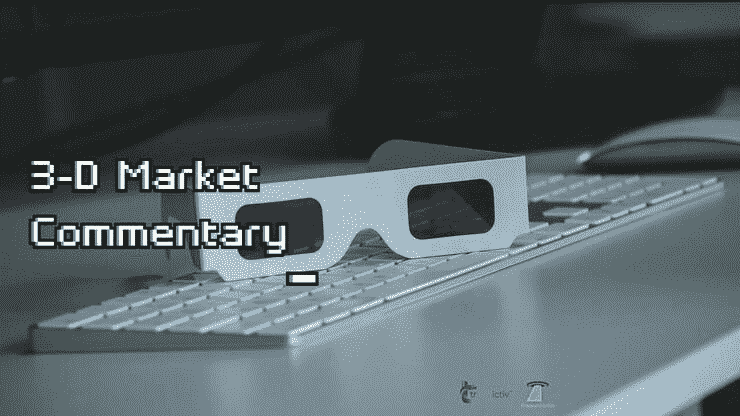

# 新闻快讯 2022 年 7 月 6 日 3d 市场评论

> 原文：<https://medium.com/coinmonks/newsflash-3-d-market-commentary-jul-6-2022-1e0b1a1ba128?source=collection_archive---------48----------------------->

# 新闻快讯 3D 评论

五大主要市场:标准普尔 500 |原油|黄金|美元|巴克特比特币

决定市场可能发生什么的 3 个关键因素:

-市场环境:未来市场方向(多头/空头)

-买卖不明飞行物:负责即将到来的转折点(进场/出场)的“未成交订单”

*   市场波动:即将到来的价格变化速度(风险/回报)

> 交易新手？试试[加密交易机器人](/coinmonks/crypto-trading-bot-c2ffce8acb2a)或者[复制交易](/coinmonks/top-10-crypto-copy-trading-platforms-for-beginners-d0c37c7d698c)

我们将以下这些统计要素结合起来，以帮助您在交易、投资或对冲时保持客观和现实。

新闻快讯链接> >【https://rb.gy/3ibhwf 

在华尔街开始交易前，观看 3D 直播市场，如下所示:

[**华尔街开始交易前的 3D 市场直播| 2022 年 7 月 6 日**](https://www.youtube.com/watch?feature=youtu.be&utm_campaign=Top%205%20Markets%20Commentary%20And%20Analysis%20Each%20Day&utm_medium=email&utm_source=Revue%20newsletter&v=-fAPtAKOCcU)**——**[**www.youtube.com**](https://www.youtube.com/watch?v=-fAPtAKOCcU&feature=youtu.be)
不要错过我们的 3D 市场评论广播，我们根据客观统计数据预测和预期市场走势:1 .市场环境:即将到来的市场…