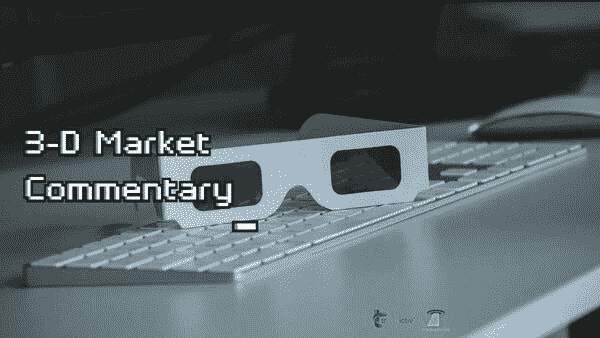

# 新闻快讯 3d 市场评论 2022 年 10 月 31 日

> 原文：<https://medium.com/coinmonks/newsflash-3-d-market-commentary-oct-24-2022-70287d297cda?source=collection_archive---------45----------------------->

# 新闻快讯 3D 评论

五大主要市场:标准普尔 500 |原油|黄金|美元|比特币

决定市场可能发生什么的 3 个关键因素:

-市场环境:未来市场方向(多头/空头)

-买卖不明飞行物:负责即将到来的转折点(进场/出场)的“未成交订单”

-市场波动性:即将到来的价格变化速度(风险/回报)

我们将以下这些统计要素结合起来，以帮助您在交易、投资或对冲时保持客观和现实。

新闻快讯链接> >[https://rb.gy/whx0in](https://rb.gy/whx0in)

点击这里观看每周 3D 市场评论直播，【https://youtu.be/Q17d-bpBnu8 

> 交易新手？试试[密码交易机器人](/coinmonks/crypto-trading-bot-c2ffce8acb2a)或[复制交易](/coinmonks/top-10-crypto-copy-trading-platforms-for-beginners-d0c37c7d698c)