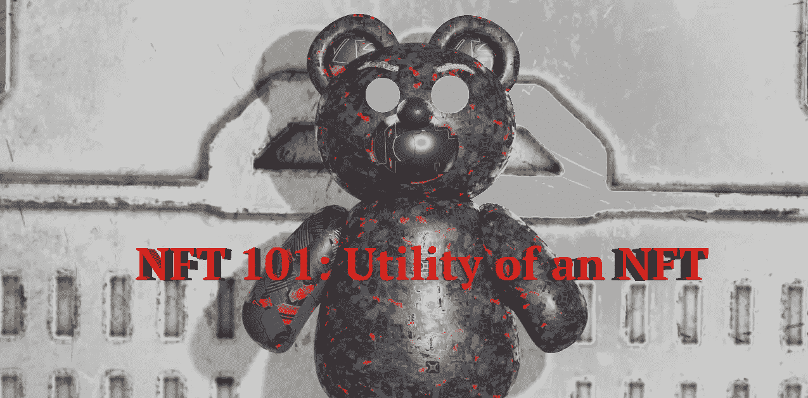

# NFT 101:你能用 NFT 做什么？

> 原文：<https://medium.com/coinmonks/nft-101-utility-of-an-nft-2195abc0fe44?source=collection_archive---------3----------------------->

超越艺术:不可替代的代币可以真正改变世界

Art Created by [Nestor Clemente](https://vipmint.xyz)

什么是 NFT，为什么他们在金融、科技和房地产领域如此重要？

NFT(不可替代的令牌)是一种数字资产，作为真实世界中某个独特事物的独特代表。