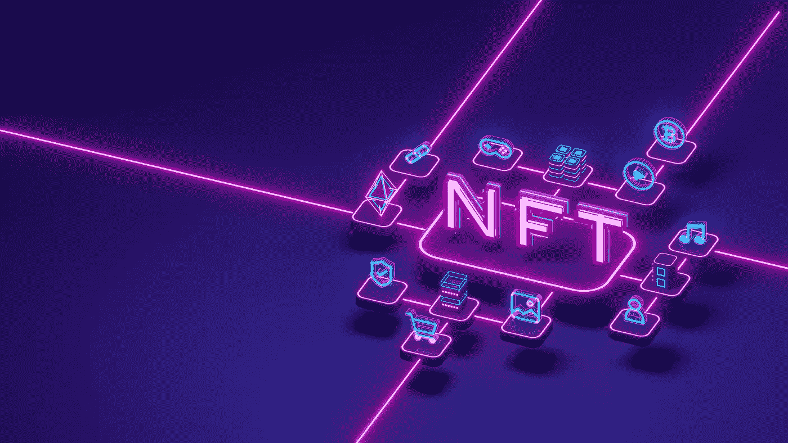
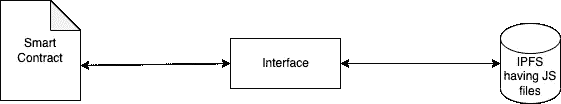

# NFT 2.0 —交互式非功能性测试

> 原文：<https://medium.com/coinmonks/nft-2-0-the-interactive-nfts-e4e4df621922?source=collection_archive---------0----------------------->



NFT 2.0

我假设您了解 NFT 及其工作原理。我不打算在这个博客中介绍 NFT。请随意阅读这种炒作的全部内容:[https://ethereum.org/en/nft/](https://ethereum.org/en/nft/)。尽管 NFT 是区块链不可知论者，以太坊网站提供了关于 NFT 的极好的介绍。

# NFTs 的局限性

当我们谈到 NFTs 时，我们会想到一些猴子的图片，但这不是它。任何数字艺术都可以在 NFT 制作。现在，NFT 都是关于静态艺术文件的。静态文件存储在 IPFS 这样的分散存储中，其哈希存储在智能合约中。哈希是铸造 NFT 的元数据。它包含艺术文件的不同属性。

ERC721 元数据 JSON 模式如下所示:

```
{
    "title": "Asset Metadata",
    "type": "object",
    "properties": {
        "name": {
            "type": "string",
            "description": "Identifies the asset to which this NFT represents"
        },
        "description": {
            "type": "string",
            "description": "Describes the asset to which this NFT represents"
        },
        "image": {
            "type": "string",
            "description": "A URI pointing to a resource with mime type image/* representing the asset to which this NFT represents. Consider making any images at a width between 320 and 1080 pixels and aspect ratio between 1.91:1 and 4:5 inclusive."
        }
    }
}
```

图像和元数据都可能存储在 IPFS 内部。

现在，我们只有一个数字文件。我们可以看，听，和交易它，但是**我们不能和它互动，他们也不能互相互动**。

这就是 NFT 能力有限的地方。它们是静态的，不是动态的。他们不能与人类或其他非功能性动物互动。

其中一个致力于交互式非功能性睾丸的项目是[隐睾](https://cryptorchids.io/)。这是一个伟大的灵感，因为它始于一个黑客马拉松项目。虽然它缺少 NFT < - > NFT 的交互，但总的来说，它是扩展 NFT 功能的一个很好的起点。

# NFT 2.0 是什么？

每个人对 NFT 2.0 都有自己的定义，对我来说，它是 NFT 1.0 的升级，基于 ERC-721 规范。

我不是在讨论为它创建一个新的 EIP，而是扩展现有的 ERC-721 规范。

让我们深入研究一些我们可能需要引入或更改的技术细节。

我们可以根据 [**客户端-服务器架构**](https://en.wikipedia.org/wiki/Client%E2%80%93server_model) 来考虑它，其中:
**客户端**是用户的设备，因为在区块链上进行计算是昂贵的。客户端是我们的接口和计算层，计算的结果将存储在区块链中，也就是我们的**服务器**。

*请注意，在我们的上下文中，客户端-服务器对是唯一的。*

## 我们将在哪里存储计算逻辑？

由于 web 浏览器将成为客户端，并且浏览器支持 JavaScript，我们可以将整个计算逻辑作为 JavaScript 函数放入 IPFS 内部的 JS 文件中。当 NFT 在浏览器中呈现时，它将执行逻辑并将结果推送到智能合约。为了使 NFT 具有交互性，它需要从用户或其他 NFT 获取输入，对其进行计算并在 NFT 中显示输出，或者将输出数据存储在智能合同中。

因为这两个是不相关的实体，所以我们必须在存储在 IPFS 内部的 JavaScript 代码和智能合同文件之间创建一个接口。



Interface for Smart Contract and IPFS

当然，在这个过程中，我们的 ERC721 元数据 JSON 模式将会改变。定义它需要时间，并且在提议新的变更或扩展现有 EIP 时，必须遵循许多步骤。

当我谈到 NFT NFT 通信时，我的意思是 NFT“A”的任何状态变化都可能引发 NFT“b”的状态变化

让我们来看看 NFT NFT 通信的大致流程:

1.  用户与 NFT“a”进行交互。输入在客户端进行计算。
2.  计算的结果存储在智能合约中。在智能合约的变量中存储结果的一种方法是调用一个将结果作为参数的函数。
3.  一旦智能合约内的函数被触发，它将:
    a .将结果存储在智能合约“a”的变量内。
    b .使用使用客户端或智能合约“a”计算的参数调用另一个智能合约的函数。
    c .上述操作更改智能合约“B”的状态，这将影响并更改 NFT B 的值

> 在这里，每一份智能合同都充当着一个名为区块链的集群中的[微服务](https://en.wikipedia.org/wiki/Microservices)。

需要注意的一点是，这种 NFT NFT 通信既可以通过人工干预实现，也可以完全通过另一个智能合同实现，而不是 NFT 合同。

# NFT 2.0 的应用

1.  我们正在试验一款名为 **appledrop 的游戏，**创建于 2020 年:[https://github.com/nft2point0/appledrop](https://github.com/nft2point0/appledrop)
2.  NFT 具有对话 Tom 的功能；我们中的大多数人可能至少在我们的设备上使用过一次对话汤姆。制作一个互动的 NFT，它有独特的角色，可以和你互动。它可能会存储你的信息，如姓名，年龄等。，在智能合约中。看看这款最近出的 NFT:[https://mint NFT . today/view/matic/0x42c 091743 f 7 b 73 B2 f 0043 B1 FB 822 b 63 AAA 05041 b/3554](https://mintnft.today/view/matic/0x42c091743f7b73b2f0043b1fb822b63aaa05041b/3554)
3.  作为忠诚卡的 NFT。展示你对品牌的热爱，你的分数将在同一个 NFT 中不断增加。你可能会得到免费津贴和升级。

当我们谈论 NFT 2.0 时，有无限的可能性

# 我们的路线图

在 **NFT2POINT0** 中，我们将介绍 NFT 2.0。

网站:https://nft2point0.com/

感谢您的阅读！

> 交易新手？试试[密码交易机器人](/coinmonks/crypto-trading-bot-c2ffce8acb2a)或者[复制交易](/coinmonks/top-10-crypto-copy-trading-platforms-for-beginners-d0c37c7d698c)