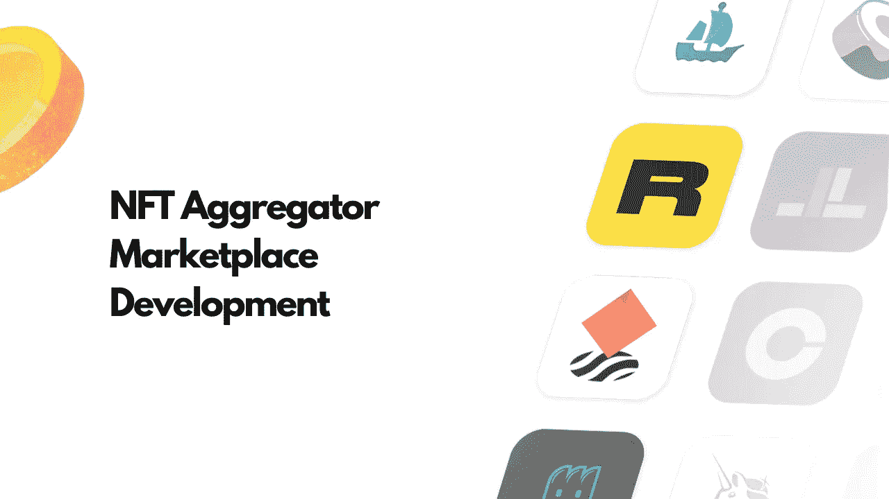
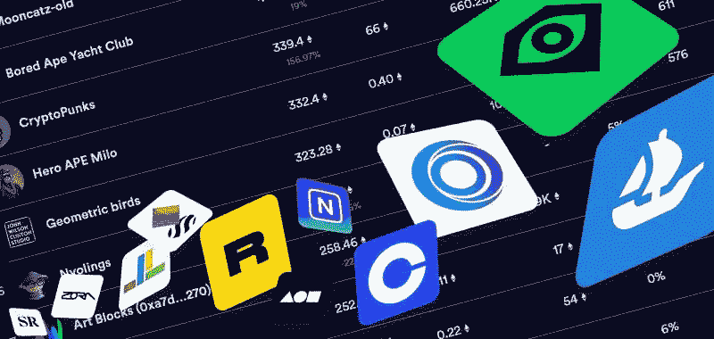

# NFT 聚合器市场开发:购买不同 NFT 的大市场指南

> 原文：<https://medium.com/coinmonks/nft-aggregator-marketplace-development-guide-to-the-extensive-marketplace-to-buy-diverse-nfts-b7c1d6f495fb?source=collection_archive---------10----------------------->

这里有几个 NFT 市场可供我们这些 NFT 爱好者选择。随着艺术家和交易者需求的不断增长，NFT 的数字资产购买市场也在不断增长。然而，这个生态系统正以其专业的平台溢出到它的边缘，以迎合你的 NFT 需求。这里出现了一个关键问题。

市场普遍要求一吨汽油费；众所周知，我们来这里不是为了抢一个 NFT。为了解决这个问题，并帮助用户舒适地跨平台交易，生态系统刚刚迎来了新成员 NFT 聚合器。在这篇博客中，我们将讨论 [**NFT 聚合器市场发展**](https://www.appdupe.com/nft-aggregator-marketplace-development) 的足迹。

> 让我们了解一些 NFT 市场的基本历史，好吗？

第一批出来交易的 NFT 市场是 2016 年和 2018 年的 OpenSea 和 SuperRare。几年之内，他们占据了 90%的市场份额。值得注意的是，那还是在交易制度尚未完善的时候。现在，将场景快进到 2021 年，在同时发展的许多其他市场中，OpenSea 是最大的 NFT 市场之一。加入这个名单的是最近的 NFT 集合市场，它把 NFT 所有的好东西集中在一起，创造了一个无与伦比的生态系统。

# **NFT 聚合器市场**

NFT 市场是为使用区块链技术的 NFT 交易者开发的空间。这些市场是有利可图的，因为它们是分散的、不可改变的、安全的、可扩展的、透明的，而且基本上是负担得起的。紧随其后， [**推出的 NFT 聚合器 NFT 市场**](https://blog.cryptostars.is/nft-aggregator-marketplace-development-how-to-build-an-nft-aggregator-platform-740100e3b455) 将所有这类归属平台聚集在一个屋檐下。

解释一下，NFT 聚合器市场可以表述为一个跨行业平台收集 NFT 的市场。这个平台开发的 USP 是，它根除了交易者在购买大量 NFT 时面临的主要问题，即汽油费。

## **NFT 聚合器市场带来了什么？**

我们都知道区块链网络的前身是以太坊。根据市场首席分析师收集的报告，共有 13 个基于以太坊的聚合平台获得了超过 18%的标准交易。这清楚地表明了在加密生态系统中对其功能的需求。

优势平台从资产的铸造到销售，充满效率的平台是以用户为导向的。市场上一些流行的 NFT 聚合器市场包括 Gem.xyz、Genie.xyz、Blur.io 等。

*   跨多个平台的 NFT 可以在一个统一的门户网站上轻松交易。
*   聚合器 NFT 市场通过比其他平台产生更低的燃气费用来帮助用户
*   在各种类别和市场下，NFTs 的搜索时间大大减少，并且可以在一个屋檐下购买。
*   平台的互操作性允许用户跨平台交易各种各样的 NFT。

## **运行中的 NFT 聚合器的主要组件**

*   一个集中的 NFT 仪表板，用户可以在这里访问聚合器中不同市场的 NFT。
*   该平台的 profile manager 功能允许用户拥有跨平台的不同 NFT 的信息。例如，NFT 价格、交易量、最大销售量等。
*   NFT 列出所有支持的 NFT 市场的 NFTs 价格。
*   艺术家的版税费用基于每次出售其不可替代代币的智能合同。
*   为用户提供多个支付网关，以便通过平台轻松转移 NFTs。
*   多个加密货币钱包集成，因为有许多 NFT 市场具有互操作性。
*   全球可见的 NFT 营销。
*   NFT 的订单历史可以在平台中追踪。
*   NFT 现场跟踪采购状态。
*   智能合约将在平台上自动执行。
*   推送通知，提醒用户对新的 NFT 下降与日历知情的交易决策。
*   对平台的审查和评级，这将使平台更加透明，更加以用户为导向。

## **为什么 NFT 聚合器是下一个首选平台？**

NFT 聚合器市场使用尖端技术，为用户提供巧妙的一站式 NFTs 购物。因为他们必须让各种各样的观众参与到论坛中来，所以他们不遗余力地与消息灵通的交易者创造潜在的交易行为。通俗地说，聚合器通过弥合市场互动之间的差距来发挥神奇的作用。

*   交易数据的聚合器允许用户和创建者有很好的机会跨平台访问大量的 NFT 交易数据。
*   它们显示从数字资产聚合的数据集合，作为平台用户的重要杠杆。随着 NFT 数据在 NFT 聚合器平台上的聚合，诱人的可信度为以结果为导向的绩效增加了价值。
*   该平台严格遵守高端技术集成平台的指导方针。这使得聚合器平台中的 NFT 集合对于具有有价值的信息片段的买家和卖家是全球可见的。这些基于指南的数据分类给出了诸如 NFT 下降、NFT 的排名状态等信息。
*   广泛的数据分析工具，让用户全面了解 NFT 相关信息。这些工具是用先进的区块链支持技术制作的，整合了国家职能部门的相关数据。这反过来有助于该行业的投资者在做出关键决定之前了解资产的价值。该信息可以包括但不限于市场容量、NFT 持有者的数量、NFT 价格细节等。
*   编程到平台中的高级搜索引擎使得平台内的导航舒适而快捷。通过这些搜索引擎，用户可以在交易前访问来自所有支持平台的 NFT 列表，以及对集合的清晰理解。
*   对于那些希望在聚合器中列出一些他们尊敬的 NFT 收藏的用户，引入了惰性铸造的概念。也就是说，用户可以在不支付燃气费的情况下铸造和出售 NFT。然而，根据智能合同，当 NFT 系列在平台上首次销售时，市场有义务从交易中抽取一部分作为汽油费。
*   [**启动 NFT 聚合器市场开发**](https://www.appdupe.com/nft-marketplace-development) 的终极好处是，可以通过单一窗口一次付款批量购买 NFTs。这样就节省了从一个平台跳到另一个平台的时间和大量的交易费用。
*   与其他 NFT 平台相比，该平台的碳排放显著减少。也就是说，由于该平台减少了用户的上网时间和油费，他们为艺术家创造了巨大的曝光率。
*   他们是一个偏向用户的平台，因为他们可以为用户和 NFT 创作者提供个性化的体验。
*   许多的聚合平台通过多个加密钱包和不同的资产清算选项来促进交易。

## **关闭思想！**

总结一下，聚合器市场是一个为用户量身定制的有凝聚力的体验，可以让用户做出明智的交易决策，NFT 价值数百万。除了以上给出的 [**NFT 聚集区或市场开发**](https://www.appdupe.com/nft-aggregator-marketplace-development)**的额外津贴和属性，如燃气费、托管费、上市费等附加收入流。，催化利润成倍增长。你是一个对创造自己的利润空间感兴趣的 NFT 人吗？去一个包罗万象、提供多种服务的平台来一次身临其境的加密之旅怎么样？**

> **交易新手？尝试[加密交易机器人](/coinmonks/crypto-trading-bot-c2ffce8acb2a)或[复制交易](/coinmonks/top-10-crypto-copy-trading-platforms-for-beginners-d0c37c7d698c)**