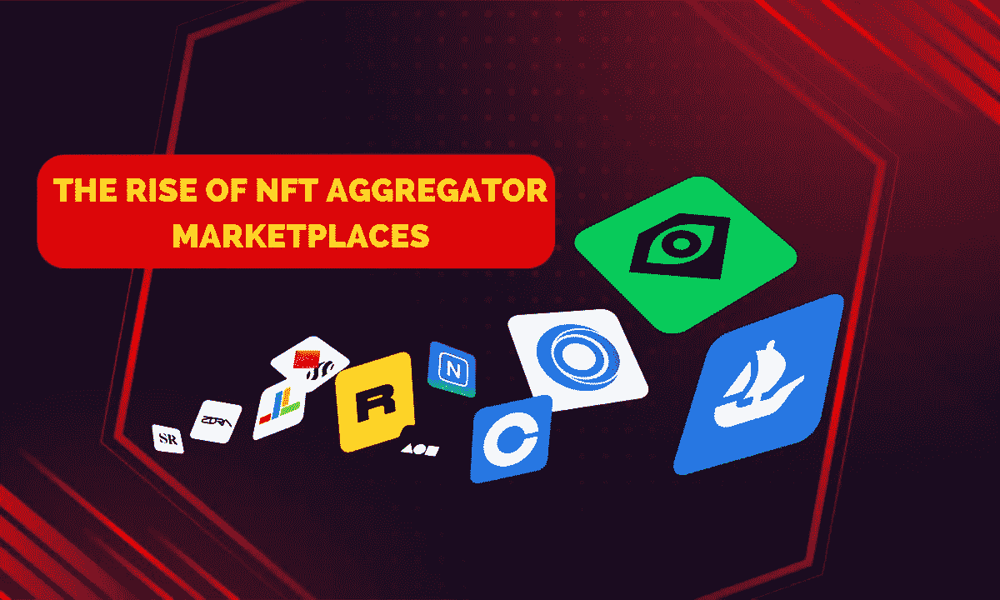

# NFT 集贸市场的崛起:2023 年 NFT 集贸市场发展指南

> 原文：<https://medium.com/coinmonks/nft-aggregator-marketplace-development-in-2023-128e41b85bee?source=collection_archive---------12----------------------->

eb3 开发公司正在一步一步地推进它的每一个项目。在众多明星和名人的涌入下，这些项目于前一年启动，投资于开发区块链技术的资金大幅增加。虽然互联网正随着 2027 年前 NFT 市场规模的预期而变得疯狂，但许多密码爱好者已经在其他 NFT 平台中取得了一些领先地位。

你一定听说过 NFT 艺术品市场，甚至 NFT 实物资产市场，但你知道新颖的 NFT 集合市场吗？如果你不系好安全带，我们就要进入数字世界中最复杂但像精灵一样的领域，NFT 聚合器市场开发。

# **用实例介绍非功能性测试**

现在，关于 web3 的所有技术内容已经有了足够的信息，让我们变得简单一点，回到基础。NFT 或不可替代令牌是所有加密企业的基本要素，因为它们是单位收入来源。这些 NFT 是在区块链的网络上制造的，这使得它们比以前更加安全和可靠。NFT 是创作者或艺术家希望在平台上交易的任何实物资产或收藏品的加密形式。这些资产可以是任何东西，从你拥有的最珍贵的照片到价值百万美元的艺术品。更简单地说，他们不区分资产的规模。有多酷？

区块链上的一些可标记的数字资产是，

*   门票和优惠券
*   艺术品
*   数字收藏品
*   音乐字节
*   视频剪辑
*   模因
*   房地产，以及更多数字资产的例子。

在所有的加密空间中，迄今为止最大的 NFT 市场是 OpenSea，它提供不同领域的多个 NFT 市场。无论疫情做了什么，它确实为生态系统带来了一些更具独创性的项目的好消息。 [**NFT 聚合器市场开发**](https://www.appdupe.com/nft-marketplace-development) 对于加密用户来说就是这样一个精灵，因为他们唯一的座右铭就是将上面列出的所有市场放在一个屋檐下。

根据 Dune Analytics，数据显示，自 NFT 聚合器市场发展以来，NFTs 的交易量约为 111，131 ETH 和 139，230 ETH。迷茫？这些数字相当于 2.94 亿美元，这清楚地表明了它在 NFT 市场的成功。

# **NFT 聚合器市场——潘多拉盒子**

NFT 市场是托管所有数字资产的地方，拥有不可改变、不可分割、独一无二、可转让所有权等特征，最重要的是，利润丰厚。NFT 市场帮助用户充分利用智能合同的优势，在区块链上的一个门户下访问他喜欢的所有 NFT。这是 NFT 被出售、购买、拍卖、借用，甚至获得奖励的地方。同样，NFT 聚合器市场也在区块链上工作，市场上有所有可能的数字资产。

[**推出 NFT 聚合器平台**](https://blog.cryptostars.is/nft-aggregator-marketplace-development-how-to-build-an-nft-aggregator-platform-740100e3b455) 的广泛意识形态引入了尖端技术，该技术对市场来说非常具有创新性，它的目标是让用户找到合法的加密资产。该平台的核心 USP(独特卖点)是，它将所有平台整合在一起，而不是接触多个平台，并且不得不注册和创建几个单独的资产。到目前为止，一些 NFT 聚合平台已经建立了自己的名字，如 Orion、genie.xyz、Blur.io、NFTGO、Gem.xyz 等等。如果你想创建自己的 NFT 聚合器市场，请关注我博客的下一部分！

## **NFT 聚合器市场开发的工作流程**

NFT 聚合器市场以一种有点反曲的方式工作。以下是这项数百万美元投资的架构。

*   **交易数据的集合**

NFT 聚合器市场将为用户提供一个机会，从不同的 NFT 市场获得关于 NFTs 交易的各种交易数据。

*   **数据的汇总**

将来自多个市场的数据整合到一个界面中，给用户带来了巨大的优势。也就是说，用户只需在一个门户网站注册就可以进入数字资产市场。从所有的市场收集这么多的数据需要很大的努力，然而，他们购买的结果正在诱使用户信任这个空间，就像他们在其他平台上做的一样。

*   **平台上的数据分类**

这个名字不言自明。NFT 聚合器市场开发显示了 NFT 数据的清晰分类，并绘制了指导方针。由于区块链网络，用户可以看到这些收集的数据，它促使买家列出交易清单并做出关键决定。考虑的一些标准是稀有性、发射时间、国家森林论坛的排名等。

*   **强大的搜索引擎**

任何市场都需要一个好的搜索引擎，它可以很容易地引导他们找到想要的资产。在平台上拥有自己喜欢的代币并进行交易是一回事，但有了 Aggregator marketplace，用户甚至可以轻松地将它们添加到自己的列表中。就像其他 NFT 市场一样，可用的过滤器选项将确保用户可以在价格、描述、最常交易、最喜欢的 NFT 等方面获得最佳交易。

*   **批量购买非功能性食物**

NFT 聚合器市场允许用户在同一屋檐下同时获得关于多个 NFT 的知识。批量购买 NFTs 是可能的，没有压力和额外的交易费用，只需点击一下。

同样，作为一名企业家，如果你想创建一个 NFT 平台，请对 2023 年创建 NFT 市场的**进行深入研究。**

## ****NFT 聚合器平台的广泛优势****

**除了其他优势，如奖励，激励措施，更少的汽油费，分散，一切，聚合 NFT 给予超越他们。他们是，**

*   **通过批量购买不可替换的代币，通过汽油费赚取的利润翻倍。**
*   **通过以低得多的成本引入所有可访问的数据，NFT 聚合器市场比任何其他平台都更加用户友好。**
*   **减少资产和碳足迹的搜索时间。**
*   **大量接触艺术家和创作者。**
*   **用户和创作者的个性化体验。**
*   **多样化的流动性选择。**

**除此之外，NFT 聚合器市场开发的收入模式需要一个适当开发和技术上成功的模式。平台中主要的利润来源是**

1.  **代理费**
2.  **免费增值**
3.  **订阅费**
4.  **上市费用**
5.  **交易费用**

## ****NFT 聚合器市场的属性****

*   **所有 NFT 市场的店面/集中仪表板**
*   **NFTs 的档案管理器**
*   **NFT 价目表**
*   **版税支持**
*   **多个支付网关**
*   **多个加密钱包集成**
*   **NFT 营销**
*   **NFT 订单历史**
*   **非功能性测试的实时跟踪**
*   **智能合同推送通知**
*   **评论和评级**

## ****势在必行的 NFT 市场发展进程****

*   **适应最适合你的项目和 NFT 系列的市场类型。有两种类型可以从开放市场和封闭市场中选择。**
*   **确定你在定制市场的定位是绝对关键的。通过导航到特定的领域，您可以有效地关注您的目标受众。**
*   **各种类别的 NFT 在密码市场上交易。通过白标 NFT 市场开发，使您的项目适应区块链网络。市场上使用最多的一些区块链包括以太坊、币安智能链、Cardano、Solana、TRON 等。**
*   **开发直观的用户界面/UX 设计，帮助用户无缝导航平台。这些对于平台保持用户与其需求之间的对话至关重要。**
*   **NFT 市场上智能合约的集成为用户提供了平台自动化方面的优势。智能合约通过发起和完成特定利基 NFT 市场的所有活动来规范平台。将 NFTs 集成到存储、管理和维护中**
*   **市场架构中的 IPFS 创建了巨大的存储空间来无任何问题或延迟地托管多个 NFT。**
*   **一个平台上的加密钱包就像每个企业的心脏。它们在 NFT 的交易和交易过程中为用户提供帮助，同时也是这些独特的 NFT 的避风港。**
*   **一旦开发出白标 NFT 聚合器市场，NFT 项目将不得不经历密集的测试。这个开发阶段通过包含平台中存在的错误和 bug 来排除。**
*   **NFT 平台开发的最后阶段是在服务器上部署一个经过测试的市场并开始交易。**

****关闭思想！****

**NFT 市场的繁荣导致了其创新的至高无上。**[**【NFT 市场发展公司**](https://www.appdupe.com/nft-marketplace-development) 提出了包含质量特征、无斑点资产和专业设计的白色标签解决方案。企业家可以利用这些解决方案快速推进他们的职业生涯。****

****与 NFT 市场开发公司合作将确保在您的预算范围内提供一个极其安全、稳定、可靠和可信的平台。拥抱区块链的核心价值是必要的，这是通过增加的可伸缩性、先进的技术工具等优雅地获得的。不确定你最喜欢的 NFT 是什么？推出 NFT 聚合平台，将淬火你的 NFT 爱好者在你的每一部分！****

> ****交易新手？尝试[加密交易机器人](/coinmonks/crypto-trading-bot-c2ffce8acb2a)或[复制交易](/coinmonks/top-10-crypto-copy-trading-platforms-for-beginners-d0c37c7d698c)****