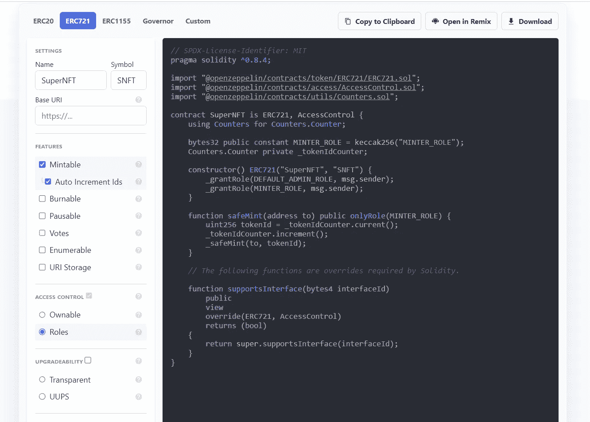
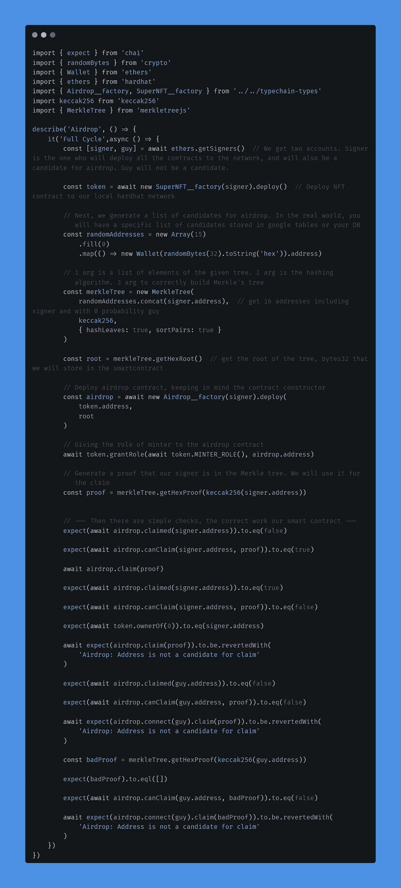
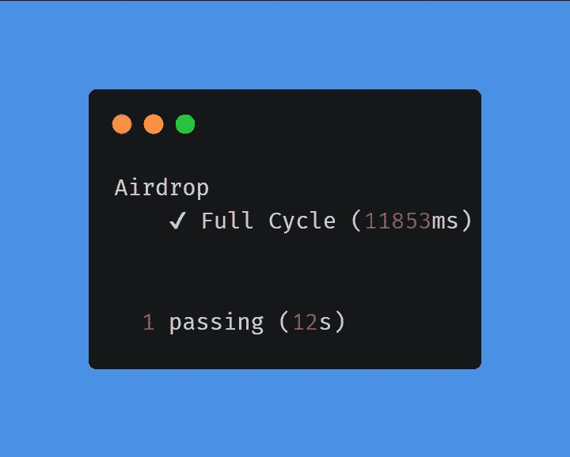
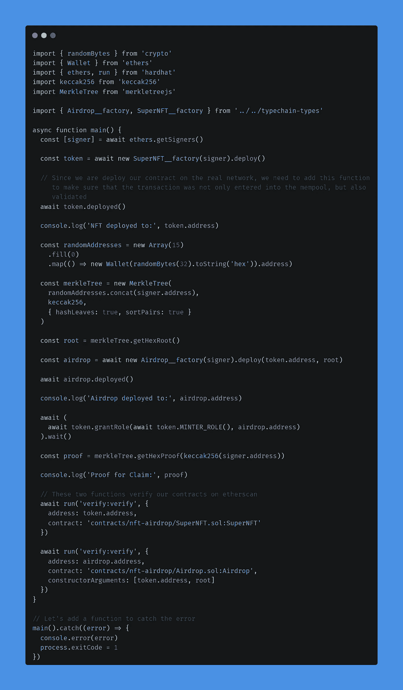
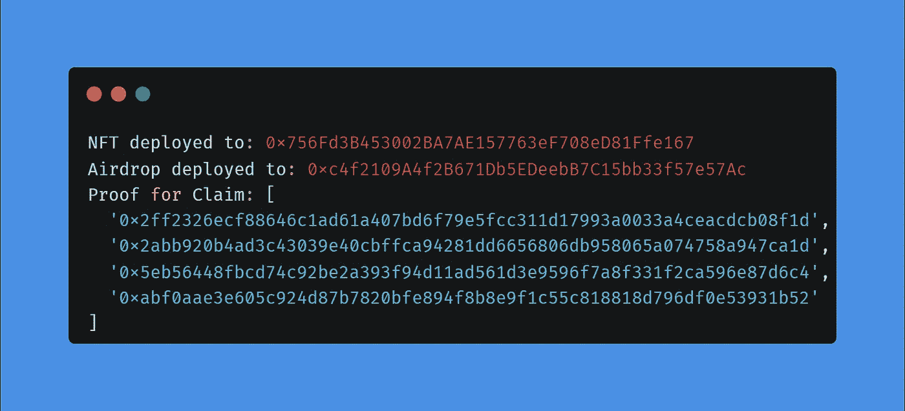
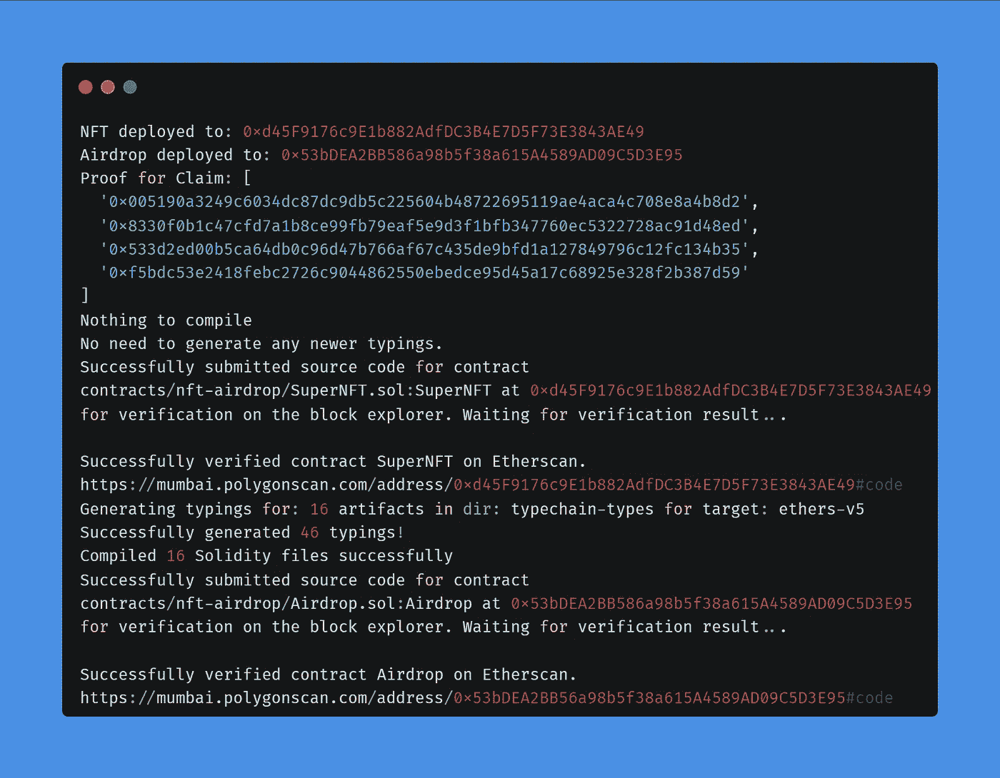
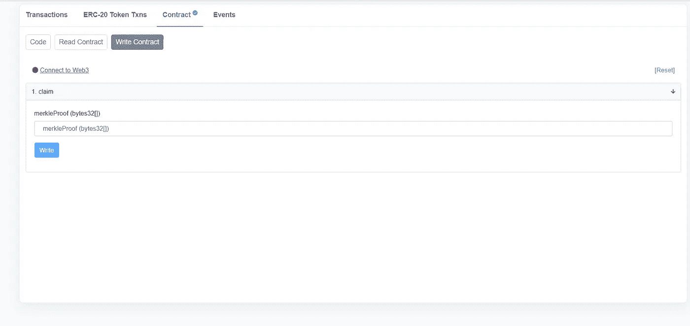
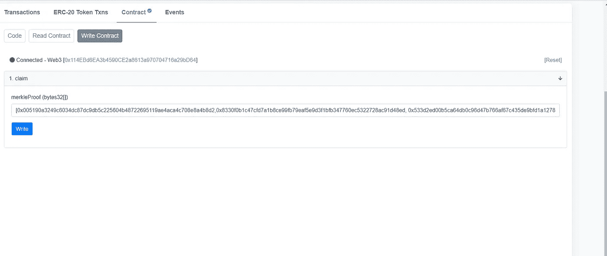
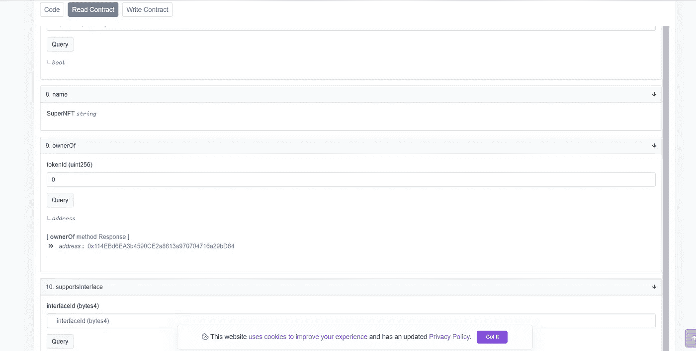

# 用 MerkleTree 实现 NFT 空投/白名单。

> 原文：<https://medium.com/coinmonks/nft-airdrop-whitelist-implementation-with-merkletree-1afbaf4c0935?source=collection_archive---------4----------------------->

在本文中，我们将为您的 NFT 集合的空投/白名单分解 MerkleTree proof 实现。(+测试)。使用多边形孟买。

> 如果你不明白这个算法是如何工作的，我建议你在开始工作之前先看一下之前的[文章](/coinmonks/solidity-merkle-tree-41c2d2b1071f)(我在这里已经详细解释了 Merkle 算法)。
> 我也建议你在开始之前阅读这篇[文章](/@ItsCuzzo/using-merkle-trees-for-nft-whitelists-523b58ada3f9)。它将帮助您更深入地理解代码是如何工作的。

# 先决条件

您需要安装以下工具来成功粉碎此版本:

*   [节点](https://nodejs.org/en/)
*   [安全帽](https://hardhat.org/)
*   [柴](https://www.chaijs.com/)
*   [元掩码](https://metamask.io/)

# 我们走吧

首先，我们将使用 [openzeppelin 向导](https://wizard.openzeppelin.com/#erc721)创建一个简单的 nft 契约。



An example of what your wizard should look like

首先，我们增加了创建新 nft 的可能性( *Mintable* 属性)并添加了 *AutoIncrementIds* 属性，这样，创建的 NFT 的计数器将自动增加，我们不需要编写额外的函数。
还添加了*角色*属性。因此，我们有一个主要的管理员，以及一个 minter 角色，我们将给予 Airdrop 合同(该合同将能够创建 NFT，并将其分发到合适的地址)。复制这段代码，我们以后会用到它。

> 重要提示:在新版本的 openzeppelin 中，您需要在 **_setupRole** 上更改 **_grandRole**

我们还将使用 MerkleProof [库](https://docs.openzeppelin.com/contracts/4.x/api/utils#MerkleProof)——它允许我们方便地使用 merkle 树，并在树中验证我们的候选证明。

# 让我们开始写代码吧

将 [githab](https://github.com/kumancev/nft-merkle-tree) 中的代码复制到您的工作目录中，安装并安装所有的依赖项:

```
$ git clone [https://github.com/kumancev/nft-merkle-tree.git](https://github.com/kumancev/nft-merkle-tree.git)
$ npm install
```

然后创建和设置你的**。环境**文件

```
PRIVATE_KEY=""  // your metamask account
POLYGONSCAN_API_KEY=""  // your polygon api key
```

## 代码审查

我们的项目中将有三个智能合同。

```
contracts-|
          |-nft-airdrop-|
                        |-Airdrop.sol
                        |-IERC721.sol
                        |-SuperNFT.sol
```

*SuperNFT.sol* 是从 openzeppelin 向导复制的代码。我们 NFT 合约的 *IERC721.sol* 接口，能够使用 safeMint()函数。
我们来分解一下 *Airdrop.sol* 合同:


现在我们需要制定编译契约:

```
$ npx hardhat compile
```

当编写智能合同时，一定要**为它们编写测试**。*测试智能合同和编写智能合同一样重要。*

## 测试智能合同

转到 *test/nft-airdrop/* 文件夹， *Airdrop.test.ts* 文件。

> 如果您对智能合约进行了更改，则必须重新编译它们。

```
$ npx hardhat clean
$ npx hardhat compile
```

现在让我们分解一下我们的 *Airdrop.sol* 契约的测试代码。
由于我们使用了 TypeChain，它在编译时自动生成了*工厂*和*接口*。我们将需要它们来测试和将来在网络上部署合同。



在我们本地的安全帽网络上运行测试:

```
$ npx hardhat test test/nft-airdrop/Airdrop.test.ts
```



测试运行成功，是时候将合同上传到网络上了。

## 部署 smartcontracts 以测试网络

转到*脚本/nft-airdrop/* 文件夹，部署*。ts* 文件。代码将与我们为测试编写的代码几乎相同。



> 您将离线存储候选人(表格，数据库)和证明也将离线生成)。由于这超出了本文的范围，我们将直接在部署脚本中生成证明(证明变量**)。**

首先，让我们在本地网络上测试我们的部署脚本。

```
$ npx hardhat run script/nft-airdrop/deploy.ts
```

您应该看到以下内容:



**我们将需要 nft 铸造的证据**

现在，让我们将部署部署到孟买多边形网络:

```
$ npx hardhat run script/nft-airdrop/deploy.ts --network matic
```



## 最后一步。NFT 造币厂。

去 Polygon [Mumbai](https://mumbai.polygonscan.com/) ，输入你部署时得到的空投合同地址。在智能合同页面，进入*“写合同”*选项卡，连接您的钱包。



然后在字段(1.claim — merkleProof (bytes32[]))中输入 4 个不带引号的散列，用方括号括起来，这是在删除时得到的



下一个声明 NFT，请注意，如果我们通过“for”方法使用进入白名单的确认，天然气价格会低得多。

现在，如果我们转到 NFT 合同的地址，并在“ownerOf”方法的“Read Contract”选项卡中输入 0(第一个 NFT 令牌的所有者)，我们会看到我们钱包的地址。



现在我想给你推荐一篇描述现代坚固性开发问题的文章&nft。
代码复制的问题等等很多东西。一个非常深入的分析与解决方案和代码的例子。这篇文章是由臭名昭著的 nft 集合 Nuclear Neadrs 的开发者之一写的。
如果你想真正理解代码优化，花点时间看看这篇 [**帖子**](/@nftchance/the-gas-efficient-way-of-building-and-launching-an-erc721-nft-project-for-2022-b3b1dac5f2e1) 。

当我写这篇文章的时候，我发现了可能是唯一的[**视频**](https://www.youtube.com/watch?v=0_9UotlUSSo) ，它描述了创建具有如此大的修改堆栈的 nft 集合(免费 mint +白名单 Mint (Merkle) +公共 Mint + PaymentSplitter)。唯一的问题是法国作者，但我们用同一种语言编写代码，所以你应该能搞清楚。

# 就是这样！你太棒了！😎

> 加入 Coinmonks [电报频道](https://t.me/coincodecap)和 [Youtube 频道](https://www.youtube.com/c/coinmonks/videos)了解加密交易和投资

# 另外，阅读

*   [瓦济里克斯 NFT 评论](https://coincodecap.com/wazirx-nft-review)|[Bitsgap vs Pionex](https://coincodecap.com/bitsgap-vs-pionex)|[Tangem 评论](https://coincodecap.com/tangem-wallet-review)
*   [如何使用 Solidity 在以太坊上创建 DApp？](https://coincodecap.com/create-a-dapp-on-ethereum-using-solidity)
*   [加密交易机器人](/coinmonks/crypto-trading-bot-c2ffce8acb2a) | [OKEx vs 币安](https://coincodecap.com/okex-vs-binance)
*   [币安 vs FTX](https://coincodecap.com/binance-vs-ftx) | [最佳(SOL)索拉纳钱包](https://coincodecap.com/solana-wallets)
*   [如何在 Uniswap 上交换加密？](https://coincodecap.com/swap-crypto-on-uniswap) | [A-Ads 评论](https://coincodecap.com/a-ads-review)