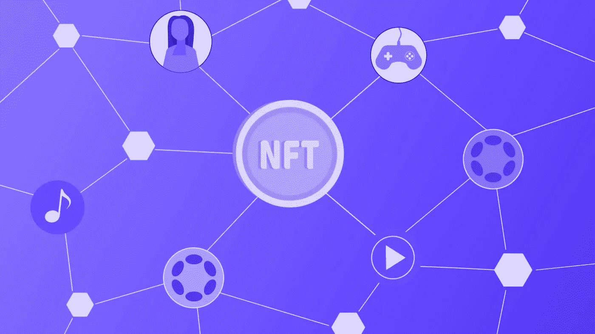

# NFT API 即服务

> 原文：<https://medium.com/coinmonks/nft-api-as-a-service-3ea26e76117f?source=collection_archive---------3----------------------->

NFT 似乎是这十年的新流行词。根据 Chainalysis 的数据，2021 年约有 410 亿美元的密码花费在 NFT 市场上。Dune Analytics 2022 的一份报告显示，NFT 的借贷正在稳步增长。

随着 NFT 席卷全球，企业和开发商正在 NFT 建设各种项目。他们依赖于在后端开发这些项目所需的 NFT API。这些 API 可以减少开发人员耗时的任务，并增强 NFT 应用程序的开发。

 [## 开发人员的 11 个最佳加密 API

### 感到开发自己的加密应用程序的渴望吗？让我们探索一下市场上最好的加密 API。

medium.com](/coinmonks/best-crypto-apis-for-developers-5efe3a597a9f) 

# 什么是 API？

在探索 NFT API 之前，让我们先定义一个 API。应用编程接口(API)是所有计算机系统连接性和交互性的基础机制。简单地说，API 是接受你的请求，指示系统执行它们，然后提供结果的信使。

**原料药可用于以下用途:**

*   从第三方获取数据，并允许不同的应用程序和服务交换信息。
*   隐藏复杂性和执行任务。
*   扩展当前系统的功能。
*   充当守卫，保护我们的敏感信息安全。

大多数网站和应用程序都使用 API，API 提供了对分散在许多来源的大量数据的访问。让我们能够使用设备访问世界其他地方的连接性最终由此成为可能。在 NFT 应用程序和存储在区块链上的 NFT 数据之间建立联系正是 NFT API 所提供的。

# 为什么需要 NFT 原料药？

在 NFT API 成为服务之前，开发人员需要花费大量时间和精力来找到他们创建基于 NFT 的应用程序所需的 NFT 特定数据。解析单个智能合同、对非结构化数据集进行排序以及清理和拼接检索到的数据对于深入了解 NFT 的各个方面是非常必要的。因为关于 NFT 的当前所有者、交易历史等信息。，对于 NFT 应用程序的工作方式至关重要，所以这一步是必需的。由于 NFT API 提供的标准化和可搜索性，开发人员可以快速跨几个 NFT 智能合同运行查询，这也有助于他们节省时间、金钱和精力。

在区块链上解析 NFT 数据时通常会出现边缘情况，这使得使用 NFTs 具有挑战性。NFT API 消除了所有这些障碍，简化了不可替换令牌的使用。无需额外努力，就可以完成从众多智能合同中获取数据并将其集成到应用程序中的任务。

您可以使用适当的 NFT API 访问区块链上列出的每个不可替换令牌的相关信息。此外，只要您的 API 允许，就可以使用许多不同的区块链来提取数据。这样做可以让您更快地完成工作，并开发一个集成了 NFT 的应用程序。此外，你可能会花时间设计你的应用程序，而不是试图收集数据。

以下信息可以通过 NFT API 直接从令牌的主机[区块链获得，省去了很多不必要的工作:](https://www.leewayhertz.com/nft-apis/)

*   NFT 所有权数据
*   NFT 元数据
*   NFT 传输数据
*   NFT 价格历史

# NFT API 可以执行的任务

NFT API 可以执行几个简单但强大的功能，例如:

**获取 NFT 所有者的数据**

不管所涉及的 NFT 遵守什么标准，您都可以使用适当的 NFT API 提取关于 NFT 所有者的任何所需信息。NFT 的所有权和转让历史都可以从一行代码中了解到。

**搜索 NFT**

某些 NFT API 的工作方式类似于 NFT 搜索引擎；例如，如果你创建一个 [NFT 市场，一些 API 可以让用户使用自由文本搜索任何给定的 NFT 变得可行。](https://www.leewayhertz.com/nft-marketplace/)

**获取 NFT 元数据**

您可以访问特定的 NFT API 从任何区块链获取 NFT 元数据。

**承办 NFT 权属核查**

任何人都可以通过几个简单的 API 调用来获取和验证 NFT 所有权信息。

**NFT 来源审计**

您可以使用 NFT API 快速跟踪不可替换令牌的整个所有权历史。

**NFT 探索者的开发**

当创建一个允许任何人通过名字在区块链搜索任何 NFT 的 NFT 浏览器时，使用 NFT API 是必不可少的。API 保证所有被访问的数据，无论是链上的还是链下的，都可以立即使用。

**社交媒体-NFT 整合**

一些 API 是将 NFT 与社交媒体无缝融合的预制补救措施。借助这些简单易用的 API，社交媒体公司可以提供出色的用户体验。

**NFT 分析访问**

任何与非金融交易相关的业务都需要获得与非金融交易相关的基本分析。借助专为分析而设计的 NFT API，您可以快速提取至关重要的 NFT 数据，并获得关于您选择的区块链的深刻知识。

# 结论

随着 NFTs 成为主流，围绕它的宣传越来越多，开发 NFT 应用程序变得越来越棘手，因为 NFT 应用程序需要获得大量数据才能正常工作。为了让 NFT 应用程序对用户有价值，需要大量的数据来源，如收集 NFT 所有权细节或检索交易历史。

然而，从单个 NFT 智能合同中获取数据既费时又费力。NFT API 将有效地收集和整理与资产、令牌、元数据、所有权等相关的 NFT 数据。，分散在不同的平台上，使 [NFT app 开发](https://www.leewayhertz.com/nft-marketplace-development-company/)流程无缝衔接。

> 交易新手？试试[密码交易机器人](/coinmonks/crypto-trading-bot-c2ffce8acb2a)或者[复制交易](/coinmonks/top-10-crypto-copy-trading-platforms-for-beginners-d0c37c7d698c)