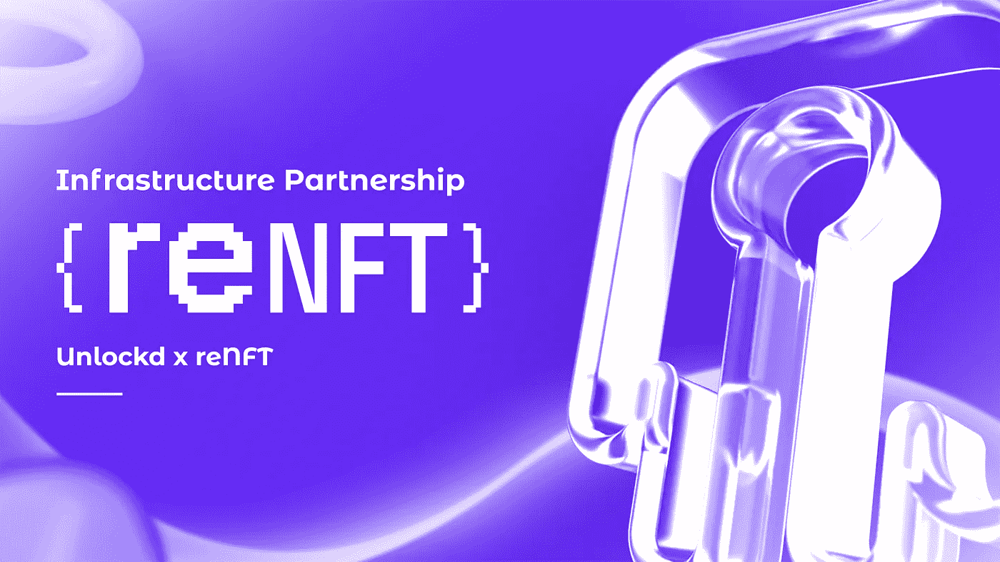
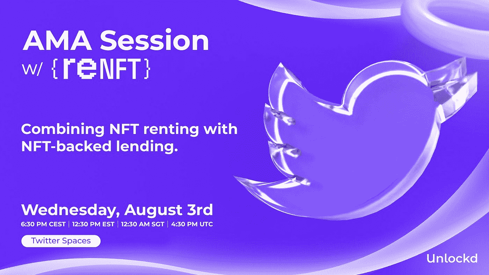

# 如何将 NFT 租赁与 NFT 支持的借贷结合起来？

> 原文：<https://medium.com/coinmonks/nft-backed-lending-directly-integrated-into-nft-renting-e24d101b4981?source=collection_archive---------9----------------------->

Unlockd 是一个分散的跨链协议，在保持所有权优势的同时提供 NFT 流动性，它很高兴地宣布我们与 reNFT 的合作伙伴关系，reNFT 是一个多链 NFT 租赁协议，可以白标集成到任何项目中，以实现无抵押的内部租赁和奖励共享。

随着 NFT 行业的发展和应对更多的垂直行业，NFT 金融化对于生态系统的未来变得至关重要。

像 NFT 租赁这样的新模式有助于抓住这一价值，并使用户能够分享收入和提高效率。租金对市场的发展至关重要，因为它们提供了流动性，并最大限度地降低了这些资产的机会成本。这种创新模式正在全面获得牵引力——主要是在游戏行业——但它们在代币门控活动和社区中也变得越来越受欢迎。

这就是 reNFT 的用武之地，他们的工具是为开发者打造的，目标是通过快速启用租赁功能让生活变得更轻松。他们的无缝解决方案允许每个人在他们现有的基础设施上建立自己的租赁市场— **改善用户体验和项目的流动性。**

reNFT 是唯一一个可以白标集成到任何项目中的租赁协议，具有基于其团队开发的项目需求的任何定制功能。

他们的目的是建立即插即用的基础设施，释放陈旧的资产类别。与 Unlockd 一起工作允许两个项目为我们的用户提供开拓性的策略，包括他们以前从未试验过的 NFT。

我们把传统的金融模式带到了元宇宙——*，但做得很好。*

# 解锁 x reNFT:同时提供额外的流动性和收入

unlockde 将与 reNFT 整合，允许借款人也可以租赁他们的 NFT，同时将它们作为抵押品抵押在 unlockde 中，并对其进行主动贷款。

我们的目标是利用现有技术，并与能够为未锁定用户提供最佳组合服务的项目合作，专注于构建一个**流畅而简单的用户流以及与他们的端到端旅程**。

我们尤其对他们自己的 reNFT marketplace 感到兴奋，在那里数百个项目只需使用一个专用页面。将解锁贷款解决方案与 NFT 市场整合是我们的主要长期目标之一，因为它为用户提供了灵活的选择和额外的流动性，提高了效率并增加了交易量。

有了这种组合，用户现在有了低得多的机会成本，并且可以轻松地访问他们选择的新项目。

将两种协议的效用结合起来，用户还将能够产生被动收入，因为 reNFT 基于一套标准自动允许这一点——这对没有时间或基础设施来积极管理其 NFT 投资组合的较小行会或临时投资者尤其有用。

非摊薄性融资和经常性租金收入的结合将有助于公会和投资 Dao 实现可持续增长和扩大其业务。

在这条道路的下一步，reNFT 将致力于部署他们的游戏集成管道，并在 Polygon，Avalanche 和 Solana 上进行进一步的链扩展。此外，他们的游戏奖励解决方案(奖学金自动化)将很快广泛提供。

Unlockd 将在他们身边，以任何可能的方式帮助使用跨链工具，最大限度地发挥用于这些功能的资产的流动性潜力。

我们将共同努力，使这些功能不仅与投资者和收藏家相关，而且成为推动 NFT 金融化的所有系统的新标准。

# 明天加入我们吧！

NFT 租赁让你租赁你的资产来获得收益。

NFT 支持的贷款让你可以用自己的资产抵押借款，以释放流动性。

**当你把它们结合起来会发生什么？**

周三加入我们的 Twitter 空间来寻找答案吧！

> CEST 时间下午 6:30 |美国东部时间下午 12:30 |新加坡时间上午 12:30 |世界协调时下午 4:30

> **！]在这里设置提醒:** [！]
> 
> [https://twitter.com/i/spaces/1mnxedAqvpLJX](https://twitter.com/i/spaces/1mnxedAqvpLJX)

## 关于解锁

Unlockd 是一个分散的跨链协议，为艺术、DeFi、元宇宙、现实世界和游戏提供民主化的 NFT 流动性和效用。

Unlockd 提供即时贷款，并实现无缝的跨链借贷，Unlockd 借款人可以通过 NFT 支持的贷款增加他们的财富，同时保持 100%的所有权津贴。

[**网站**](https://unlockd.finance/) **|** [**推特**](https://twitter.com/Unlockd_Finance) **|** [**不和**](http://discord.gg/unlockd) **|** [**电报**](http://t.me/unlockd_finance) **|** [**博客**](https://unlockd-finance.medium.com/)

## **关于 reNFT**

reNFT 是一个多链 NFT 租赁协议和平台，可以白标集成到任何项目中，以实现无抵押的内部租赁、借贷和奖励分享(奖学金自动化)。

reNFT 是为从事 web3 项目的开发人员构建的。他们的目标是通过快速启用租赁功能，让您的生活更加轻松。

[**网站**](https://www.renft.io/) **|** [**文档**](https://docs.renft.io/) **|** [**推特**](https://twitter.com/renftlabs) **|** [**电报**](https://t.me/renftlabs) **|** [**不和**](https://discord.com/invite/4Ab8tknmhf) **|** [**博客**](https://medium.com/renftlabs)

> 交易新手？尝试[加密交易机器人](/coinmonks/crypto-trading-bot-c2ffce8acb2a)或[复制交易](/coinmonks/top-10-crypto-copy-trading-platforms-for-beginners-d0c37c7d698c)