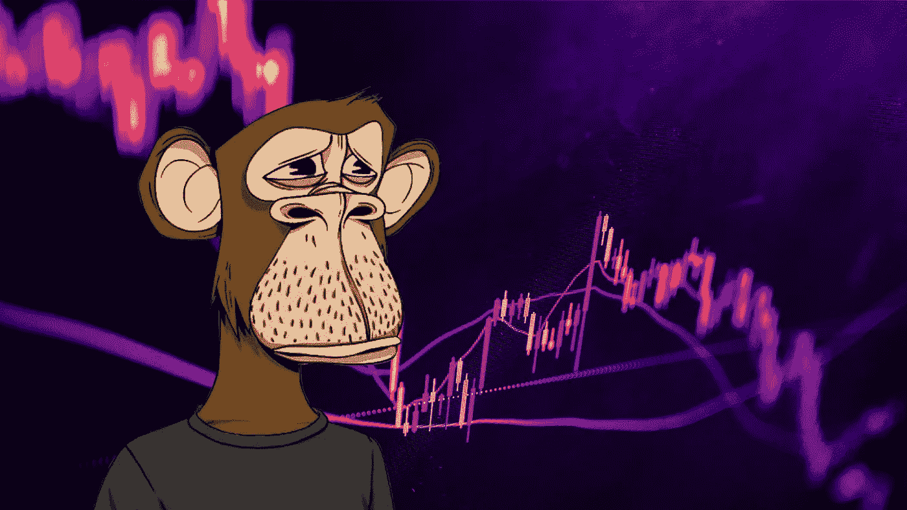
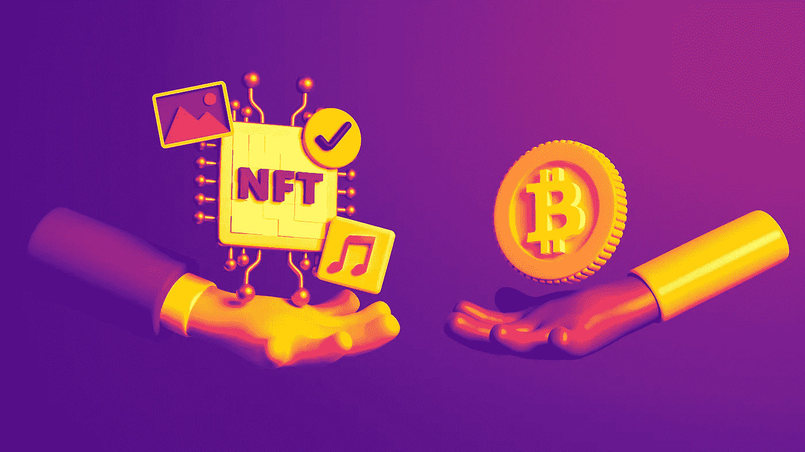
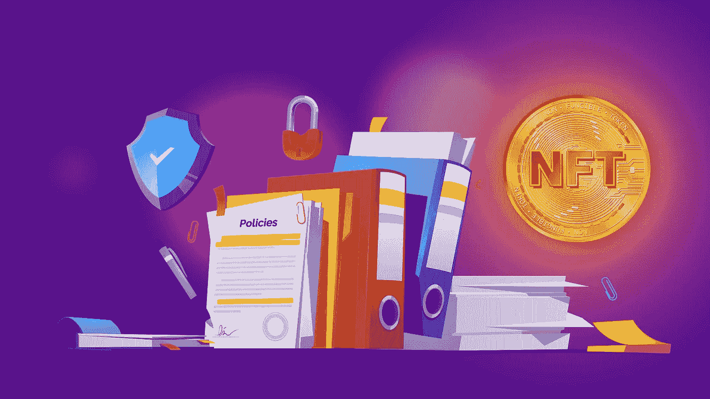

# NFT 支持的贷款正在冲击 NFT 市场

> 原文：<https://medium.com/coinmonks/nft-backed-loans-are-crashing-the-nft-market-5058ebffd518?source=collection_archive---------6----------------------->

你有没有想过人们是如何负担得起这些昂贵的食物的？当然，像 BAYC，Crypto Punks，甚至大肆宣传的哥布林镇这样的标志性 NFT 的价格已经从今年早些时候的峰值大幅下降。人们支付数十万美元来拥有这些数字艺术品的事实令人难以置信。他们从哪里弄来的那种抓痕？很容易假设他们只是在早期进入后挥霍他们的密码，但事实证明有另一种方法来资助这些数字豆豆娃。进入 NFT 借贷的世界。

# NFT 贷款……那是什么？

事实证明，金融化的世界很快赶上了 NFTs。你看，NFT 不像 crypto 那么容易交易。有了比特币，你可以很快卖掉它，并获得一些法定货币来支付现实世界中你需要的任何东西。NFT 不一样。它们是不可替代的。这意味着他们是独特的，不是每个 NFT 都是一样的。你必须把它挂牌出售，并希望有人像你一样喜欢你的猴子角色、像素朋克或妖精…或者曾经喜欢过。这意味着你可能会坐在那里点击拍卖刷新一段时间。为了解决这个问题，金融工具已经出现，让你用你的 NFT 作为抵押，担保贷款。这就像去银行要 10 万美元。银行会给你钱，但他们希望得到一些保证，如果你不还钱，他们可以拿走你的东西，并为自己兑现，以取回他们的钱。NFT 贷款也是如此。

通过把你的 NFT 作为抵押，你可以得到一个密码，你可以用它来购买更多的 NFT，持有或交换菲亚特，然后大展拳脚。当然，不是每笔贷款都一样。有些资产比其他资产更安全。例如，房子被认为是非常安全的……“像房子一样安全”，他们过去一直这么说，直到 2008 年 GFC 来袭，将房地产市场搅得天翻地覆。事实证明，非金融资产也不是最稳定的投资。

正如我们在过去几个月中所看到的，更广泛的加密市场正在经历一场自己的金融崩溃。BAYC NFT 系列的以太坊底价已经跌至今年的最低点。底价基本上是最低的价格点，一个贝可 NFT 将出售。随着价格的下降，银行作为贷款担保的抵押品变得越来越不值钱，这意味着如果你想继续持有贷款，你需要找到更多的担保。如果银行认为证券的价值低于贷款，他们将强制出售。这就是所谓的清算，它有助于保护银行的资产价值低于他们借出的钱。如果这些资产的价值低于贷款的价值，而这些贷款出现违约，银行就可能破产。对于那些把资金存在这些银行的人来说，这是个坏消息。

# 本岛流动性危机

这就给我们带来了[奔岛](https://www.benddao.xyz/)的案例。本道就像一个分散的银行。更准确地说，这是一种点对点贷款服务。客户可以通过使用他们的非金融资产作为抵押为 ETH 贷款，最高可达其底价的 40%。非功能性存款被赋予一个健康因子，该因子被定义为“你的存款 NFT 相对于借入的 ETH 及其潜在价值的安全性的数字表示”如果健康系数恰好低于 1，NFT 将在 48 小时内被拍卖。如果借款人违约，出价最高者将获得 NFT。现在问题来了——目前有 72 个 BAYC NFTs 危险地接近下滑到 1 以下，健康因素徘徊在 1.2 以下。简单来说，如果 BAYC 股价进一步下跌 17%,这些贷款无法偿还，那么这 72 家 NFT 将被拍卖。结合这一事实，BAYC 地板价较 5 月份创下的历史高点下跌了 57%，BAYC 藏品中有 2.57%与本道有关，NFT 市场可能会进一步遭受打击。

# 防止市场崩溃

BendDAO 显然想确保这种情况不会发生，所以他们想出了一个计划。作为一个分散的自治组织，他们向社区成员提出了一项建议。该提议旨在降低流动性门槛，以避免大规模抛售。新的清算门槛将是 70%，而不是 85%。其他措施包括将拍卖时间从 48 小时缩短至 4 小时，将贷款利率从 100%降至 20%，并取消了最低出价为底价 95%的条件。这一切都是为了防止 NFT 市场崩盘。该提案在社区中很受欢迎，并已获得通过，超过 97%的选民支持新的改进措施。危机解除！

# NFT 贷款值得冒险吗？

为什么要用 NFTs 做抵押？问问任何一位经济学家，他们可能会告诉你，这个想法很荒谬，肯定会让贷款人、投资者和借款人都感到痛苦。事实是，我们仍在学习如何使用这些数字资产，在这个过程中会犯错误。在过去的两年里，非功能性金融产品被大肆宣传，当任何金融产品被大肆宣传时，都不会有好结果。自从现代资本主义开始以来的过去五百年里，我们已经一遍又一遍地学到了这一课，在未来的许多年里，我们很可能会继续接受这一课。这并不是说使用数字资产作为贷款担保是个坏主意。在探索 DeFi 的世界之前，我们需要更好地了解风险，并知道没有任何保证，尤其是在市场处于白热化的时候。永远不要投资、借入或借出你无法承受损失的东西。

如果你喜欢这篇文章，并想留在了解所有事情的网站 3，请确保你关注 BAXE 博客并注册我们的邮件列表。

你也可以在[推特](https://twitter.com/BaxeApp)上关注我们，并加入我们的[电报组](https://t.me/BaxeCommunity)。

我们承诺让您了解最新信息，尽情娱乐😏

> 交易新手？尝试[加密交易机器人](/coinmonks/crypto-trading-bot-c2ffce8acb2a)或[复制交易](/coinmonks/top-10-crypto-copy-trading-platforms-for-beginners-d0c37c7d698c)