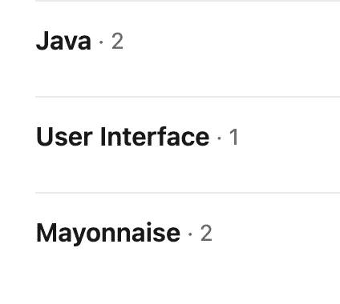
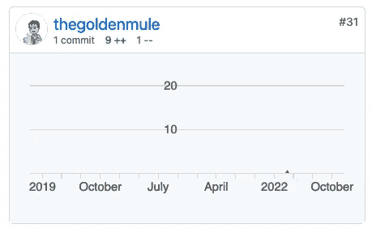
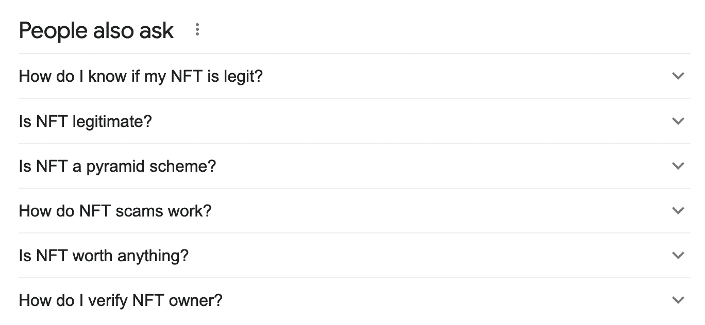
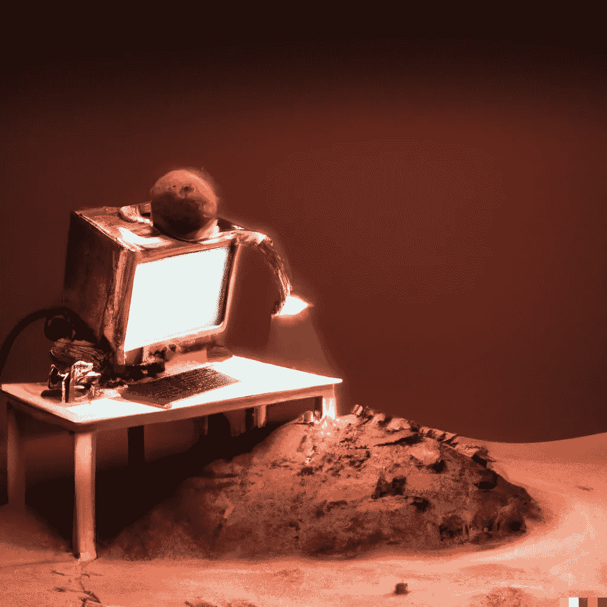
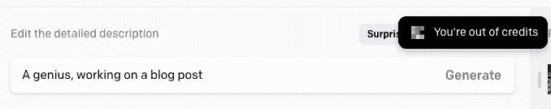
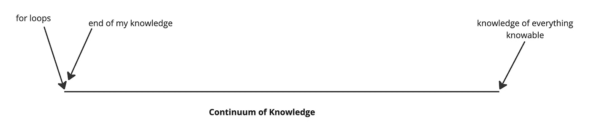
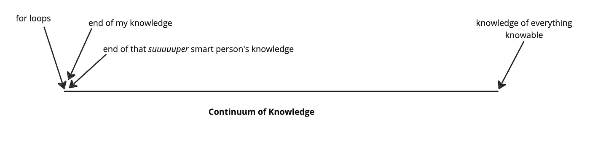
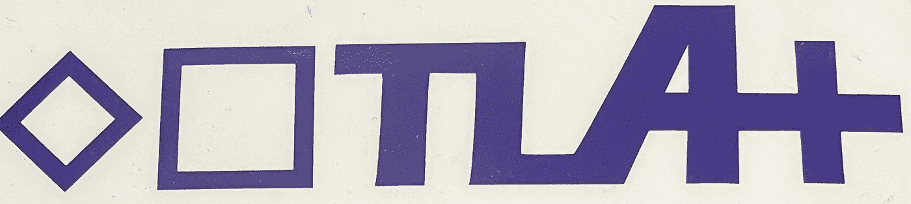

# NFT 收藏家是天才

> 原文：<https://medium.com/coinmonks/nft-collectors-are-geniuses-3edbc427c48c?source=collection_archive---------11----------------------->

“an nft-collecting robot in space”, by DALL-E

不管你认为我的 GitHub 有多棒，我知道“for loops”的基本知识这一事实让我成为了一个电脑高手，超过了普通的互联网用户。我会说，我实际上至少比平均水平高了两个 T2——但你不必相信我的话:看看这些响亮的 LinkedIn 支持！

我非常有资格。

此外，我有一个微分几何专业的数学学位，我每天都用*(如果不是每小时的话)，这是值得的。*

*作为我智慧的最后证明，我贡献了 Go to [Polygon Edge](https://github.com/0xPolygon/polygon-edge) :运行多边形网络的第 2 层技术(MATIC token)。*

**

*holy cow*

*这是非常重要的，因为当我说我很难确定哪些 NFT 是合法地为世界增加价值，哪些是被喷漆的路苹果时，这应该让你暂停一下，非平均水平以上的互联网用户应该如何涉水通过 NFT 的生态系统。*

**

*From Google — an ‘up and coming’ Bing competitor.*

*这显然是 NFT 市场的一个问题。*

*这也是一个真正的耻辱，因为作为一个数学训练有素的计算机爱好者，NFT 的概念是……非常酷！支撑它们的结构实际上是新颖的，潜力是惊人的。你以前听说过这一点，但通常不是从“Web3 行业”之外的人那里，尤其不是从那些实际上并不拥有任何非专利技术的人那里，他们不是在自己的区块链上制作的。*

*我选择了一个“阵营”，这可能是你意想不到的(尤其是在 FTX 崩溃之后)。我认为非技术人员有机会为世界做出有意义的贡献，也许他们已经这样做了，但一般来说:*不要*。在当前的 NFT 生态系统中，消费者正在被集体欺骗，这是 NFT 创造者社区也将被欺骗的另一种说法——可能在未来几年。*

# *感知不是问题*

**

*“a n00b getting scammed, in the tron Universe”, by DALL-E*

*没有人“认为”NFT 的生态系统充满了骗局——多年来，骗局一直是头条新闻，因为有太多的骗局。这不是感知，这是*此刻的现实*。那些狡猾的 NFT 项目创始人没有考虑长期的游戏，当他们和他们有关系的朋友以某种方式偷偷从他们自己的项目中积累统计上不可能的稀有资产，并把它们翻转 800 ETH。*

*这个问题很难解决，因为 NFT 是如此的复杂，以至于要理解它们是什么或者为什么它们会有意思，你必须认真学习。我在一开始就说了那些数学的东西，以证明当我说“我几乎没有得到这些东西”时，这并不是因为我笨，或者没有足够努力去得到它，或者没有必要的数学或计算机科学背景。这是因为区块链和 NFT 实际上是复杂和不透明的(和美丽的)建筑。*

**然后*，在这一切之后——因为所有的非功能性测试肯定不是生来平等的，你必须在 NFT 项目上做你的功课。这里没有美国证券交易委员会，没有认证过程——每个 NFT 项目都是由 randos 制作的，这令人难以置信(金融服务的民主化似乎很酷)，但显然有一些“锋利的边缘”。*

*数学很难，编程很脆弱，ERC 721 合同——哎呀，现在我们每个人都在使用 ERC 1155(除了所有已经发货和没有使用它的项目)——不是微不足道的。*

# *DApps 不是“不可信的”,重新定义没有帮助*

**

*“A computer getting a perm on mars but it doesn’t like how things are progressing”, by DALL-E*

*情况变得更糟。*

*NFT 项目实际上只是在电脑上运行的软件应用程序。看到我的大写字母了吗？只是为了让这些应用听起来格外可信，而不是称它们为“软件应用”，它们被称为“dApps”(这是一个软件工程师密集的部门，*营销*还没有在这里)，并且计算机不是一些 Linux 盒子——它通常要么是[以太坊世界计算机](https://consensys.net/blog/news/programmable-blockchains-in-context-ethereum-smart-contracts-and-the-world-computer/)，要么是一些“以太坊兼容”的计算机，如[多边形世界计算机](https://polygon.technology/)。*

**现在*我真的在谈论单词选择——因为这些技术重新定义了“不可信”这个词，然后像什么都不是一样到处扔，尽管这种重新定义违反了每个女人的定义。这就是我们如何得出类似于“[不信任是什么意思？](https://www.gemini.com/cryptopedia/trustless-meaning-blockchain-non-custodial-smart-contracts)”其中第一句写着:*

> *虽然《韦氏词典》将“不信任”定义为“不值得信任”，但在区块链，它的含义完全不同。*

*太棒了。*

*这意味着倒霉的不理解 for 循环的 n00bs(不像我，我完全理解 for 循环)带着对技术基础的巨大误解进入了一个生态系统。*

*这是 NFT 市场的一个问题。*

# *NFT 收藏家是天才*

**

*by DALL-E*

*这证实了我的论点:外面的几十个 NFT 收藏家肯定不只是比我聪明一点点，而是比我聪明得多。他们一定是吓坏了。*

*他们一定做了功课，以确保 [BAYC 合同](https://etherscan.io/address/0xbc4ca0eda7647a8ab7c2061c2e118a18a936f13d#code)保证随机分配([不保证](/northwest-nfts/bored-ape-yacht-club-contract-review-80dce503308e))，并且所有者不能在他们喜欢的时候随机铸造，因为这可能会改变所有猿的价值([不保证](/northwest-nfts/bored-ape-yacht-club-contract-review-80dce503308e))，并且合同所有者不能在铸造后改变图像集([不保证](/northwest-nfts/bored-ape-yacht-club-contract-review-80dce503308e))。*

*看在大便的份上！*

*老实说，这只是表面水平的分析。一个 NFT 收藏家如何知道合同是否会成为一个普遍领先的人的牺牲品？OpenZepplin 合同的 TLA+规范在哪里？见鬼——主人的钥匙安全吗？数学的东西变成了简单的部分。愚蠢的人是愚蠢的，不幸的是，聪明的人更愚蠢。*

# *聪明人能解决这个问题吗？*

*你可能已经知道这一点，但有比我更聪明的人在研究这些问题。这显然是一件好事，因为在某种程度上，我的知识在 for 循环之后戛然而止。*

**

*this is optimistic*

*其中一项努力就是[诚实协议](https://honestprotocol.xyz/)。最初是一群义务警员审查非传染性疾病，现在已经演变成“区块链支持的”NFT 大规模审查协议。不幸的是，虽然该协议试图扩大一个数据科学和法医专家小组的努力，但它似乎在去年左右失去了动力。事实证明，这实际上不是一个可扩展的解决方案，当然，它只是把谁值得信任的问题从 NFT 作者那里转移到我不知道我是否应该信任的第三方，我也不知道我是否可以信任。众所周知的罐子被踢下了秘密道路。我应该相信这个不和谐服务器上的用户“龙神”吗？他们告诉我关于泊松分布的什么？？？*

*这掩盖了一个更基本的问题，即使我个人确实认识这些神秘的成员:人类在某些事情上经常出错。我将在这个极其有用的图形中添加另一个数据点。*

**

# *电脑能解决这个问题吗？*

*好了，现在我们谈了。*

*我不需要一个*人*来解决这个问题，我需要一种“坚硬、易碎、带有蓝灰色金属光泽的结晶固体。”你知道我的意思，对吗？它对氧有很高的化学亲和力？一个四分之一电子组态？哎呀，我不知道如何让[变得更明显](https://en.wikipedia.org/wiki/Silicon)。*

*一个更好的方法——我上面顺便提到的一个*可扩展的*解决方案，是通过[正式方法](https://en.wikipedia.org/wiki/Formal_methods)将更多的研发转移到验证中。事实是，区块链程序根本不需要测试！程序员习惯于通读代码并使用他们弱小的大脑来确保它做他们想要的事情，然后他们可能会编写一些单元测试来确保某些输入实际上导致正确的输出。不幸的是，在一个状态比宇宙中的基本粒子还多的可能性空间里，在一台人们想要运行一千年的计算机上，这一切都毫无意义。*

*虽然单元测试作为软件开发实践对于构建稳定的系统非常有用，但是单元测试*永远无法证明*一个重要程序的正确性。*

*区块链程序不需要测试，需要*证明。**

**

*Oh my goodness, this one is hilarious: see it’s a TLA+ inside joke that only took me an 8-hour TLA+ workshop to understand.*

*事实上，我们已经有太多的工具来做这件事了。TLA+是我上面给出的例子——也是我唯一有标签的正式方法(见上图),但它远不是唯一的选择。TLA+大师和著名的“正式方法传道者”Hillel Wayne 最近要求各种各样的程序员用正式方法来证明 leftpad，并收到了几十个有效的方法。*

*我们可以合法地证明区块链程序的正确性，今天*。对我来说很疯狂的是，OpenZepplin 没有向提供任何证据证明他们的合同是正确的。他们实际上向写这些合同的人推荐单元测试。“我们让一群人审查这些合同。”是的，OpenSSL 也是如此，进展如何？除了这些合同是刻在区块链石头上的，不是我们可以推一堆软件更新的东西。有趣的是，由于一个人工智能在查看合同 300 微秒后开发的 OpenZepplin 漏洞，数千个 NFT 项目同时受到威胁。**

**我明白了——如果有某种方法可以在某种分散的数据结构上发布一个程序*和*所述程序正确性的证明，这样每个人都可以看到它，会怎么样？EVM 的疯狂之处在于*校对程序本身*可以在 EVM 上运行。更进一步:*校对者可以验证 EVM* 的真实性。每个人都迫不及待地想搬到 WASM 支持的区块链，这样我们就可以推送更新了——不要误会，这是一个胜利。然而，更大的问题是证明更新一开始就是正确的。**

# **鳍状物**

**所以我们有很多问题要解决。**

**首先，我们需要 Solidity 的 spec 语言和其他智能合约语言(这种 spec 语言最终应该能够证明自己是正确的)。**

**接下来，我们需要使用正式的方法来证明区块链虚拟机实际上是正确的。**

**最后，我们需要与合同一起发布给区块链的规范。**

**我将把这些作为练习留给读者。**

> ***交易新手？试试* [*密码交易机器人*](/coinmonks/crypto-trading-bot-c2ffce8acb2a) *或* [*复制交易*](/coinmonks/top-10-crypto-copy-trading-platforms-for-beginners-d0c37c7d698c)**
> 
> ***分散加密持股，了解* [*币安的替代方案*](https://coincodecap.com/binance-alternatives)**
> 
> ***加入 Coinmonks* [*电报频道*](https://t.me/coincodecap) *和* [*Youtube 频道*](https://www.youtube.com/c/coinmonks/videos) *获取每日* [*加密新闻*](http://coincodecap.com/)**

# **另外，阅读**

*   **[复制交易](/coinmonks/top-10-crypto-copy-trading-platforms-for-beginners-d0c37c7d698c) | [加密税务软件](/coinmonks/crypto-tax-software-ed4b4810e338)**
*   **[网格交易](https://coincodecap.com/grid-trading) | [加密硬件钱包](/coinmonks/the-best-cryptocurrency-hardware-wallets-of-2020-e28b1c124069)**
*   **[密码电报信号](/coinmonks/top-3-telegram-channels-for-crypto-traders-in-2021-8385f4411ff4) | [密码交易机器人](/coinmonks/crypto-trading-bot-c2ffce8acb2a)**
*   **[最佳加密交易所](/coinmonks/crypto-exchange-dd2f9d6f3769) | [印度最佳加密交易所](/coinmonks/bitcoin-exchange-in-india-7f1fe79715c9)**
*   **[开发者最佳加密 API](/coinmonks/best-crypto-apis-for-developers-5efe3a597a9f)**
*   **最佳[密码借贷平台](/coinmonks/top-5-crypto-lending-platforms-in-2020-that-you-need-to-know-a1b675cec3fa)**
*   **[免费加密信号](/coinmonks/free-crypto-signals-48b25e61a8da) | [加密交易机器人](/coinmonks/crypto-trading-bot-c2ffce8acb2a)**
*   **杠杆代币的终极指南**