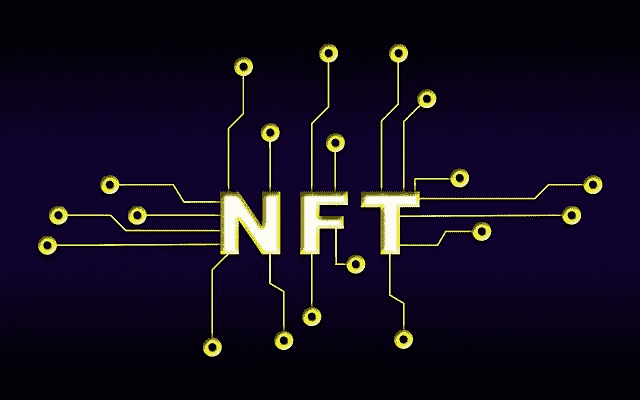

# 随着 2022 年 6 月的日销售额下降到一年的下降趋势，NFT 热潮消退

> 原文：<https://medium.com/coinmonks/nft-craze-fades-as-daily-sales-in-june-2022-drop-to-one-year-downtrend-6a6ce69669b9?source=collection_archive---------33----------------------->

NFT 的飙升是由强大而乐观的加密环境以及积极的投资者态度推动的。然而，加密行业受到了比特币熊市的负面影响。

在 2021 年，不可伪造的代币(NFT)作为一线名人、有影响力的人而受到欢迎，体育界最终发现了一种粉丝互动机制，使普通公众能够从他们的成功中获利。然而，随着销量在 2022 年的严重熊市中跌至一年来的低点，围绕 NFT 的乐观情绪无法保持住。

从 2021 年初开始，NFT 热潮一直持续到 2022 年 5 月，这得益于强大而乐观的加密环境和有利的投资者态度。虽然它对整个加密生态系统产生了负面影响，但比特币(BTC)无法维持其历史最高价格。

2022 年 6 月，每日交易总数降至约 19，000 笔，估计价值为 1，380 万美元，这是 NFT 生态系统一年中最低的一个月。这个数字最后一次出现是在 2021 年 6 月。

尽管去年这个羽翼未丰的生态系统在多个用例中得到了广泛的实施，但类似数量的每日 NFT 销售额仍被视为值得关注。

根据 nonfungible.com 的数据，在 2021 年 9 月 24 日，NFT 生态系统经历了 224768 次 NFT，价值 7850 万美元的日常交易，创下新高。然而，最大的交易是在 2022 年 5 月 1 日，当时出售了 118，577 辆 NFT，总额为 7.8040 亿美元。

乙醚(ETH)价格的下降、二级市场需求的匮乏以及天然气价格的上涨是对围绕 NFTs 的乐观情绪产生负面影响的一些主要方面。结果，在过去的三个月里，NFT 的市场价值下降了 40%左右，交易量减少了 66%以上。

尽管市场不景气，但像赵长鹏这样的加密企业家正在协助政府调查用于识别公民身份的 NFT 用例。社交媒体巨头 Meta 的子公司脸书最近透露了为创作者启用 NFTs 的计划。

根据 Meta 发言人的说法，在脸书引入 NFTs 将是渐进的，从美国的一小群创作者开始。