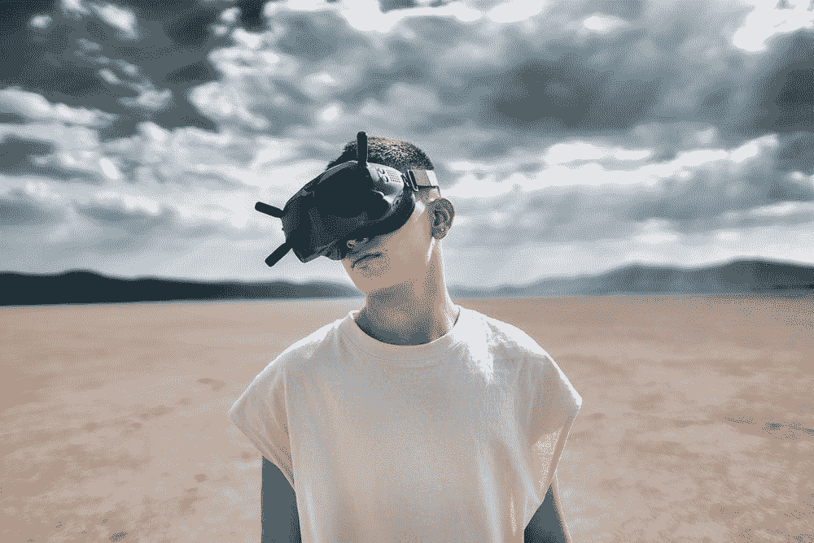

# NFT 专家 Webhead:欢迎来到元宇宙

> 原文：<https://medium.com/coinmonks/nft-expert-webhead-welcome-to-the-metaverse-9057b622c73c?source=collection_archive---------19----------------------->

马克·扎克伯格，苹果，微软，谷歌，以及其他许多名字。所有人都在向“元宇宙”投入大量资金据估计，到 2024 年，“元宇宙”将成为 8000 亿美元的产业。相比之下，2020 年智能手机行业的价值约为 3800 亿美元。然而，普通路人并不知道元宇宙到底是什么意思。这听起来很超前，有点像电影里的情节，但这到底是什么呢？

Source : [https://unsplash.com/photos/wCAa_rIG-Dc](https://unsplash.com/photos/wCAa_rIG-Dc)