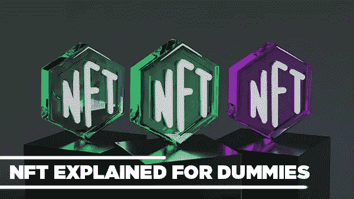
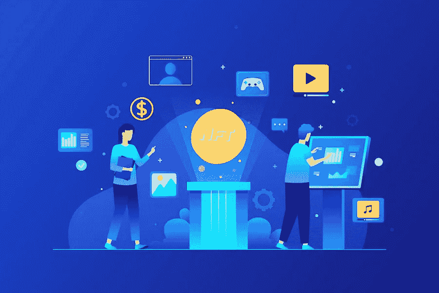
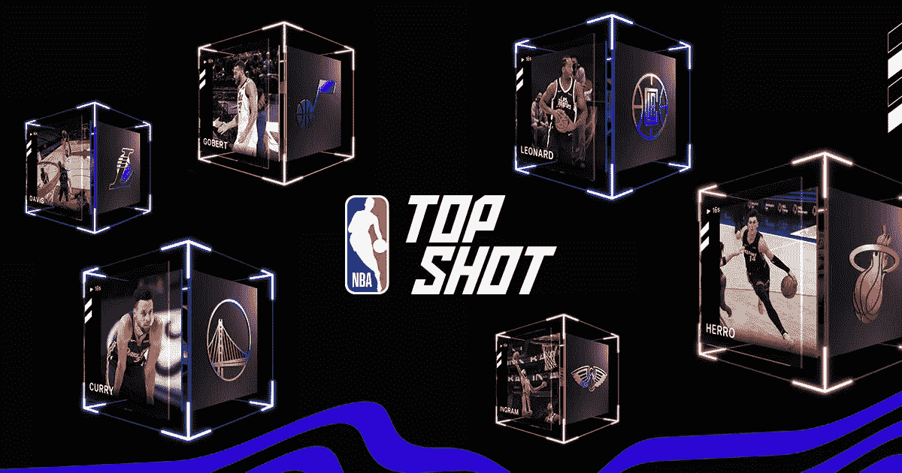
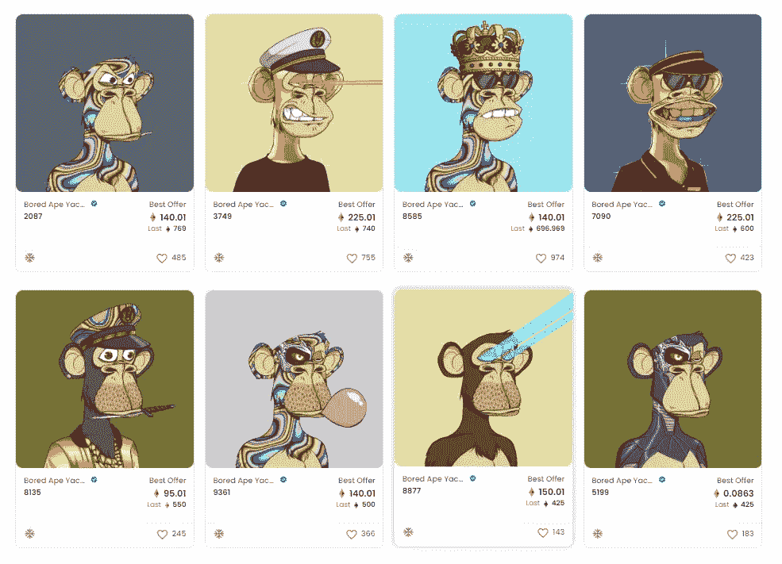

# NFT 为假人解释道

> 原文：<https://medium.com/coinmonks/nft-explained-for-dummies-f8a53cdc1e28?source=collection_archive---------43----------------------->

作为一名利用更传统的交易工具(如股票、商品、期权或期货)来获取利润的交易者，当您发现 NFT 和加密货币这一新兴的加密世界时，您肯定会大吃一惊。最近几年，不难发现一些带有“NFT”标签的彩色图片，其价格高得令人难以想象，高达 100 万美元。这个价值肯定不仅让你，也让整个交易行业彻底无语，留给你无数的问题，比如“NFT 到底是什么？”。

到 2020 年底和 2021 年初，密码行业产品的需求和供应都出现了奇迹般的激增，使 2021 年成为密码世界。除了现代技术设备使普通人更容易进行交易之外，加密货币和 NFT 的蓬勃发展和日益普及也有助于许多交易者在新发现的充满希望的土地上寻找新的机会。

由于 NFT 涉及一些高度技术性的知识，如果没有适当的方法，大一新生可能会觉得很难理解。但是不要担心，我们关于 **NFT 为假人**解释的指南会消除所有的困惑，只给你最基本的东西，这样你就有资格在这篇文章之后继续你自己的旅程。

# NFT 解释道

# 什么是 NFT？

广义而言，不可替代令牌(或简称为 NFTs)是连接到一个对象(通常是数字)的独特加密数据块，使其成为包含独特标识码和元数据的交易工具，这些标识码和元数据在标识和金融价值方面将它们与其他产品区分开来。由于互联网上各种各样的显示可能性，NFT 可以以各种各样的数字化形式发布，包括艺术品、音乐、视频、[游戏内资产](https://libraryoftrader.net/how-to-make-money-with-nft-games)等。

由于“独特的识别码”，在所有相关方面没有也不会有两个相同的非功能性测试。为了进一步理解这一点，让我们假设我们有一张图片和它的副本，几乎所有的东西看起来都是一样的。如果这些对象被转换成 NFT，它们将被分配唯一的识别码，因此，现在被认为是与其他对象不同的唯一识别码。从这一刻起，曾经只是一个复制品的物体获得了它自己存在的确定证据，与它的源头分离。虽然这两种非功能性交易现在有相同的外观，但它们不能被视为一件事，可以有不同的财务价值，因此被称为“不可替代”。

*As long as your assets are digital, they will have a great chance of being converted into NFTs with financial value.*

这背后的基本过程包括将资产作为 NFT 分配给一系列由区块链技术支持的分散网络。这个系统可以被视为一个大的在线账本，其中记录了现有的每一种 NFT 和加密货币以及它们在网络中的活动。因此，交易者有实际的方法来检查某个交易记录，即使它来自他们自己的行为，也没有人能够故意进行伪造或重复花费的交易。

# NFT 的历史

像加密货币一样，NFT 是创新技术的产物，显然不是凭空出现并一夜成名的。那么，NFT 到底是什么时候开始的？

这让我们回到 2014 年，更确切地说是 2014 年 5 月 2 日，凯文·麦考伊在区块链硬币上铸造了“量子”，并保持着 NFT 第一个合法所有者的记录。该法案标志着密码世界历史上的一个里程碑。从那以后，无数的 NFT 项目被创造出来，并分发给全世界数以百万计的用户，取得了传统金融市场前所未有的价值和记录。

# 我们为什么要拥有 NFT

当我们谈论 NFT 时，我们不仅谈论资产本身，还谈论它们定义的独特性和盈利的财务潜力。NFT 与有形和无形物品的展示相关联，包括艺术品、音乐、收藏品、NFT 游戏物品、金融服务等。

对于艺术品和音乐等数字主题，NFT 通过为社区提供动力来帮助他们提高创作者的潜在盈利能力，因为 NFT 可以在粉丝和支持者之间交易，他们的创作可以在社区中分发。然后，买家成为产品的合法所有者，反过来，如果这些资产需求稀少，并受到大量热情追随者的追捧，买家就能继续获利。

NFT 增强了 NFT 游戏中用户的物品所有权。在传统游戏中，如果制作人决定中止和停止所有与游戏相关的服务，你在玩游戏时获得的所有数据和资产都将被清除。由于 NFTs，这种情况将不会发生，因为玩家可以收回他们花掉的钱，并在他们停止游戏时将他们换成一些其他代币，以在另一个游戏或其他服务中使用。

NFTs 还推出了一项名为“NFT 贷款”的全新服务。这是因为 NFT 和 Defi(分散融资)的基础设施完全相同。这一过程包括使用非正规金融凭证作为抵押品，让你根据在申请服务时记录的这些非正规金融凭证的价值借入一定数额的资金。

# NFT 的流行例子

如果你不是信息技术行业的从业者或普通交易员，你很有可能通过 Cryptokitties 和 Bored Ape Yacht Club 等名字了解 NFT。这些是 NFT 的最好例子，因为他们已经取得了巨大的突破，出现在他们原来的平台或社区之外。

Cryptokitties 于 2017 年推出，由以太坊区块链公司提供动力。它们显示为具有独特标识符的猫，并且可以组合起来“繁殖”，产生新的后代作为新鲜的 NFT，与它们的父母共享特性和特征。这个概念后来被许多不同的平台所利用，尤其是 NFT 游戏，因为它允许人们在不花费太多的情况下获得新的资产。

*The Cryptokitties introduces a fresh concept for creating new NFTs.*

在首次推出后不久，kitties 就吸引了一批粉丝，据说他们愿意花 2000 多万美元购买这些产品。其中，一些人据称在该项目上花费了 10 多万美元——如果我们考虑到该项目的运营时间，这是一个令人震惊的数字。

无聊猿游艇俱乐部是 NFT 的另一个重要例子，也许比 Cryptokitties 更受欢迎，因为它们的恶名和最近引发的争议。Bored Ape 游艇俱乐部的藏品超过 1 万件，其中最昂贵的艺术品超过 340 万美元——Bored Ape # 8817。它被拍卖，出价为 852.39 ETH(当时大约超过 340 万美元)。无聊猿游艇俱乐部之所以能取得如此高的价值，其中一个原因是因为他们设法获得了名人的支持。

*The Bored Ape #8817 has reached the highest value ever recorded as an NFT.*

在 NFT 的影响下，名人不再是局外人。他们也是热情的 NFT 支持者。一些最知名的歌手如史努比·道格、DJ·哈立德和麦当娜都公开表示有兴趣成为投资者。甚至像 NBA 这样的大型协会也抓住了这个机会，利用著名篮球运动员的现有基础，创造了一个巨大的职业生涯难忘时刻的集合，称为 NBA Top Shot。该系列由顶级球员主演，如勒布朗·詹姆斯、斯蒂芬·库里、凯里·欧文、凯文·杜兰特、詹姆斯·哈登等等。

*NBA Top Shot possesses an incredible potential for NFT thanks to their basketball player base.*

# NFT 和加密货币的区别

一般来说，NFT 和加密货币共享被构建和分发到一系列由区块链技术(如比特币或以太坊)支持的去中心化网络的过程。但相似之处仅限于此。

互换性是最重要的区别。与真实世界的货币一样，加密货币旨在用于交易，因此必须根据其当前价值与其他货币互换，而不是固定不变的唯一性。简而言之，1 个比特币仍然可以在没有发行的情况下兑换成另一个 1 个比特币，而如上所述，两个视觉上相同的 NFT 由于其唯一的标识而无法平等兑换。

# 你怎么能得到一个 NFT，并为自己做一个呢

# 如何制作 NFT？

创造一个 NFT 通常被称为[铸造一个 NFT](https://libraryoftrader.net/what-does-minting-nft-mean) ,任何级别的任何人都可以完成，只要他们认真遵循说明。这个过程包括导入您想要的物品，并在某个加密市场平台上通过几个步骤，该平台允许物品格式并连接到您的加密钱包-在这里，您的 NFT 现在将被存储为带有识别码的物品，并准备好进行交易。

# 如何获得 NFT？

尽管进入 NFT 市场并为自己获得一个网站的过程似乎相当容易，因为它可以总结为一句话:“按照说明”，但对于一些之前对这些网站的工作方式没有多少经验的人来说，这也可能是一种威胁。下面是 NFTs 入门概述。让我们开始吧！

## 获得加密钱包

一般来说，加密钱包可以是计算机应用程序或物理设备——加密钱包的两种基本类型:软件或硬件——允许您存储和转移加密资产，包括 NFT 和加密货币。

“热钱包”——软件钱包的另一个名称——是一个计算机应用程序，可以安装在您选择的设备上作为您的加密资产存储。当谈到移动性时，热门钱包只是简单地胜过其他，因为它显然更方便，只要你提供正确的安全信息并连接到互联网，就可以随时随地访问。加密资产在被转移用于采矿或交易之前必须存储在热钱包中，因为大多数加密钱包都直接链接到某些平台——与硬件钱包相反。然而，结果是，这些钱包更容易受到黑客的攻击，同时依赖于你的行为得到很好的保护。

“冷钱包”——也称为硬件钱包——是一种物理钱包，其总体设计看起来像一个 u 盘，允许您导入您的加密资产进行存储。这款钱包独立于 PC 或笔记本电脑等其他设备。如果您想在它们之间转移项目，您需要让它们都可用。这种类型的钱包也与互联网连接隔离，没有黑客可以接触甚至跟踪你的任何存储资产。然而，这也带来了潜在的风险，如果你不知何故丢失了钱包棒，你将没有办法找到它，更不用说恢复丢失的东西了。

2022 年，一些最受认可的加密钱包包括比特币基地、信托、Electrum 和 Exodus。

当创建你自己的钱包时，你总是被提供一系列随机的单词来恢复你的帐户。如果你打算在这个行业走得更远，发展自己，就要小心地保护它。

## 购买你的第一个 NFT

如果你仔细地按照指示做，你应该在这个时候有你的钱包和一些钱在你的帐户里。然后，让我们进入下一步:购买你的第一个密码。

首先，选择你想要的在线交易所(通常被称为 NFT 市场)。记得找到支持你钱包的，以确保你的尝试不会毫无意义。话又说回来，只要按照平台提供的说明。这些说明通常是直观的，有一步一步的分解。一些最常见的 NFT 交易所是:

*   基础(Foundation):一个排他性的市场，要求创作者被已经在平台上的其他创作者邀请
*   [OpenSea](https://opensea.io/) :最大的平台之一，开创了 NFT 市场的概念，提供各种各样的 NFT 收藏品
*   [Nifty Gateway](https://www.niftygateway.com/) :与知名品牌、运动员和创作者合作的艺术市场。

*Not all leading NFT brands are available on all marketplaces. Make sure you do your research to choose the right one.*

# NFT 的未来

NFT 在改变领先消费品牌的视角方面做得很好，找到了更多与忠实粉丝互动的方式。例如，一套罕见的 NFT 收藏品在一个著名品牌的社区中进行拍卖。出价最高的买家不仅得到了上述设备，还在当年晚些时候实际发布之前提前得到了一个现实生活中的独家产品。

有了 NFT，艺术家和音乐家有了更多的机会。他们现在可以更容易地与他们的支持者互动，并通过 NFT 市场进行交易，管理简单，不需要中介或第三方服务。

尽管 NFT 已经对世界产生了重大影响，但它现在仍处于发展阶段。要明确预测 NFT 从现在开始会走多远是不可能的。

每个对加密市场感兴趣的人都在关注加密世界的下一个吸引人的地方——元宇宙。毫无疑问，NFT 将是一个重要的组成部分，在今后的阶段中发挥主要作用。NFT 将使物品，如头像或游戏中的财产，能够在某个元宇宙的较小的部门或合作伙伴之间无缝转移。

# NFT 安全吗？

NFT 通过使用区块链技术以与加密货币相同的方式进行分发和操作，这使得它非常安全。由于区块链的性质，NFT 经过测试证明极难被黑客攻击。但是，也不是完全不可能。

例如，拥有特定的 NFT 或使用一般的加密平台通常需要您进行多个中间步骤和操作，甚至是第三方应用程序，例如创建加密钱包、铸造 NFT、用钱包进行交易等等。因此，如果黑客设法跟踪你的信息，并设法在一个地方获得你的个人密码，其余的被接管的可能性只是一个时间问题？

 [## 如何度过难熬的密码寒冬？

### 加密市场就像过山车。它用许多巨大的胜利吸引和愉悦人们，尽管他们可能会遭受…

medium.com](/@libraryoftrader/how-to-get-through-the-tough-cryptos-winter-4b047aba4196) 

作为 NFT 所有者，如果托管您的 NFT 的平台不复存在，您也有可能无法访问您的资产。此外，如果主人不能理解需求和供给的平衡。他们以某种方式使非金融资产的数量不断增加，却没有为它们提供实际的用途，从而使它们失去了潜在的价值，并消除了所有的交易机会。

NFT 市场上最常见的骗局之一是网络钓鱼。这通常涉及虚假广告、NFT 赠品或其他形式的信息交互，骗子会间接询问您的个人信息，包括私人钱包密钥或安全短语。

*The NFT market is filled with both opportunities and scams. And there is a better way to avoid scamming rather than getting more knowledge and experience.*

区块链是去中心化的，用户大多匿名。在大多数国家，即使是发达国家，仍然没有要求参与者提交身份证明进行认证的官方法规。所以，即使你设法发现一个黑客拿走了你的财产，你仍然没有办法找回它们，甚至没有办法对付那个骗子。

网络钓鱼诈骗的形式数不胜数，很难被发现。只要记住没有大牌或者官方平台会要求敏感信息。不要与任何人共享种子短语或您的私钥，即使是您的密友或亲戚。如果发生一些不幸的事情，他们将不会对你的行为承担法律责任。

# 结论

以上是我们的指南 **NFT 为傻瓜**解释，这样即使是一个没有任何关于密码世界知识的新生也会明白。在世界大部分地区，NFT 仍然是一个新鲜的概念。尽管它还处于发展的初级阶段，但它确实影响了每个人对市场的看法，并使他们变得更好。现在说这种影响是否会持续还为时过早。尽早熟悉这一热门趋势只会带来更多潜在利润的机会。所以，赶快抓住机会吧！

相关文章:

 [## 区块链技术:你想知道的一切

### 如何简单解释区块链？

medium.com](/@libraryoftrader/blockchain-technology-everything-you-want-to-know-8539f1771d61)  [## 我们从过去的股市崩盘中学到了什么？

### 股市崩盘是头条新闻，也是许多交易员和投资者的讨论话题。显然，它已经…

medium.com](/@libraryoftrader/what-are-the-lessons-we-learned-from-past-crashing-stock-markets-268ae4ad3c96) 

> *交易新手？试试* [*加密交易机器人*](/coinmonks/crypto-trading-bot-c2ffce8acb2a) *或* [*复制交易*](/coinmonks/top-10-crypto-copy-trading-platforms-for-beginners-d0c37c7d698c) *上* [*最好的加密交易*](/coinmonks/crypto-exchange-dd2f9d6f3769)

> 加入 Coinmonks [电报频道](https://t.me/coincodecap)和 [Youtube 频道](https://www.youtube.com/c/coinmonks/videos)获取每日[加密新闻](http://coincodecap.com/)

# 另外，阅读

*   [免费加密信号](/coinmonks/free-crypto-signals-48b25e61a8da) | [加密交易机器人](/coinmonks/crypto-trading-bot-c2ffce8acb2a)
*   [杠杆代币](/coinmonks/leveraged-token-3f5257808b22)终极指南
*   [16 款最佳折叠电动自行车](/coinmonks/top-17-folding-electric-bikes-5e296f0918cb)
*   [28 款最佳电动自行车点评](/coinmonks/the-28-best-electric-bikes-review-and-buying-guide-in-2023-7bb3146cb403)
*   前三名[币安期货交易机器人](/coinmonks/top-3-binance-futures-trading-bots-e6031f84b3f9)