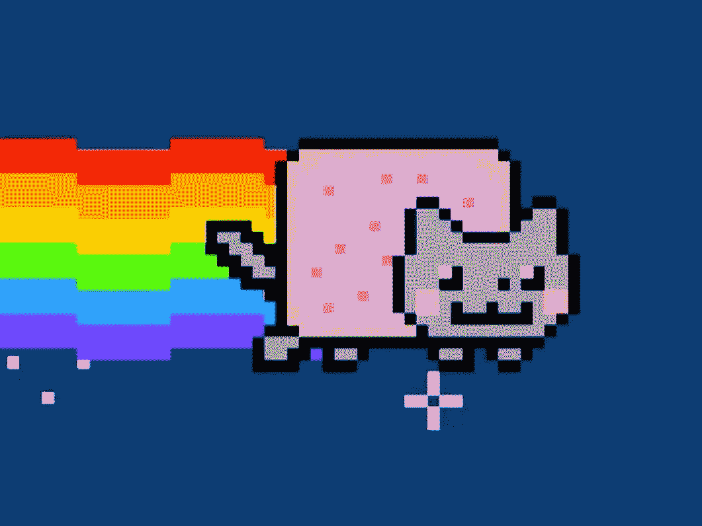

# NFT 是好的，NFT 是我们的星球

> 原文：<https://medium.com/coinmonks/nft-for-good-nft-for-our-planet-89cf64b0f3b2?source=collection_archive---------15----------------------->

## 什么？你一定是在跟我开玩笑。

我从来没有想象过对 Web3.0 或 NFTs 感兴趣，但我在这里写了这篇关于 NFTs 在解决世界上一些关键的可持续发展挑战时可以带来的价值的文章。

我总是从朋友那里听说，一旦你开始尝试理解加密货币是什么，你就开始陷入深深的黑暗兔子洞。你必须明白，对我来说，这“应该”在道德上是错误的。没有一个正常的环保主义者会支持这样一个碳密集的地区。我说的对吗？但是也许在这个很深的洞的底部有一道亮光。请把你的判断留到你读完这篇文章。谢谢您们。

The Nyan Cat sold as an NFT

# 什么是 NFT？

NFT 代表不可替换的令牌。它们是数字资产，包括艺术、音乐、游戏中的物品和视频。这些数字资产在网上买卖，经常使用加密货币**。**

**不可替代也意味着它是独一无二的。这是大多数数字创作之间的巨大差异，它们的供应几乎是无限的。华盛顿技术行业协会卡斯卡迪亚区块链委员会主席兼黄伞风险投资公司董事总经理 Arry Yu 表示:“从本质上讲，NFT 造成了数字稀缺。”**

> **“本质上，NFT 造成了数字稀缺”**

**2021 年，仅 NFTs 市场的价值就达到了惊人的 410 亿美元，接近整个全球艺术品市场的总价值。**

> **交易新手？试试[密码交易机器人](/coinmonks/crypto-trading-bot-c2ffce8acb2a)或[复制交易](/coinmonks/top-10-crypto-copy-trading-platforms-for-beginners-d0c37c7d698c)**

## **新发现的对创意的热爱**

****

**作为一名通信专业的学生，我很欣赏这种对创意的指数级认可，以及在社区建设方面所利用的软技能——这是任何 NFT 项目中必不可少的一块砖。当那些居高临下的金融大佬们经常称我们为“毛绒绒”的创意人才时，我想特别为他们大声疾呼“去死吧”。**

## **NFTs 与加密货币**

**NFT 和加密货币(如比特币或以太坊)之间唯一的相似之处是它们使用相同的编程。**

**加密货币和实物货币一样，是“可替代的”，这意味着它们可以相互交易或交换。它们在价值上是相等的，一美元总是值另一美元。加密的可替代性使其成为区块链上进行交易的可信手段。**

**NFT 不一样。每一个都有一个数字签名，使得它们不可能互相交换或等同。**

# **房间里的大象:为什么 NFT 不好**

**NFT 被认为是不好的有两个原因:**

1.  ****对环境有害:**如果你读了我的文章《[加密货币能否持续发展](/@TheChubbyHonu/can-cryptocurrencies-be-truly-sustainable-c7c85a964fcb)，我们可以观察到它们是碳密集型的，尤其是当你铸造它们的时候。**
2.  ****加剧网络犯罪**:它们加剧了洗钱、逃税和投资欺诈。NFT 领域的一种主要加密欺诈形式被称为“拉地毯”，即 NFT 的创造者突然关闭项目，带走项目资金，然后消失。2021 年，密码诈骗让用户损失了约 28 亿美元。**

**本文的目的不是支持或反对非功能性测试。引用 Jillian Godsil 的话，“这里的目标是平衡言辞，反击固有的偏见或纯粹的错误信息，就像福音一样传播。”**

## **有没有办法减轻非功能性测试的负面影响？**

**创建 NFT 的方式是能源密集型的，因为大多数 NFT 是使用工作验证操作方法制造的。在我的[上一篇文章](/@TheChubbyHonu/can-cryptocurrencies-be-truly-sustainable-c7c85a964fcb)中，我简要提到了它并不是唯一的共识机制，一个更环保的机制是[利益证明](https://ethereum.org/en/developers/docs/consensus-mechanisms/pos/) (PoS)。**

**另一个越来越出名的区块链是埃尔隆德。**

****

**Elrond, the 1st European carbon-negative blockchain**

**埃尔隆德是一个高速 PoS 网络，也是欧洲第一个碳负区块链，抵消的二氧化碳比我们的网络还多。据说，该公司正在引领高度可扩展和高能效的区块链创新的新浪潮。这一点意义重大，尤其是当区块链技术在解决复杂的经济和环境问题方面越来越出名，但其能源效率极低的时候。**

**相比之下，埃尔隆德网络目前每秒 15，000 笔交易(TSP)的容量可扩展至 100，000 TPS 以上，吞吐量和执行速度提高了 1000 倍，而处理一笔交易所需的能源减少了 600 万倍。(埃尔隆德，2022 年)。迄今为止，该公司已经抵消了 7，407，000 公斤的二氧化碳，比其网络所占的二氧化碳多抵消了 25%。**

**当涉及到最大限度地减少网络犯罪时，事情变得有点棘手。首先是对你从谁那里购买非功能性食物进行彻底的背景调查。如果创作者在社交网络上没有名声或痕迹，那就令人担忧了。一个 [***了解你的客户***](https://www.investopedia.com/terms/k/knowyourclient.asp) 的标准最终也可以适用于这个空间。Discord 是大多数 NFT 项目用来进行社区建设和营销的地方。如果说服务器支持这些活动，那么他们也有责任确保这些欺骗不会发生。安全措施可以包括服务器上创建者和版主的可追溯性和合法性。**

# **永久的非功能性食物**

**现在让我们看看光明的一面。国家森林机构如何应对我们这个世界的挑战，并为影响力驱动的实体提供支持？**

## **为非营利组织筹款**

****

**“Mean Men” NFT Collection to Raise Funds for Mental Health NGO**

**对于许多以影响力为导向的组织来说，来自 NFT 项目的一份大礼可能会改变游戏规则。这可以通过多种方式实现。**

1.  **企业捐赠合作关系:拥有大量资源的大品牌乐于接受新趋势。通过与企业合作伙伴合作举办慈善拍卖，NFT 艺术家可以利用他们的创造力为慈善事业筹集大笔资金。**
2.  ****名人驱动的 NFT 拍卖:**利用名人来获得知名度。2021 年 8 月，NFT 平台 Cryptograph 和摄影师 Davis Factor 联手拍卖了已故 NBA 球星科比·布莱恩特的八张从未公开过的照片。所有收益都捐给了曼巴和曼巴西塔基金会。**
3.  ****作为慈善投资的 NFT:**慷慨的收藏家可以选择购买一幅 NFT 作品并捐赠给慈善机构。**
4.  ****直接捐赠给慈善机构:**可能只是 NFT 艺术家希望直接捐赠给有影响力的慈善机构。**

**下表显示了 NFT 项目如何支持影响力驱动型组织的使用案例。**

****

**[The most charitable NFT Projects](https://thegivingblock.com/resources/nonprofits-nfts-explained-a-new-vision-for-charitable-fundraising/)**

## **解决环境问题——清洁海洋的 NFT**

**除了为外部组织筹集资金，NFT 的创造者们还可以围绕解决世界挑战来构建他们的商业模式。在这种情况下，我们可以看看 Aquaverse，NFT 项目的使命是清洁海洋。**

****

**Aquaverse NFT**

**[Aquaverse](https://theaquaverse.io/) 是一个完整的生态系统，允许我们结合生态学、区块链&游戏，对海洋污染采取具体行动。受海绵的启发，他们的目标是开发具体的解决方案，通过吸收微塑料、重金属和有毒颗粒来过滤它们，并清洁海洋。**

**使用**$海绵，**aqua verse 生态系统的 ESDT 公用事业令牌，允许所有者行使其治理权并投资于积极影响项目。这包括他们的水产养殖场。其目的是确保从海洋海绵的所有角度(环境、社会和金融)为积极的生态系统提供资金。**

**这个想法利用了一个志趣相投、充满激情的社区，为清洁海洋的共同目标而努力。**

# **判决**

**不可否认，要验证和证明环保主义者将很快张开双臂欢迎非功能性森林交易，这是一个挑战。他们有充分的理由持怀疑态度，因为上述这些崇高的挑战仍然存在。**

**然而，我们也不能忽视 NFTs 所支持的影响驱动型实体的收入流的增加。仅 NFT 最慈善的 16 个项目就已经资助了 20 多个关注影响力的组织 870 万美元。此外，利用区块链技术的性质可以准确显示他们的捐款去向，这可以激发社区成员之间的信任。**

**NFT 提供的不仅仅是一个从下一个投机项目中赚一大笔钱的机会。它可以支持组织、捐助者和社区应对当今的重大挑战，如贫困、确保教育和赋予妇女权力。NFTs 也可能是一种接触年轻人的好方法，这些年轻人构成了 NFT 和加密货币狂热分子的主体，并吸引新的受众。**