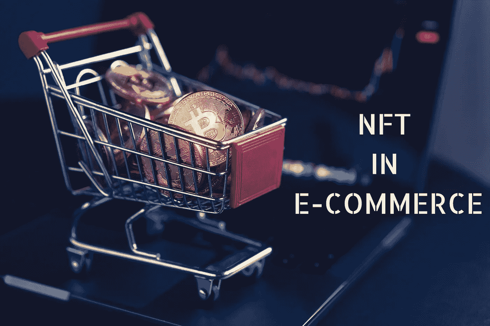
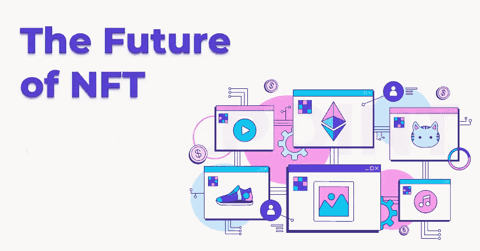

# 电子商务中的 NFT:为什么这些 Web3 应用能让世界变得更好？

> 原文：<https://medium.com/coinmonks/nft-in-e-commerce-why-could-these-web3-applications-change-the-world-for-the-better-38d9f16596e9?source=collection_archive---------13----------------------->

今天，由于各种原因，不可替代令牌(NFT)已经成为一种热门趋势。但是，什么是 NFT 呢？这些数字令牌为它们所支持的资产(物理/数字)提供所有权和真实性的证明。虽然这些虚拟代币在一个季度(2021 年第三季度)内建立了数十亿美元的市场，为自己赢得了声誉，但要知道，所有的成功都应归功于 NFT 在电子商务领域的成就。该领域一直在快速发展，并承诺在未来几年提供更多。本博客详细阐述了在未来十年中， [**NFT 在电子商务发展中的作用，**](https://bit.ly/3oc1uIS) 。

**NFT in E-Commerce**

## 电子商务中的 NFT 如何绑定？

就目前的趋势和统计数据而言，电子商务中的 NFT 彼此结合得很好，因为这些令牌刚刚为在线商务的发展开辟了另一条道路。在 2010 年代，没有人会预测到他们可以购买和拥有数字艺术品，而不用担心假冒资产。现在，与加密货币一样，不可替代的代币已经成为 Web3 爱好者在数字世界中茁壮成长的重要因素。目前，NFTs 在电子商务开发中的许多用例已经得到应用。

## 当前使用案例

☀ [**电子商务中的 NFT**](https://bit.ly/3oc1uIS)明显用于出售对持有者具有情感价值的可收藏物品。他们也是有益的，因为他们提高了品牌知名度和追随者之间的关系水平。可收藏的 NFT 通常类似于旧时代的体育交易卡，几乎在每个角落都能买到。

☀当我们谈到非功能性翻译时，我们脑海中浮现出元诗句。这些数字代币可以在虚拟世界中充当现实世界物品的虚拟副本。NFT 可以与实物产品结合使用，专门从事服装和珠宝的品牌已经成功地在电子商务中实施了 NFT。

☀ NFT 在电子商务发展中也可以通过客户忠诚度计划做出贡献，并增加额外津贴。客户数据可以转移到分布式区块链分类账，从而节省公司维护记录的时间和成本。用户还可以通过在不同地方互换使用他们的积分从 NFT 忠诚中获益。

☀ [**实物资产 NFT**](https://bit.ly/3uUvVHh)或许是这些代币最有吸引力的应用。基于 NFT 的区块链记录可以支持任何真实世界的项目，这可以帮助证明所有权和财产交易。此外，由于每笔交易都记录在可公开验证的区块链上，因此不会出现物品所有权方面的问题。

☀此外，电子商务中的非功能性营销对于企业在不实际销售实物产品的情况下预先推出实物产品是很有用的。NFT 可以作为独家代币提供，提供早期访问，可以在买家中产生嗡嗡声。风险企业甚至有可能从自己的网上商店制造和销售非功能性食品。

☀:虽然 NFT 是数字化的，但人们可以通过在衣服和可穿戴设备上的专门屏幕上观看来欣赏它们。这使得 NFT 持有者可以炫耀他们的新财产，而不必拿出一个设备，对于品牌来说，这可以作为一种被动的促销策略，而不需要额外的费用。

☀可赎回 NFT 是大多数品牌使用的一个用例，尤其是那些销售独特和稀有产品的品牌，如古董收藏品和酒精饮料。NFT 可在品牌商店兑换，以领取实物产品。这些独家代币也可以在赎回前二次出售。

**Future Of NFT**

## NFT 的未来将走向何方？

✅:在未来，实体产品可以辅以数字体验，这对品牌在 Web3 时代的生存至关重要。对于可以拍卖的产品，可以通过 NFT 提供独特的客户体验，即使可能在没有额外津贴的情况下正常利用它们。

电子商务中的✅ NFT 可以通过让人们购买虚拟版本的房地产、车辆和服装来塑造虚拟世界。通过数字化方面，可以在两个世界同时购买产品。虽然实体版本可以在现实世界中使用，但 NFT 可以在元版本中使用。

✅不可替代令牌也可以作为物理项目的虚拟所有权证书。实物资产非功能性交易对所有者和消费者都有利，因为历史、真实性和其他更新可以在区块链账本上进行数字验证。这些被称为无信任环境，Web3 技术在其上蓬勃发展。

> 交易新手？试试[密码交易机器人](/coinmonks/crypto-trading-bot-c2ffce8acb2a)或者[复制交易](/coinmonks/top-10-crypto-copy-trading-platforms-for-beginners-d0c37c7d698c)

## 总结想法

因此，我们可以说，随着越来越多的人逐渐将这些代币融入他们的生活，电子商务发展中的**NFT 很快就会做大。如果你是一个热衷于创业的人，想要在 Web3 世界留下印记，那么一个基于 NFT 的电子商务公司可能是一个完美的解决方案。要获得技术支持，可以考虑联系一家经验丰富的 Web3 应用程序开发公司，该公司奉行以客户为中心的政策。**